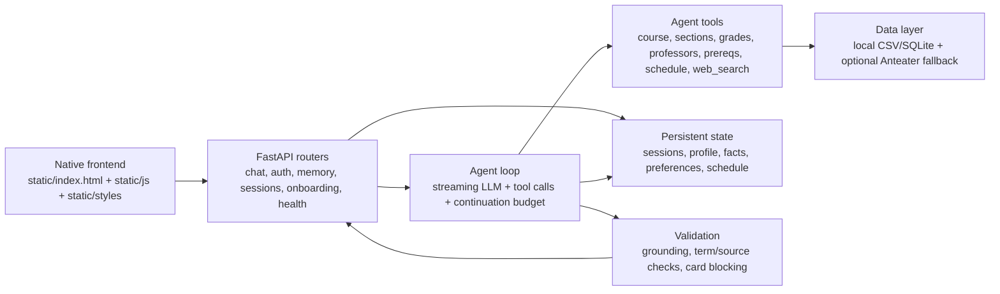

# UCI Course Advisor

Private-beta course planning assistant for UCI students. It combines a FastAPI backend, a streaming tool-using agent, local UCI catalog data, persistent sessions/memory, validation, and a native HTML/CSS/JS frontend.

This project is not an official UCI advisor, degree audit, or enrollment system. It can help explore course options, but students must verify requirements, prerequisites, deadlines, and enrollment decisions with official UCI sources and academic advisors.

## Current capabilities

- Streaming chat through `/api/chat/stream` with SSE events, tool chips, limit-reached continuation, and persisted history.
- Tool-backed course, section, professor, grade, prerequisite, policy, and schedule-conflict lookups.
- Controlled `web_search` agent tool with source classification, default-off safety, fake-provider tests, and markdown citations for web-sourced facts.
- Structured recommendation cards with validation before they can be added to the weekly schedule.
- Authenticated sessions, isolated guest identities, onboarding, profile memory, preferences, and cross-session restoration.
- Local catalog coverage manifest that distinguishes `complete`, `partial`, `stale`, and `unavailable` data.
- Private-beta hardening: rate limits, production cookie/CSRF defaults, no shared writable demo user in production, and traceable logs.
- Health and observability endpoints: `/health/live`, `/health/ready`, `/health/metrics`.

## Architecture



## Directory structure

```text
.
├── main.py                         # FastAPI app, middleware, router registration
├── Procfile                        # Production-style startup command
├── requirements.txt                # Runtime dependencies
├── requirements-dev.txt            # Runtime + test/data-script dependencies
├── app/
│   ├── agent/                      # Tool-calling agent loop and tool schemas
│   ├── auth/                       # Auth store, cookies, guest identity, rate limits
│   ├── catalog/                    # Term parsing, local catalog loaders, coverage manifest
│   ├── data/                       # Course/professor/grade/session data access
│   ├── llm/                        # DeepSeek OpenAI-compatible adapter
│   ├── memory/                     # Profile, facts, preferences, and session memory
│   ├── routers/                    # API routers including health endpoints
│   ├── scheduling/                 # Schedule conflict and bundle validation service
│   └── validation/                 # Grounding validators and validation log
├── data/
│   ├── uci/                        # Versioned local catalog CSVs
│   ├── professor/                  # Professor/review data
│   └── uci_general/                # General UCI requirements data
├── scripts/                        # Data import, verification, smoke, and migration scripts
├── static/
│   ├── index.html
│   ├── js/                         # Frontend modules
│   └── styles/                     # CSS tokens and components
└── tests/                          # Offline pytest suite and fixtures
```

## Requirements

- Python `3.14.4` (see `.python-version`)
- `pip`

## Install

```bash
python -m venv .venv
source .venv/bin/activate
python -m pip install --upgrade pip
python -m pip install -r requirements-dev.txt
cp .env.example .env
```

For production/runtime-only installs, use `requirements.txt` instead of `requirements-dev.txt`.

## Environment variables

`.env.example` lists the supported variables and safe local defaults. Important variables:

- `APP_ENV`: `development`, `test`, or `production`.
- `AUTH_SESSION_SECRET`: required in production; use a long random value generated outside the repo.
- `DEEPSEEK_API_KEY`, `DEEPSEEK_BASE_URL`, `DEEPSEEK_MODEL`: enable live LLM mode.
- `ANTEATER_API_KEY`: optional external UCI API fallback.
- `WEB_SEARCH_ENABLED`, `WEB_SEARCH_PROVIDER`, `WEB_SEARCH_API_KEY`, `WEB_SEARCH_MAX_RESULTS`, `WEB_SEARCH_TIMEOUT_SECONDS`: controlled web-search mode. It is disabled by default; the current build supports the `fake` provider for offline tests/dev and returns structured unavailable errors for unimplemented real providers.
- `RESEND_API_KEY`, `RESEND_FROM_EMAIL`, `RESEND_SUBJECT`: optional email verification delivery.
- `ALLOW_SHARED_DEMO`, `ALLOW_GUEST_USERS`, `COOKIE_SECURE`, `CSRF_PROTECTION`, `ALLOWED_ORIGINS`, `ALLOW_CUSTOM_SYSTEM_PROMPT`: private-beta safety switches.
- `LLM_INPUT_USD_PER_1K`, `LLM_OUTPUT_USD_PER_1K`: optional estimated cost rates for observability logs.

Do not commit `.env`, API keys, auth databases, verification codes, cookies, or runtime memory data.

## Data preparation

The repository includes local data for offline development and tests:

- `data/uci/*.csv` for catalog/course/section data.
- `data/professor/*` for local professor/review lookup.
- `data/uci_general/*` for general UCI requirement helpers.

Current catalog coverage:

| Term | Status | Notes |
|---|---|---|
| Spring 2025 | complete | Local section data available. |
| Spring 2026 | complete | Local section data available. |
| Fall 2026 | partial | Only partial local section coverage; answers must not treat missing rows as definitive no-offering facts. |

Useful checks:

```bash
python scripts/smoke_test.py
python scripts/verify_data.py sections CS161 "Spring 2025"
python scripts/verify_db.py
```

Network/data refresh scripts exist under `scripts/`, but default tests and offline development do not require live API access.

## Run

Development:

```bash
python -m uvicorn main:app --reload --port 8000
```

Then open `http://127.0.0.1:8000`.

Production-style command:

```bash
python -m uvicorn main:app --host 0.0.0.0 --port "${PORT:-8000}"
```

`Procfile` uses the same startup command.

## Test and CI

Run the offline suite:

```bash
python -m pytest
```

Local CI-equivalent checks:

```bash
python -m compileall app main.py scripts tests
python -m pip check
python -m pytest
```

Default tests block external network and real LLM calls. Manual live integration tests are marked `live`/`manual` and are not part of default CI.

GitHub Actions runs install, syntax lint, dependency graph validation, and offline tests from `.github/workflows/ci.yml`.

## Runtime modes

- Offline mode: no API keys. The app uses local data, deterministic fallbacks, and test doubles. This is the default development/test mode.
- External API fallback: set `ANTEATER_API_KEY` if you want live UCI API fallback when local term data is unavailable. Partial/stale local data is surfaced as uncertain instead of silently overruled.
- Controlled web search: set `WEB_SEARCH_ENABLED=true` and a provider. In the current build, `WEB_SEARCH_PROVIDER=fake` is the supported deterministic provider for tests/dev; unimplemented real providers fail closed with a structured `provider_unimplemented` response. Web search results are never written into the local DB and are labeled with URL, domain, retrieved date, source class, and trust level.
- Live LLM mode: set `DEEPSEEK_API_KEY`. The adapter uses an OpenAI-compatible DeepSeek endpoint and streams through the agent loop.
- Email delivery: set `RESEND_API_KEY` and sender variables. Without this, development can still exercise auth flows without logging verification codes.

## Correctness boundaries

- The assistant is strongest for catalog, schedule, prerequisite, professor, and course-planning questions covered by the local data and implemented tools.
- Local DB/tool data is the default highest-trust source. Web-sourced facts must be linked and shown separately; complete local DB data is not overridden by external web pages unless the answer explicitly describes the conflict.
- Degree Audit is not implemented. Major requirement support is limited and should not be treated as official degree certification.
- `partial`, `stale`, and `unavailable` coverage states mean the assistant must say it cannot confirm a fact rather than inventing certainty.
- Web source classes are `official_uci`, `official_university`, `government`, `professor_page`, `rmp`, `reddit`, `commercial`, `news`, and `unknown`. Reddit/forum/social results are anecdotal, and any web claim without a URL is not usable as a factual source.
- Recommendation cards are validation-gated, but validation is not a substitute for official UCI enrollment rules.
- Always verify add/drop deadlines, restrictions, prerequisites, waitlists, exams, and degree progress through official UCI systems.
