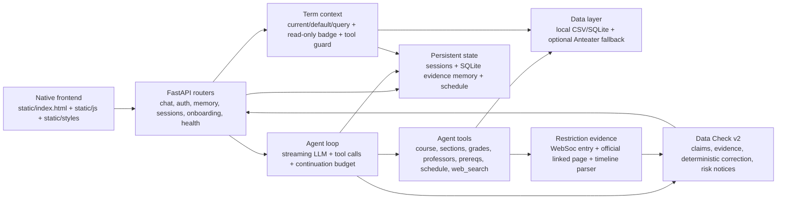

# UCI Course Advisor

Private-beta course planning assistant for UCI students. It combines a FastAPI backend, a streaming tool-using agent, local UCI catalog data, persistent sessions/memory, and a native HTML/CSS/JS frontend.

This project is not an official UCI advisor, degree audit, or enrollment system. It can help explore course options, but students must verify requirements, prerequisites, deadlines, and enrollment decisions with official UCI sources and academic advisors.

## Current capabilities

- Streaming chat through `/api/chat/stream` with SSE events, tool chips, limit-reached continuation, and persisted history.
- New conversations center the existing composer beneath a randomly selected greeting. The first send animates into the chat layout without delaying the request; restored conversations skip the transition, and system reduced-motion preferences are respected. Offline browser coverage: `scripts/verify_welcome_motion.cjs`.
- Tool-backed course, section, professor, grade, prerequisite, policy, and schedule-conflict lookups.
- Controlled `web_search` agent tool with source classification, default-off safety, fake-provider tests, and markdown citations for web-sourced facts.
- Fixed WebSoc restriction evidence pipeline: the backend follows query-relevant official links, parses cross-row timelines, and selects dates/scopes/exceptions deterministically.
- Expandable fetch audit under restriction tool chips showing each real GET/POST request, response status, byte count, source role, depth, and whether it supplied the final facts.
- Direct answer streaming with no post-generation Check or hidden rewrite step; evidence and uncertainty rules live in the Agent answer contract.
- Structured recommendation cards remain available for planning; unresolved sections can be kept in Schedule without creating a fabricated calendar block.
- Automatic Week 8 planning defaults, a read-only default badge, conversational term inference, and multi-term offering/professor comparisons.
- Structured XML runtime context plus a backend tool guard keeps the conversation default separate from the term(s) each tool is allowed to query.
- Cross-term schedules: every entry keeps its own term, overlaps are non-blocking, and the same course/section can coexist across terms.
- Schedule shows only added sections, with TBA/unknown-time sections in a visible untimed area above the weekly grid. Suggested meeting previews are disabled. Exact server-refreshed meeting data takes precedence over older catalog times for both calendar blocks and conflict checks.
- The weekly grid spans 08:00–22:00 by default, extending for actual meetings outside those hours. A confirmed class-free Friday afternoon shows `Free` with a randomly chosen celebration or smile emoji; unknown meeting times remain unknown.
- Registrar times such as `12:30–1:50p` are normalized to `12:30–13:50`, including existing saved cards. Schedule mutations reuse the current session's server-generated cards and cache fallback lookups per request; live checks remain behind Refresh.
- `@uci.edu` email/password registration with password confirmation and immediate sign-in, authenticated sessions, optional onboarding, and cross-session restoration. New emails are not ownership-verified.
- Student Profile workspace between Ask and Schedule: real academic summary, private GPA reveal, searchable completed courses, and existing profile-edit/transcript-import flows. See [profile data and UI conventions](docs/student-profile.md).
- Optional UCI unofficial-transcript import: PDF.js extracts text entirely in
  the browser, discards identity fields, and sends only allow-listed structured
  academic records to the authenticated server profile.
- MemoryBear-inspired evidence memory with SQLite/FTS5 recall, source quotes, confidence, temporal supersession, soft forgetting, and an audit trail.
- Profile course selection reads the checked-in local UCI catalog first, then a restart-safe runtime snapshot; a full paginated Anteater crawl is only a last resort.
- Local catalog coverage manifest that distinguishes `complete`, `partial`, `stale`, and `unavailable` data.
- Private-beta hardening: rate limits, production cookie/CSRF defaults, no shared writable demo user in production, and traceable logs.
- Health and observability endpoints: `/health/live`, `/health/ready`, `/health/metrics`.

## Architecture



## Directory structure

```text
.
├── main.py                         # FastAPI app, middleware, router registration
├── Procfile                        # Production-style startup command
├── requirements.txt                # Runtime dependencies
├── requirements-dev.txt            # Runtime + test/data-script dependencies
├── app/
│   ├── agent/                      # Tool-calling agent loop and tool schemas
│   ├── academic/                   # Structured transcript models and server store
│   ├── auth/                       # Auth store, cookies, guest identity, rate limits
│   ├── catalog/                    # Term parsing, local catalog loaders, coverage manifest
│   ├── data/                       # Course/professor/grade/session data access
│   ├── llm/                        # DeepSeek OpenAI-compatible adapter
│   ├── memory/                     # Profile, facts, preferences, and session memory
│   ├── routers/                    # API routers including health endpoints
│   ├── scheduling/                 # Schedule conflict and bundle validation service
│   ├── terms/                      # Automatic/default/query state, parsing, sync, and tool scope
│   └── validation/                 # Grounding validators and validation log
├── data/
│   ├── uci/                        # Versioned local catalog CSVs
│   ├── professor/                  # Professor/review data
│   └── uci_general/                # General UCI requirements data
├── scripts/                        # Data import, verification, smoke, and migration scripts
├── static/
│   ├── index.html
│   ├── js/                         # Frontend modules
│   └── styles/                     # CSS tokens and components
└── tests/                          # Offline pytest suite and fixtures
```

## Requirements

- Python `3.14.4` (see `.python-version`)
- `pip`

## Install

```bash
python -m venv .venv
source .venv/bin/activate
python -m pip install --upgrade pip
python -m pip install -r requirements-dev.txt
cp .env.example .env
```

For production/runtime-only installs, use `requirements.txt` instead of `requirements-dev.txt`.

## Environment variables

`.env.example` lists the supported variables and safe local defaults. Important variables:

- `APP_ENV`: `development`, `test`, or `production`.
- `AUTH_SESSION_SECRET`: required in production; use a long random value generated outside the repo.
- `DEEPSEEK_API_KEY`, `DEEPSEEK_BASE_URL`, `DEEPSEEK_MODEL`: enable live LLM mode.
- `ANTEATER_API_KEY`: optional external UCI API fallback.
- `TERM_STATE_PATH`: runtime-only automatic-term cache; defaults to `data/runtime/term_state.json`.
- `MEMORY_PROVIDER`, `MEMORY_ROOT`, `MEMORY_DB_PATH`, `MEMORY_MAX_ACTIVE_ITEMS`: select and size the evidence-backed long-term memory store. SQLite is the default; `json` is a rollback mode.
- `ACADEMIC_DB_PATH`: server-side normalized academic record database. It never stores PDF bytes or raw transcript text.
- `WEB_SEARCH_ENABLED`, `WEB_SEARCH_PROVIDER`, `WEB_SEARCH_API_KEY`, `WEB_SEARCH_MAX_RESULTS`, `WEB_SEARCH_TIMEOUT_SECONDS`: controlled web-search mode. Development defaults to `WEB_SEARCH_ENABLED=true` and `WEB_SEARCH_PROVIDER=duckduckgo`; production defaults to disabled unless explicitly enabled. Tests force offline fake/disabled modes.
- `ALLOW_SHARED_DEMO`, `ALLOW_GUEST_USERS`, `COOKIE_SECURE`, `CSRF_PROTECTION`, `ALLOWED_ORIGINS`, `ALLOW_CUSTOM_SYSTEM_PROMPT`: private-beta safety switches.
- `LLM_INPUT_USD_PER_1K`, `LLM_OUTPUT_USD_PER_1K`: optional estimated cost rates for observability logs.

Do not commit `.env`, API keys, auth databases, cookies, or runtime memory data.

### Registration

Account access uses a full-page split layout with a Solon introduction and a compact
sign-in/create-account form. Mobile screens use a single column. Tabs support keyboard
navigation; incomplete forms and pending requests disable submission. The workspace is
hidden and inert until authentication resolves. Only existing email/password features
are shown, with no SSO, Google, password-reset, help, or language-picker placeholders.

The registration form takes a UCI email address, password, and password confirmation,
plus the existing age/terms/privacy acknowledgment. `POST /api/auth/register` validates
the UCI domain and matching passwords, stores a bcrypt password hash, and immediately
sets the login cookie. Passwords require at least 8 characters and must fit within
bcrypt's 72-byte UTF-8 limit. No email service or verification code is required;
`/api/auth/request_code` and `/api/auth/verify` are retired.

New accounts have `verified_at = NULL`. On first database access, legacy auth tables
are upgraded transactionally to allow this while retaining existing user IDs, password
hashes, verification timestamps, and consent receipts. Back up the auth database before
deployment. Registration creates no profile, course, or conversation records itself.

Registration is limited to five attempts per client IP per ten minutes, independent
of the submitted email. Configure Uvicorn's trusted proxy addresses for your reverse
proxy; application code uses the resolved ASGI client address, not arbitrary forwarding
headers. The domain restriction does not prove that a registrant owns the email.

Focused checks: `pytest tests/test_password_registration.py tests/test_auth_ownership_characterization.py tests/test_private_beta_security.py --no-cov -q`.
Offline desktop/mobile browser check: `node scripts/verify_registration_ui.cjs`
(requires Playwright and Chrome; starts its own temporary local static server and uses
synthetic API responses, without creating real accounts).

### Transcript import

The private beta accepts the current text-based UCI unofficial transcript PDF
format, up to 5 MB and 20 pages. The original file is processed by the vendored,
pinned PDF.js build in browser memory and is never uploaded. The parser submits
only course identifiers, effective grades, units, GPA summary fields, university
requirement status, and exam/transfer summaries. Name, Student ID, source URL,
file name, and raw extracted text are not part of the API schema.

The server stores one effective row per course, hides non-passing statuses from
the Student Profile, merges imports with manually entered courses, and uses UCI
repeat notation such as `RF`/`G0` to resolve repeats. Imported results are
student-provided and are not an official UCI transcript or degree audit.

Transcript course rows carry separate `department` and `course_number` fields.
Canonical registrar departments come from `data/uci/courses.csv`; the smaller
conversation alias table is not used as a structured-data allow-list. Import
responses distinguish `added`, `updated`, `unchanged`, `older_ignored`, and true
`skipped` records, with sanitized per-course reason codes for UI diagnostics.
Parser-only issues remain local to the browser except for an aggregate count.

Browser requests for user-owned memory and conversations use `/api/memory/me`
and `/api/sessions/me`. The server resolves ownership from the signed session
cookie, and request logging records route templates rather than account values.

The two real sample PDFs used for local smoke verification must stay outside the
repository. Run the aggregate-only checker with local sample paths:

```bash
node scripts/verify_transcript_parser.mjs "/path/to/sample-one.pdf" "/path/to/sample-two.pdf"
```

### Long-term memory

The default memory backend is an in-process SQLite/FTS5 evidence store. It
imports existing JSON profile/fact/preference data once, keeps message-level
provenance for new memories, versions conflicts instead of overwriting them,
and injects query-relevant memories as untrusted historical evidence rather
than permanent system instructions. The existing Memory panel exposes sources,
confidence, lifecycle counts, and user-controlled soft forgetting.

For an eager migration before deployment:

```bash
python scripts/migrate_memory_to_sqlite.py --dry-run
python scripts/migrate_memory_to_sqlite.py
```

See [the MemoryBear integration design](docs/memorybear-integration.md) for the
schema, prompt trust boundary, API, attribution, and the features deliberately
deferred from the full upstream platform.

## Data preparation

The repository includes local data for offline development and tests:

- `data/uci/*.csv` for catalog/course/section data.
- `data/professor/*` for local professor/review lookup.
- `data/uci_general/*` for general UCI requirement helpers.

Current catalog coverage:

| Term | Status | Notes |
|---|---|---|
| Spring 2025 | complete | Local section data available. |
| Spring 2026 | complete | Local section data available. |
| Fall 2026 | partial | Only partial local section coverage; answers must not treat missing rows as definitive no-offering facts. |

Useful checks:

```bash
python scripts/smoke_test.py
python scripts/verify_data.py sections CS161 "Spring 2025"
python scripts/verify_db.py
```

Network/data refresh scripts exist under `scripts/`, but default tests and offline development do not require live API access.

### Automatic term state

The user-confirmed contract, implementation map, and known parsing gaps are recorded in [学期规则与实现核对](docs/term-rules.md). Read it before changing term behavior; `AGENTS.md` also points maintainers to this contract. The 2026-09-20 audit found that the main flows are implemented, but unrelated yearless queries, mixed explicit/relative dates, and custom historical year ranges still have documented gaps.

The backend uses `America/Los_Angeles` and UCI instruction dates from Anteater `calendar/all`. The actual ongoing `current_term` is separate from the planning `default_term`. At Week 8 Monday 00:00 Pacific time, the default advances Fall → Winter → Spring → Fall, regardless of whether the next timetable is published. Week 1 starts on the first Monday on or after instruction begins, accounting for Fall's opening Week 0. Official term end dates are preferred; when absent, the bounded calendar fallback ends after finals in Week 11. Summer queries are not supported yet.

`GET /api/term-state` returns `automatic_term`, `source`, `status`, and `next_cutoff`. The composer displays a read-only `@ Quarter YYYY` badge alongside the existing default-term display, and refreshes at the next boundary and when the tab becomes visible. Per-answer query badges never overwrite this default. Legacy manual/pinned sessions migrate to automatic mode (metadata schema v3); the old mutation endpoint rejects manual requests with `manual_term_disabled` and continues accepting auto refresh for compatibility.

Complete user dates and actual-current relative references take precedence, followed by relevant discussion context, then the default. Missing years are inferred from context or the current/upcoming quarter and disclosed in the answer. Ordinary follow-ups (including a different course such as “那 ICS 32 呢”) retain the discussion terms. A bounded semantic LLM pass handles indirect follow-ups and offering-pattern intent, with deterministic fallback on timeout or offline operation. Backend term guards validate the resulting scope independently of the model.

`get_course_offerings` queries every requested term and summarizes whether a course runs and its lecture/seminar professors. Pattern questions inspect the six previous completed regular terms (two years). Only verified records support conclusions about seasonality; missing data is not evidence of absence. The tool distinguishes `offered`, `not_offered`, `unpublished`, and `unavailable`. An unpublished future quarter is identified from a successful official WebSoc form lookup, not a transport error or a missing local catalog. Its previous two same-season quarters are returned separately as `historical_reference`; an observed offering supports a labelled **possible** future offering, never a professor or section prediction. Reference lookups do not replace the user's target or update discussion focus.

Successful calendar state is refreshed after 30 days and remains usable as last-known-good data for 45 days. The versioned code fallback remains explicitly labelled when live synchronization cannot recover. Calendar-backed date selection and timetable availability are independent. The JSON store uses atomic replacement and a process-local lock; multi-process production deployments require shared storage and a distributed lock.

The LLM receives one XML runtime block with UCI time, current/default/query terms, query intent, inference status, and response language. Query scopes remain server-validated; historical reference expansion is bounded inside the offering tool to the previous two same-season quarters.

### Profile course catalog loading

`GET /api/onboarding/courses/all` no longer performs a cold, sequential whole-catalog API crawl after every process restart. It builds the slim picker payload from `data/uci/courses.csv`, keeps it in process memory, and uses `data/runtime/onboarding_courses.json` as a restart-safe fallback when a deployment has no versioned CSV. Anteater cursor pagination runs only when both local sources are missing; a successful fallback fetch is persisted atomically.

Whole-catalog course data is loaded only when the onboarding course picker needs it. The default system prompt is likewise loaded only when Settings opens. Agent web activity is recorded as compact audit events: each real request logs its URL, method, status or error, byte count, duration, `cache_hit=false`, and trigger, followed by a deduplicated fetched-URL summary. Page bodies, extracted passages, restriction fields, and complete tool results are not written to logs.

Run the read-only live source check manually (it is excluded from default CI):

```bash
python scripts/smoke_term_state.py
python scripts/smoke_term_state.py --term "2026 Fall"
```

### Restriction evidence pipeline

Questions about major/school restrictions, New Only restrictions, course-specific restrictions, and related enrollment rules always enter through the Registrar WebSoc workflow. The workflow submits the real WebSoc department query, reads only query-relevant links explicitly published in the returned comments, and follows a tightly allowlisted second hop only when required fields are still missing.

Fetched HTML is cleaned into ordered headings, paragraphs, lists, tables, and links. A sequential parser binds department, date, time, action, audience, course scope, and exceptions into typed events using the `America/Los_Angeles` timezone. A completeness gate then marks the evidence `verified`, `partial`, `conflicting`, or `unavailable`; missing or conflicting data is never converted into a guessed date.

The backend renders the primary restriction type, effective time, related-but-different restrictions, eligibility, exceptions, and source URLs as structured evidence. The LLM receives that compact evidence and may add only a short explanation or next-step question.

The frontend’s restriction tool chip expands to the exact requests made during that turn. The compact audit is persisted with the assistant turn, so restored sessions show the same request list without fetching the websites again.

### V1 answer contract

V1 has no post-generation Check module. Agent tokens stream directly to the
student and the backend does not rewrite completed prose, inject sentence
badges, mutate recommendation cards, or attach validation reports.

Reliability comes from the answer contract: factual course claims must use the
data tools available in that turn, uncertainty stays next to the affected
statement in the student's language, and live seat questions use the live
WebSoc tool. Markdown tables must remain structurally complete. Schedule time
conflict detection and explicit live Schedule refresh remain because they are
planning features, not answer post-processing.

Run the read-only M14 live checks manually (excluded from default CI):

```bash
python scripts/smoke_restriction_evidence.py \
  --term "2026 Fall" \
  --department "I&C SCI" \
  --restriction-type school_major \
  --expect-primary "2026-09-18T12:00:00-07:00" \
  --expect-related "new_only=2026-09-01T12:00:00-07:00" \
  --expect-exception "I&C SCI 139W"

python scripts/smoke_restriction_evidence.py \
  --term "2026 Fall" \
  --department "I&C SCI" \
  --restriction-type new_only \
  --expect-primary "2026-09-01T12:00:00-07:00" \
  --expect-related "school_major=2026-09-18T12:00:00-07:00"
```

The product uses data from [Anteater API](https://icssc.link/about-anteaterapi), maintained by the ICS Student Council. Its attribution policy requires credit in relevant query and data-display contexts; the app keeps that credit in the persistent sidebar and Schedule footers. Anteater data is derived from public UCI sources, but should still be verified against official UCI systems for enrollment decisions.

## Run

Development:

```bash
python -m uvicorn main:app --reload --port 8000
```

Then open `http://127.0.0.1:8000`.

Production-style command:

```bash
python -m uvicorn main:app --host 0.0.0.0 --port "${PORT:-8000}"
```

`Procfile` uses the same startup command.

## Test and CI

Run the offline suite:

```bash
python -m pytest
```

Local CI-equivalent checks:

```bash
python -m compileall app main.py scripts tests
python -m pip check
python -m pytest
```

Default tests block external network and real LLM calls. Manual live integration tests are marked `live`/`manual` and are not part of default CI.

GitHub Actions runs install, syntax lint, dependency graph validation, and offline tests from `.github/workflows/ci.yml`.

## Runtime modes

- Offline mode: no API keys. The app uses local data, deterministic fallbacks, and test doubles. This is the default development/test mode.
- External API mode: Anteater term-state sync and live UCI fallback can run without a key under the shared quota; set `ANTEATER_API_KEY` for a dedicated rate limit. Missing or stale local sections trigger the fixed official Registrar WebSoc query, followed by Anteater when the official request fails. Results retain their source, lookup time and failure diagnostics.
- Controlled web search: development can use `WEB_SEARCH_PROVIDER=duckduckgo` without an API key. `WEB_SEARCH_PROVIDER=fake` is the deterministic provider for offline tests/dev fixtures; unimplemented paid providers fail closed with a structured `provider_unimplemented` response. Web search results are never written into the local DB and are labeled with URL, domain, retrieved date, source class, and trust level.
- Live LLM mode: set `DEEPSEEK_API_KEY`. The adapter uses an OpenAI-compatible DeepSeek endpoint and streams through the agent loop.

## Correctness boundaries

- The assistant is strongest for catalog, schedule, prerequisite, professor, and course-planning questions covered by the local data and implemented tools.
- Evidence is compared only within the same subject, field, term, and catalog year. Comparable source timestamps choose the newer value; without comparable timestamps, an official UCI source wins over an API aggregate. An unresolved tie is shown as a conflict and is never auto-corrected.
- Restriction dates, types, scopes, exceptions, eligibility, and cited URLs come only from the typed restriction evidence bundle; the LLM is an explanation layer, not a fact source.
- Degree Audit is not implemented. Major requirement support is limited and should not be treated as official degree certification.
- Local row counts do not establish complete department coverage. Every local section miss is checked against official WebSoc; only a validated official no-match supports `not_offered`. If official and secondary lookups cannot confirm the result, return `unavailable`, never no-offering or unpublished. Only a future term absent from the successfully read official term list triggers the prior two same-season references.
- Offering-only answers stay focused on term, offering status, professor and source. Historical patterns use the requested two-year window; cache diagnostics and unsolicited prerequisite/eligibility advice are excluded.
- Web source classes are `official_uci`, `official_university`, `government`, `professor_page`, `rmp`, `reddit`, `commercial`, `news`, and `unknown`. Reddit/forum/social results are anecdotal, and any web claim without a URL is not usable as a factual source.
- Recommendation cards and Schedule writes are never validation-gated. Their badges describe risk; the Schedule remains a planning draft and is not a registration action.
- Always verify add/drop deadlines, restrictions, prerequisites, waitlists, exams, and degree progress through official UCI systems.
