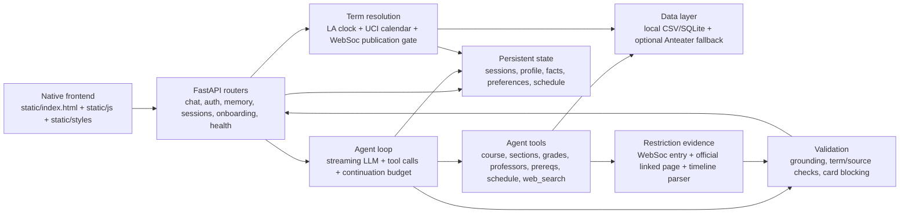

# UCI Course Advisor

Private-beta course planning assistant for UCI students. It combines a FastAPI backend, a streaming tool-using agent, local UCI catalog data, persistent sessions/memory, validation, and a native HTML/CSS/JS frontend.

This project is not an official UCI advisor, degree audit, or enrollment system. It can help explore course options, but students must verify requirements, prerequisites, deadlines, and enrollment decisions with official UCI sources and academic advisors.

## Current capabilities

- Streaming chat through `/api/chat/stream` with SSE events, tool chips, limit-reached continuation, and persisted history.
- Tool-backed course, section, professor, grade, prerequisite, policy, and schedule-conflict lookups.
- Controlled `web_search` agent tool with source classification, default-off safety, fake-provider tests, and markdown citations for web-sourced facts.
- Fixed WebSoc restriction evidence pipeline: the backend follows query-relevant official links, parses cross-row timelines, selects dates/scopes/exceptions deterministically, and validates every restriction claim before display.
- Expandable fetch audit under restriction tool chips showing each real GET/POST request, response status, byte count, source role, depth, and whether it supplied the final facts.
- Structured recommendation cards with validation before they can be added to the weekly schedule.
- Backend-owned automatic term resolution with conversation-level auto/pinned memory, a read-only term display, and canonical `YYYY Quarter` values.
- Cross-term schedules: every entry keeps its own term, overlaps are non-blocking, and the same course/section can coexist across terms.
- Authenticated sessions, isolated guest identities, onboarding, profile memory, preferences, and cross-session restoration.
- Local catalog coverage manifest that distinguishes `complete`, `partial`, `stale`, and `unavailable` data.
- Private-beta hardening: rate limits, production cookie/CSRF defaults, no shared writable demo user in production, and traceable logs.
- Health and observability endpoints: `/health/live`, `/health/ready`, `/health/metrics`.

## Architecture



## Directory structure

```text
.
├── main.py                         # FastAPI app, middleware, router registration
├── Procfile                        # Production-style startup command
├── requirements.txt                # Runtime dependencies
├── requirements-dev.txt            # Runtime + test/data-script dependencies
├── app/
│   ├── agent/                      # Tool-calling agent loop and tool schemas
│   ├── auth/                       # Auth store, cookies, guest identity, rate limits
│   ├── catalog/                    # Term parsing, local catalog loaders, coverage manifest
│   ├── data/                       # Course/professor/grade/session data access
│   ├── llm/                        # DeepSeek OpenAI-compatible adapter
│   ├── memory/                     # Profile, facts, preferences, and session memory
│   ├── routers/                    # API routers including health endpoints
│   ├── scheduling/                 # Schedule conflict and bundle validation service
│   ├── terms/                      # Canonical parsing, automatic state, sync, and conversation terms
│   └── validation/                 # Grounding validators and validation log
├── data/
│   ├── uci/                        # Versioned local catalog CSVs
│   ├── professor/                  # Professor/review data
│   └── uci_general/                # General UCI requirements data
├── scripts/                        # Data import, verification, smoke, and migration scripts
├── static/
│   ├── index.html
│   ├── js/                         # Frontend modules
│   └── styles/                     # CSS tokens and components
└── tests/                          # Offline pytest suite and fixtures
```

## Requirements

- Python `3.14.4` (see `.python-version`)
- `pip`

## Install

```bash
python -m venv .venv
source .venv/bin/activate
python -m pip install --upgrade pip
python -m pip install -r requirements-dev.txt
cp .env.example .env
```

For production/runtime-only installs, use `requirements.txt` instead of `requirements-dev.txt`.

## Environment variables

`.env.example` lists the supported variables and safe local defaults. Important variables:

- `APP_ENV`: `development`, `test`, or `production`.
- `AUTH_SESSION_SECRET`: required in production; use a long random value generated outside the repo.
- `DEEPSEEK_API_KEY`, `DEEPSEEK_BASE_URL`, `DEEPSEEK_MODEL`: enable live LLM mode.
- `ANTEATER_API_KEY`: optional external UCI API fallback.
- `TERM_STATE_PATH`: runtime-only automatic-term cache; defaults to `data/runtime/term_state.json`.
- `WEB_SEARCH_ENABLED`, `WEB_SEARCH_PROVIDER`, `WEB_SEARCH_API_KEY`, `WEB_SEARCH_MAX_RESULTS`, `WEB_SEARCH_TIMEOUT_SECONDS`: controlled web-search mode. Development defaults to `WEB_SEARCH_ENABLED=true` and `WEB_SEARCH_PROVIDER=duckduckgo`; production defaults to disabled unless explicitly enabled. Tests force offline fake/disabled modes.
- `RESEND_API_KEY`, `RESEND_FROM_EMAIL`, `RESEND_SUBJECT`: optional email verification delivery.
- `ALLOW_SHARED_DEMO`, `ALLOW_GUEST_USERS`, `COOKIE_SECURE`, `CSRF_PROTECTION`, `ALLOWED_ORIGINS`, `ALLOW_CUSTOM_SYSTEM_PROMPT`: private-beta safety switches.
- `LLM_INPUT_USD_PER_1K`, `LLM_OUTPUT_USD_PER_1K`: optional estimated cost rates for observability logs.

Do not commit `.env`, API keys, auth databases, verification codes, cookies, or runtime memory data.

## Data preparation

The repository includes local data for offline development and tests:

- `data/uci/*.csv` for catalog/course/section data.
- `data/professor/*` for local professor/review lookup.
- `data/uci_general/*` for general UCI requirement helpers.

Current catalog coverage:

| Term | Status | Notes |
|---|---|---|
| Spring 2025 | complete | Local section data available. |
| Spring 2026 | complete | Local section data available. |
| Fall 2026 | partial | Only partial local section coverage; answers must not treat missing rows as definitive no-offering facts. |

Useful checks:

```bash
python scripts/smoke_test.py
python scripts/verify_data.py sections CS161 "Spring 2025"
python scripts/verify_db.py
```

Network/data refresh scripts exist under `scripts/`, but default tests and offline development do not require live API access.

### Automatic term state

The backend is the sole term authority. It combines the Los Angeles clock, UCI instruction dates from Anteater `calendar/all`, the Week 2 Friday 17:00 cutoff, the published WebSoc term list, and a non-empty department-level WebSoc probe. The probe checks a small sequence of common departments and stops after the first course with a section, avoiding a multi-megabyte all-department payload. Automatic selection advances only through Fall, Winter, and Spring; Summer remains available for explicit queries.

Successful state is refreshed after 30 days and remains usable as last-known-good data for 45 days. If an older cache cannot refresh, the API and UI explicitly report the versioned `code_fallback` term. The JSON store uses atomic replacement and a process-local lock. Multi-process production deployments must replace the store/lock boundary with shared storage and a distributed lock before relying on one global sync writer.

The browser-facing `/api/term-state` response intentionally contains only `automatic_term`, `source`, and `status`; detailed timestamps, cache age, availability evidence, fallback state, and transitions remain available through the health endpoints. Static asset URLs are versioned and revalidated so a new HTML shell cannot run against an older JavaScript bundle.

Whole-catalog course data is loaded only when the onboarding course picker needs it. The default system prompt is likewise loaded only when Settings opens. Agent web activity is recorded as compact audit events: each real request logs its URL, method, status or error, byte count, duration, `cache_hit=false`, and trigger, followed by a deduplicated fetched-URL summary. Page bodies, extracted passages, restriction fields, and complete tool results are not written to logs.

Run the read-only live source check manually (it is excluded from default CI):

```bash
python scripts/smoke_term_state.py
python scripts/smoke_term_state.py --term "2026 Fall"
```

### Restriction evidence pipeline

Questions about major/school restrictions, New Only restrictions, course-specific restrictions, and related enrollment rules always enter through the Registrar WebSoc workflow. The workflow submits the real WebSoc department query, reads only query-relevant links explicitly published in the returned comments, and follows a tightly allowlisted second hop only when required fields are still missing.

Fetched HTML is cleaned into ordered headings, paragraphs, lists, tables, and links. A sequential parser binds department, date, time, action, audience, course scope, and exceptions into typed events using the `America/Los_Angeles` timezone. A completeness gate then marks the evidence `verified`, `partial`, `conflicting`, or `unavailable`; missing or conflicting data is never converted into a guessed date.

The backend—not the LLM—renders the primary restriction type, effective time, related-but-different restrictions, eligibility, exceptions, and source URLs. The LLM may add at most a short explanation or next-step question. `RestrictionClaimValidator` checks its text against the evidence bundle and replaces unsupported dates, type substitutions, eligibility claims, omitted exceptions, or unfetched URLs with the deterministic fact block.

The frontend’s restriction tool chip expands to the exact requests made during that turn. The compact audit is persisted with the assistant turn, so restored sessions show the same request list without fetching the websites again.

Run the read-only M14 live checks manually (excluded from default CI):

```bash
python scripts/smoke_restriction_evidence.py \
  --term "2026 Fall" \
  --department "I&C SCI" \
  --restriction-type school_major \
  --expect-primary "2026-09-18T12:00:00-07:00" \
  --expect-related "new_only=2026-09-01T12:00:00-07:00" \
  --expect-exception "I&C SCI 139W"

python scripts/smoke_restriction_evidence.py \
  --term "2026 Fall" \
  --department "I&C SCI" \
  --restriction-type new_only \
  --expect-primary "2026-09-01T12:00:00-07:00" \
  --expect-related "school_major=2026-09-18T12:00:00-07:00"
```

The product uses data from [Anteater API](https://icssc.link/about-anteaterapi), maintained by the ICS Student Council. Its attribution policy requires credit in relevant query and data-display contexts; the app keeps that credit in the persistent sidebar and Schedule footers. Anteater data is derived from public UCI sources, but should still be verified against official UCI systems for enrollment decisions.

## Run

Development:

```bash
python -m uvicorn main:app --reload --port 8000
```

Then open `http://127.0.0.1:8000`.

Production-style command:

```bash
python -m uvicorn main:app --host 0.0.0.0 --port "${PORT:-8000}"
```

`Procfile` uses the same startup command.

## Test and CI

Run the offline suite:

```bash
python -m pytest
```

Local CI-equivalent checks:

```bash
python -m compileall app main.py scripts tests
python -m pip check
python -m pytest
```

Default tests block external network and real LLM calls. Manual live integration tests are marked `live`/`manual` and are not part of default CI.

GitHub Actions runs install, syntax lint, dependency graph validation, and offline tests from `.github/workflows/ci.yml`.

## Runtime modes

- Offline mode: no API keys. The app uses local data, deterministic fallbacks, and test doubles. This is the default development/test mode.
- External API mode: Anteater term-state sync and live UCI fallback can run without a key under the shared quota; set `ANTEATER_API_KEY` for a dedicated rate limit. Partial/stale local data is surfaced as uncertain instead of silently overruled.
- Controlled web search: development can use `WEB_SEARCH_PROVIDER=duckduckgo` without an API key. `WEB_SEARCH_PROVIDER=fake` is the deterministic provider for offline tests/dev fixtures; unimplemented paid providers fail closed with a structured `provider_unimplemented` response. Web search results are never written into the local DB and are labeled with URL, domain, retrieved date, source class, and trust level.
- Live LLM mode: set `DEEPSEEK_API_KEY`. The adapter uses an OpenAI-compatible DeepSeek endpoint and streams through the agent loop.
- Email delivery: set `RESEND_API_KEY` and sender variables. Without this, development can still exercise auth flows without logging verification codes.

## Correctness boundaries

- The assistant is strongest for catalog, schedule, prerequisite, professor, and course-planning questions covered by the local data and implemented tools.
- Local DB/tool data is the default highest-trust source. Web-sourced facts must be linked and shown separately; complete local DB data is not overridden by external web pages unless the answer explicitly describes the conflict.
- Restriction dates, types, scopes, exceptions, eligibility, and cited URLs come only from the typed restriction evidence bundle; the LLM is an explanation layer, not a fact source.
- Degree Audit is not implemented. Major requirement support is limited and should not be treated as official degree certification.
- `partial`, `stale`, and `unavailable` coverage states mean the assistant must say it cannot confirm a fact rather than inventing certainty.
- Web source classes are `official_uci`, `official_university`, `government`, `professor_page`, `rmp`, `reddit`, `commercial`, `news`, and `unknown`. Reddit/forum/social results are anecdotal, and any web claim without a URL is not usable as a factual source.
- Recommendation cards are validation-gated, but validation is not a substitute for official UCI enrollment rules.
- Always verify add/drop deadlines, restrictions, prerequisites, waitlists, exams, and degree progress through official UCI systems.
