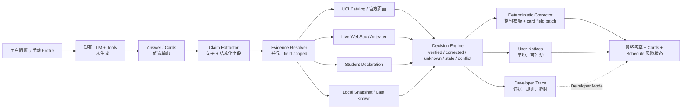

# UCI Course Advisor Roadmap

> 更新日期：2026-08-14
>
> 当前目标：M17「多学期简写、严格 Term Guard 与官方 WebSoc 历史开课链路」已完成。
>
> 执行规则：严格按阶段推进。每一阶段通过验收后，再进入下一阶段；README 在全部工程调整完成后最后更新。

## 1. 当前定位

项目已经完成 M0-M14 的主要产品、联网搜索、WebSoc workflow、统一学期上下文、跨学期 Schedule 与 restriction evidence pipeline。M15 Check 方案已归档，不进入 V1。M16 保留 M13 的 automatic term、canonical parsing、数据发布门禁和跨学期 Schedule，同时已用“稳定 `default_term` + 临时 `query_terms`”取代由聊天内容驱动的 `auto/pinned` 切换与只读 term UI。

### 已实现

- [x] FastAPI 后端和 SSE 流式聊天
- [x] Agent loop、工具调用、调用预算、错误降级和继续生成
- [x] 课程、section、教授、成绩、先修、政策和冲突查询工具
- [x] `propose_recommendation` 结构化推荐卡片
- [x] 可点击课程卡片和 Weekly Schedule
- [x] 邮箱验证码注册、密码登录和 Session Cookie
- [x] Onboarding、Profile、跨会话记忆和会话历史
- [x] 本地课程、section、教授评价和专业要求数据
- [x] Catalog、Provenance 和基础 Validation 框架
- [x] Controlled web search、agentic deep search 和 run 内 URL 去重
- [x] Anteater live availability 与 WebSoc restriction 固定 workflow
- [x] Developer-authored workflow registry 和公共 deep-search trace history

### M13 已完成

- 后端 `TermResolutionService` 统一 automatic、conversation、query 与 tool term。
- Anteater calendar/WebSoc 发布门禁、30/45 天缓存和显式 fallback 已落地。
- conversation 支持可持久化的 `auto/pinned` 语义与幂等旧数据迁移。
- 前端 term selector 已替换为只读 conversation term。
- Schedule entry 自带 canonical term，支持跨 term 展示、去重、删除和非阻断 overlap。
- M13 默认离线回归与手工真实 Anteater smoke 均有可重复验收路径。

### M14 已完成

- restriction linked page 的跨行日期、时间、类型、范围和例外现已形成结构化证据。
- M14 保留 M10–M12 的固定 WebSoc 入口，并补齐查询分类、正文分块、时间线解析、证据门禁、事实校验和抓取 URL 可见性。
- 程序负责抓取和确定限制类型、日期、适用对象、例外与来源；LLM 只负责简短解释，未验证事实会被阻断并由确定性答案替换。

### M16 已完成

- conversation 使用稳定的 `default_term`；`auto` 只随系统时间与发布状态更新，`manual` 只由用户通过 selector/API 修改。
- 用户问题只生成本轮 `query_terms`，不能修改 `default_term` 或 `term_mode`。
- 每轮向 Agent 注入 Claude 风格的结构化 runtime context；XML 只负责分隔语义，后端 tool guard 才是 term 正确性的最终保障。
- 前端恢复 conversation 级 term selector，并同时显示默认学期与本轮查询学期。
- selector 显示与 mutation API 使用同一 WebSoc 发布口径；Profile 全课程列表改为本地优先、重启可复用缓存，消除了冷启动的串行全量 API 抓取。

### V1 应答链路

- Agent/LLM 的 token 直接流向前端，不再缓存整段回答等待 Check。
- 不再二次改写正文、插入句子 badge、修改推荐卡片或返回 validation report。
- 应答模板强制跟随用户语言，并要求课程事实来自本轮工具结果；不确定内容就地说明。
- Markdown 表格由 Agent 一次生成并直接渲染，后处理不再向表格行中插入标记。
- Schedule 的时间冲突和手动实时刷新继续保留；它们是规划功能，不是答案 Check。

## 2. M13 已完成目标、M16 取代范围与非目标

### 已完成目标

完成以下结果后，系统不再依赖用户手工维护全局学期：

1. 后端根据 UCI calendar、Week 2 Friday 和 Anteater WebSoc 发布状态确定 automatic term。
2. conversation 使用独立、可持久化的 `auto/pinned` term memory。
3. chat、workflow、agentic、catalog、validation 和 schedule 使用同一个 effective term。
4. 前端删除全局 selector，只显示 conversation 对应的只读 canonical term。
5. Schedule entry 保存自己的 term，并允许所有时间 overlap 非阻断加入。
6. 同步、缓存、stale 和 fallback 行为有离线自动化测试及可观测性。

### M16 取代的 M13 语义

以下内容只保留为 M13 历史记录，不再代表 M16 完成后的产品契约：

1. 用户在问题中明确提到一个学期并成功回答后，conversation 自动变为 `pinned`。
2. 相对学期查询、工具成功结果或 validation 结果可以提交 conversation term change。
3. 顶部 term 只能只读展示，用户不能通过 selector 明确修改默认学期。
4. `term`、`effective_term`、`planning_term`、`discussion_terms` 与 `query_terms` 同时承担默认状态和本轮查询状态。

M16 完成后：

1. `default_term` 是 conversation 稳定默认值。
2. `query_terms` 是本轮临时查询范围。
3. 只有 term selector/API 可以把 conversation 切到 `manual` 或恢复 `auto`。
4. Chat、Agent、LLM、tool、回答成功/失败和数据是否可用均无权修改 `default_term`。

### 暂不开发

- 协同过滤
- 教授联网搜索
- 自动生成完整多学期 Degree Plan
- 全部 87 个专业的 Degree Audit
- Waitlist 实时提醒
- React/Vue/Svelte 全量重写
- PostgreSQL 迁移
- 新导航页面、主题和动画扩展

这些功能等私测稳定、产生真实用户反馈后再评估。

## 3. 执行总览

| 阶段 | 目标 | 预计工作量 | 前置依赖 |
|---|---|---:|---|
| M0 | 冻结当前基线 | 0.5–1 天 | 无 |
| M1 | 建立自动化安全网 | 2–4 天 | M0 |
| M2 | 统一 Session 与 Memory | 3–5 天 | M1 |
| M3 | 建立可靠的课表约束层 | 3–5 天 | M2 |
| M4 | 修正数据、先修与 Validation | 4–7 天 | M1、M3 |
| M5 | Agent 主链切换与旧代码清理 | 3–5 天 | M2–M4 |
| M6 | 前端收敛与性能优化 | 4–7 天 | M5 |
| M7 | 私测安全与工程化 | 3–5 天 | M1–M6 |
| M8 | Roadmap 收尾与 README | 1 天 | M7 |
| M9 | 联网搜索与证据链 | 4–7 天 | M4、M5、M7 |
| M10 | Live WebSoc 与专业限制 Workflow | 已完成 | M9 |
| M11 | Agentic Deep Search 与 Workflow Registry | 已完成 | M9、M10 |
| M12 | WebSoc Restriction Workflow 可靠性 | 已完成 | M10、M11 |
| M13 | 自动学期上下文与跨学期 Schedule | 已完成 | M2–M7、M10–M12 |
| M14 | Restriction Evidence Pipeline 可靠性改造 | 已完成 | M10–M13 |
| M15 | 非阻断式 Data Check 与确定性局部纠正 | 已归档，不进入 V1 | M4、M7、M13、M14 |
| M16 | 稳定默认学期、显式 selector 与临时查询范围 | 已完成 | M13、M14、V1 scope |

工作量按 1 名开发者估算，不是发布日期承诺。

## 4. M0 — 冻结当前基线

目标：先保护当前跨 Agent、政策和 UI 的大规模修改，避免清理过程中丢失有效工作。

### 任务

- [x] 将运行生成的数据与源码改动分开：用户 memory、turn log、auth DB、grade cache、教授 summary。
- [x] 把可复用 demo fixture 移到明确的 `tests/fixtures/` 或 `data/demo/`。
- [x] 检查 `.gitignore`，确保真实用户运行数据不会进入提交。
- [x] 保存当前代码 checkpoint，不在同一个提交中混入后续重构。
- [x] 记录当前可演示流程：注册、onboarding、发送消息、生成卡片、加课、继续生成、恢复会话。
- [x] 记录当前已知失败场景，作为 M1 characterization tests 的输入。

### 验收

- [x] `git status` 中不再混有真实用户运行数据。
- [x] 当前功能有可回退的代码 checkpoint。
- [x] 后续每个重构阶段可以独立提交和回滚。

基线记录见 [`docs/m0-baseline.md`](docs/m0-baseline.md)。

## 5. M1 — 建立自动化安全网

目标：在删除旧代码前固定当前正确行为，并让错误路径可以重复验证。

### M1.1 测试基础设施

- [x] 引入 `pytest`、FastAPI TestClient 和覆盖率配置。
- [x] 测试默认禁止外网访问和真实 LLM 调用。
- [x] 建立 fake LLM client，支持 token、tool call、error 和 limit reached 事件。
- [x] 建立最小课程、section、profile、memory 和 session fixture。
- [x] 修复 smoke 脚本必须手动设置 `PYTHONPATH=.` 才能运行的问题。
- [x] 将 live API / live LLM 测试标记为手动测试，不进入默认 CI。

### M1.2 第一批 Characterization Tests

- [x] 新会话第一轮到第二轮状态连续。
- [x] 已登录用户只能读取自己的 session 和 memory。
- [x] Profile 可以加载到聊天上下文。
- [x] 记忆新增、删除、进程重启后结果一致。
- [x] Agent tool call、错误降级、limit reached 和 continue 协议稳定。
- [x] 推荐卡片能够通过 SSE meta 持久化并在历史会话中恢复。
- [x] Schedule add/remove/clear 的当前行为被固定。
- [x] Spring 2025 离线 smoke 校验能够识别不存在的课程与教师。

### 验收

- [x] 一条命令可以执行全部离线测试。
- [x] 测试不需要 API key、不调用 Anteater、不调用真实 LLM。
- [x] 核心测试失败时返回非零退出状态。
- [x] 后续 M2–M6 的每个 bug 修复先增加失败测试，再修改实现。

## 6. M2 — 统一 Session 与 Memory

目标：消除最容易导致用户数据丢失和状态漂移的重复存储。

### M2.1 修复立即存在的状态错误

- [x] 修复 `load_student_into_session()` 对 `get_student_profile()` envelope 的错误读取。
- [x] 新会话创建 `sess_xxx` 后，当前请求立即切换到该 ID；禁止使用空字符串保存第一轮状态。
- [x] `ChatRequest.student_id` 不再参与身份判断，身份只来自签名 Cookie。
- [x] Pydantic list/dict 默认值改用 `Field(default_factory=...)`。

### M2.2 选择唯一 Session 真相源

- [x] 以 `app/data/sessions.py` 为持久化 Session repository。
- [x] Session state 增加 term、当前规划偏好和 pending schedule。
- [x] 聊天历史只保存在 `sessions/{session_id}/turns.jsonl`。
- [x] 移除 Memory 中重复的完整 `turn_log.jsonl` 和 session-end history snapshot。
- [x] 完成数据迁移后删除 `app/modules/state.py::_sessions`。
- [x] 删除 `demo_session` 到 persistent session 的临时映射逻辑。

### M2.3 统一 Memory schema

- [x] Profile、facts、preferences 只通过 MemoryRepository 读写。
- [x] Router 不再直接读写 JSON 文件，避免绕过 provider cache。
- [x] `facts.json` 统一为一个确定的数据结构，不再同时按 list 和 dict 解释。
- [x] preference 统一为 `{id, text, learned_at, last_confirmed_at}`。
- [x] `add_preference()` 不再写入裸字符串。
- [x] 修复 preference 单条删除和 size-limit 计算。
- [x] 用户新陈述与旧偏好冲突时，以新陈述为准并更新时间。

### 验收

- [x] 新会话第一轮保存的信息在第二轮仍然存在。
- [x] 服务重启后 term、profile、history 和 pending schedule 不丢失。
- [x] 删除 preference 后重启服务不会重新出现。
- [x] 同一轮对话不再保存三份完整副本。

## 7. M3 — 建立可靠的课表约束层

目标：推荐卡片和课表使用同一套确定性约束逻辑。

### M3.1 合并重复实现

- [x] 以 `app/modules/conflict.py` 或新建 `app/scheduling/` 作为唯一 scheduling domain service。
- [x] Agent tool、推荐卡片和 Schedule API 全部调用同一个日期/时间解析器。
- [x] 删除 `app/agent/tools.py` 中重复的 `_parse_days/_parse_time/_section_overlap`。
- [x] 删除 `chat.py` 中重复的 `_parse_days`。
- [x] 删除 `modules/query.py` 中永远返回“无冲突”的 placeholder。
- [x] 统一 Mon–Sun 编码，明确 TBA 的 unknown 状态。

### M3.2 实现 Schedule Bundle Validation

- [x] 新增 `validate_schedule_bundle()`。
- [x] 检查推荐课程之间的上课时间冲突。
- [x] 检查推荐课程与 pending schedule 的冲突。
- [x] 检查 final exam 冲突。
- [x] 检查 Lec/Dis/Lab pairing 是否完整。
- [x] 检查 cancelled、FULL、waitlist 和 section restriction。
- [x] 返回结构化结果：`valid / warnings / conflicts / unknowns`。
- [x] `propose_recommendation` 和 `/schedule/add` 同时调用该服务。

### M3.3 持久化与权限

- [x] Schedule API 使用当前认证用户验证 session ownership。
- [x] pending schedule 写入持久化 Session。
- [x] Add 操作遇到硬冲突时要求确认，不静默加入。
- [x] Lec/Dis/Lab 不完整时不允许展示为可执行完整课表。

### 验收

- [x] 同一组输入在 Agent 推荐和手动加课时得到相同冲突结果。
- [x] 重启和切换会话后课表保持一致。
- [x] 无法通过猜测 session ID 修改其他用户课表。
- [x] TBA 不被误报为“无冲突”，而是明确显示 unknown。

## 8. M4 — 修正数据、先修与 Validation

目标：让“有数据”“没开课”和“数据不完整”成为不同状态。

### M4.1 Catalog 本地化

- [x] `UCIRelationalLoader` 加载 `courses.csv`。
- [x] CourseRecord 填充 title、units、description、level、restriction 和 prerequisite tree。
- [x] `get_course_info()` 优先返回本地课程元数据，Anteater 只作为 fallback。
- [x] 修复 loader 跳过坏 section 后 `zip(section_rows, sections)` 可能错位的问题。
- [x] `search_courses()` 使用稳定排序，不再从 set 产生不确定顺序。
- [x] 对常用课程信息增加进程内 cache 和批量 enrich 接口。

### M4.2 Prerequisite Engine

- [x] 使用现有 `prerequisite_tree_json`，不再使用 flat list 直接判断。
- [x] 支持 AND、OR、corequisite 和 minimum grade。
- [x] 明确当前学期 in-progress 是否可以满足目标学期先修。
- [x] 返回 `met / not_met / unknown` 三态。
- [x] 查询失败时不再默认 `prereq_met=True`。
- [x] 推荐卡片显示具体缺失分支和 unknown 原因。

### M4.3 数据覆盖和新鲜度

- [x] 为每次数据构建生成 manifest：term、记录数、部门覆盖、来源、更新时间、schema version。
- [x] 学期状态统一为 `complete / partial / stale / unavailable`。
- [x] 将当前 Fall 2026 标记为 partial，禁止将 452 条数据视为完整学期。
- [x] `/api/terms` 返回 coverage status，不只返回名称。（历史实现；M13 收尾后旧 selector 接口已移除。）
- [x] 前端 term selector 显示 partial/stale 标识。
- [x] API 失败时区分“没有开课”和“无法确认”。

### M4.4 主 Agent Validation

- [x] Agent 最终文本和结构化 cards 都进入 Validation。
- [x] 删除使用其他学期 catalog 验证当前学期回答的 fallback。
- [x] 验证课程、section code、教师、时间、seat、政策日期和 tool provenance。
- [x] 错误卡片禁止进入 Schedule。
- [x] 实现明确的 KEEP、ANNOTATE、REMOVE、BLOCK 行为。
- [x] Validation 输出写入 session turn，历史恢复时可重现。

### 验收

- `MATH 3A or MATH H3A` 完成其中一门即可通过先修。
- 先修数据缺失时显示 unknown，不显示已满足。
- partial 学期的空结果不会被回答为“确定不开课”。
- 所有 section code、时间、教师和政策日期都能回溯到 tool result 和数据版本。

## 9. M5 — Agent 主链切换与旧代码清理

目标：只保留一套聊天业务逻辑，缩小维护面。

### M5.1 唯一聊天入口

- [x] `/api/chat/stream` 成为唯一产品聊天入口。
- [x] Agent pre-flight 失败时返回确定性的 grounded fallback，不再启动第二套 LLM 推荐流程。
- [x] 确认无外部客户端依赖后，弃用并删除非流式 `/api/chat`。
- [x] Intent 结果不再控制主链路，只保留必要的确定性 decision detection。
- [x] 删除 streaming 前串行执行的非必要 intent LLM 调用。
- [x] 将 hard-fact extraction 合并进 Agent/tool，或移动到回答后的后台任务。

### M5.2 删除 Legacy Recommendation

- [x] 删除 `_handle_recommendation()`。
- [x] 删除 `_handle_single_query()`，保留一个最小确定性单课程降级查询即可。
- [x] 删除 legacy `_build_card()`。
- [x] 删除 `modules/query.py` 的旧推荐和排序流程。
- [x] 删除 `modules/answer.py` 的模板回答。
- [x] 删除未使用的 `query_professor()` 和 `generate_professor_answer()`。
- [x] 评估 structured followup chips 是否仍需要；需要则基于 Agent/cards 重写，否则删除 `modules/followup.py`。
- [x] `clarification.py` 只保留仍被事实提取使用的部分，或整体迁移后删除。

### M5.3 统一课程号解析

- [x] 修复 `catalog/normalization.py` 的中文相邻字符边界。
- [x] 所有课程 ID 提取改用同一 canonical parser。
- [x] 删除 chat.py 和 decision detector 中重复的课程号正则/normalize 实现。
- [x] 增加 `我想选CS122A这门课`、`ICS 33`、`I&C SCI 33`、`SOC SCI 178C` 测试。

### 验收

- 聊天请求不再进入 legacy query/answer 路径。
- 代码中只保留一个课程推荐实现和一个卡片 enrich 实现。
- LLM 不可用时仍返回明确、真实、非幻觉的降级响应。
- 每轮正常请求不再先执行 intent LLM + extraction LLM + Agent LLM 三次串行调用。

## 10. M6 — 前端收敛与性能优化

目标：降低 7,500 行单文件带来的回归风险，不进行框架迁移。

### M6.1 立即清理

- [x] 删除无调用方的 `appendTyping()`。
- [x] 删除无调用方的 `appendAI()`。
- [x] 抽取统一 `consumeSSE(response, handlers)`，供 send 和 continue 共用。
- [x] 删除曾由后端 `/api/terms` 替代的静态 term 假数据 fallback；M13 后改为最小 `/api/term-state`，API 不可用时显示 unavailable。
- [x] JavaScript 颜色从 CSS custom properties 读取，不再维护第二份 hardcoded palette。

### M6.2 模块拆分

- [x] `styles/tokens.css`
- [x] `styles/components.css`
- [x] `js/api-client.js`
- [x] `js/chat.js`
- [x] `js/cards.js`
- [x] `js/schedule.js`
- [x] `js/sessions.js`
- [x] `js/auth.js`
- [x] `js/profile-memory.js`
- [x] `js/onboarding.js`
- [x] 保留原生 HTML/CSS/JS，不在本阶段引入 React/Vue/Svelte。

### M6.3 浏览器回归

- [x] 覆盖登录、onboarding、发送消息、tool chip、卡片、加课、继续生成和会话恢复。
- [x] 增加移动端、键盘焦点、对比度和基础 screen-reader 检查。
- [x] 历史消息与实时消息共用同一个 card/followup/validation renderer。

### 验收

- 业务 JavaScript 不再集中在单个 HTML 文件。
- send/continue 不再重复解析 SSE。
- 登录到生成可执行课表的核心路径有浏览器自动化覆盖。
- 拆分前后主要界面截图无非预期差异。

## 11. M7 — 私测安全与工程化

目标：达到可以邀请真实用户测试的最低安全和运维标准。

### M7.1 安全

- [x] 公开环境禁用共享可写的 `demo_001`；Guest 使用隔离、可过期的临时身份。
- [x] Schedule、Memory、Session 写接口统一验证用户身份和 ownership。
- [x] 登录、验证码和 LLM 请求增加 rate limit。
- [x] 生产 Cookie 开启 `Secure`，增加 Origin/CSRF 防护。
- [x] 生产密钥必须来自环境变量，禁止自动生成本地 fallback。
- [x] 自定义 system prompt 和 `/api/system_prompt` 仅在开发模式或管理员模式开放。
- [x] 日志禁止记录密码、验证码、Cookie 和不必要的完整个人资料。

### M7.2 依赖与 CI

- [x] 补全运行依赖：FastAPI、LLM client、requests、bcrypt、itsdangerous 等。
- [x] 单独声明开发/数据脚本依赖：pytest、python-dotenv、openpyxl、beautifulsoup4 等。
- [x] 固定 Python 版本和启动命令。
- [x] GitHub Actions 执行安装、lint、离线测试和最小构建验证。
- [x] 增加 `.env.example`，只列变量名和说明，不包含真实密钥。

### M7.3 可观测性

- [x] 增加 `/health/live` 和 `/health/ready`。
- [x] 每个请求生成 trace ID，串联路由、Agent、tools、data source 和 SSE 结束状态。
- [x] 记录首 token 延迟、总延迟、tool failure、limit reached、LLM token 和成本。
- [x] 数据 partial/stale、刷新失败和外部 API 限流产生明确日志与告警。

### 验收

- 核心 CI 在干净环境通过。
- 无有效身份无法修改其他用户数据。
- 任意私测报错可以通过 trace ID 定位到具体 tool 和数据版本。
- 高风险安全问题为 0 后才开放真实用户私测。

## 12. M8 — 文档收尾

文档必须描述已经落地的实现，不能提前承诺尚未完成的架构。

### M8.1 更新本 Roadmap

- [x] 将已完成任务打勾。
- [x] 为每个阶段记录完成日期、commit/PR 和验收结果。
- [x] 将私测反馈转换成下一阶段计划。
- [x] 再决定多学期规划、Degree Audit、提醒和个性化的优先级。

### M8.2 README 最后更新

- [x] 删除 “Initial Demo”、mock data 和 placeholder 等过时说明。
- [x] 更新真实架构图和目录结构。
- [x] 写清 Python 版本、安装、环境变量、数据准备、启动和测试命令。
- [x] 区分离线模式、外部 API fallback 和 live LLM 模式。
- [x] 说明支持的学期、专业范围和正确性边界。
- [x] 说明项目不是 UCI 官方 advisor，不能替代正式学业审核。

### 私测反馈转下一阶段计划

当前仓库内没有已记录的真实私测用户反馈；因此下一阶段先把 M7 暴露出的私测风险转成反馈闭环，而不是直接扩功能：

1. P0 — 私测运行闭环：收集 trace ID、失败截图、用户问题、term、coverage status 和 validation action；每个高风险反馈必须归类为数据缺失、工具错误、LLM 行为、前端交互或认证/权限问题。
2. P0 — 正确性修复：优先处理会导致错误课程/错误 section/错误可加课状态的反馈。
3. P1 — 多学期规划：在现有 session state、term coverage 和 schedule validation 稳定后再扩展跨 term plan。
4. P2 — Degree Audit：只有在 major requirement 数据结构、官方来源和 unknown 语义稳定后启动；不能把当前 CS/GE helper 伪装成完整 audit。
5. P3 — 提醒和个性化：在认证、隐私、通知偏好和数据保留策略明确后再做。

### 验收

- 新开发者只按 README 可以在干净环境启动应用并运行离线测试。
- README、代码、应用版本和 Roadmap 状态一致。

## 13. M9 — 联网搜索与证据链

目标：当本地数据库没有信息、数据不完整、或用户明确要求联网时，Agent 可以调用受控搜索工具；但所有联网信息必须和本地数据库信息分层展示，不能让用户误以为外部网页等同于数据库验证。

本阶段不做 Future Planning，不扩 Degree Audit。重点只解决问答式体验中的“数据库没有覆盖的问题怎么回答”和“用户如何知道信息来源”。

### M9.1 搜索触发规则

- [x] 新增 Search Skill / prompt block，明确什么时候允许调用搜索工具。
- [x] 允许搜索的情况：
  - 用户明确要求“上网查 / search / look up / 最新信息”。
  - 本地 DB tool 返回 `found=false`。
  - term coverage 是 `partial / stale / unavailable`。
  - 问题依赖近期变化：deadline、department restriction、department announcement、政策更新、教授页面。
  - 用户问的是本地数据库之外的信息，例如 department 网页、官方 announcement、外部教授评价。
- [x] 不应搜索的情况：
  - 本地 DB 已经确认事实，且 coverage 是 `complete`。
  - 普通推荐流程已有足够本地数据。
  - 只是为了让回答看起来更丰富。
  - 每轮默认搜索。
- [x] Agent 必须先使用本地 DB 工具；只有触发条件满足时才调用 web search。
- [x] 如果用户显式要求联网，则即使 DB 有结果，也可以搜索，但回答必须分别标注 DB 与 Web。

### M9.2 新增后端搜索工具

- [x] 新增 `app/data/web_search.py`。
- [x] 工具名使用 `web_search`，不使用 `web_search_official`，因为允许全网搜索。
- [x] 第一版搜索 API 只返回网页搜索结果，不做浏览器深度抓取。
- [x] 每次调用必须记录：
  - `query`
  - `reason`
  - `searched_at`
  - `max_results`
  - `preferred_domains`
  - `results`
- [x] 返回结果统一结构：

```json
{
  "ok": true,
  "query": "ART department major restriction release date UCI",
  "reason": "local policy data does not contain department-specific restriction release timing",
  "searched_at": "2026-07-05T00:00:00Z",
  "results": [
    {
      "title": "string",
      "url": "https://...",
      "domain": "uci.edu",
      "snippet": "string",
      "published_at": null,
      "source_class": "official_uci",
      "trust_level": "high",
      "why_trusted_or_not": "UCI official domain"
    }
  ]
}
```

- [x] 搜索失败时返回结构化错误，不抛出导致整轮 Agent 崩溃。
- [x] 搜索结果数量默认限制为 5，避免把大量不可靠网页塞进上下文。
- [x] 搜索请求加 rate limit 和 trace log。

### M9.3 来源分类与可信度规则

- [x] 新增 source classifier，将每个 URL 分类为：
  - `local_db_verified`
  - `official_uci`
  - `official_university`
  - `government`
  - `professor_page`
  - `rmp`
  - `reddit`
  - `commercial`
  - `news`
  - `unknown`
- [x] 可信度排序写入代码与 prompt：

```text
local_db_verified
> official_uci
> official_university / government
> professor_page
> external_web
> forum/social
> llm_inference
```

- [x] 默认 trust level：
  - `local_db_verified`: high
  - `official_uci`: high
  - `official_university`, `government`: medium_high
  - `professor_page`: medium
  - `rmp`: medium
  - `news`, `commercial`: medium_low
  - `reddit`, forum/social: low
  - `unknown`: low
- [x] 任何没有 URL 的 web 信息不能作为事实来源。
- [x] LLM 推断不能作为事实来源，只能作为解释或建议。

### M9.4 Agent Tool 接入

- [x] 在 `app/agent/tools.py` 增加 `web_search` tool schema。
- [x] 增加 `_tool_web_search()` dispatcher。
- [x] tool schema 参数：

```json
{
  "query": "string",
  "reason": "string",
  "preferred_domains": ["string"],
  "max_results": 5
}
```

- [x] `reason` 必填，迫使 LLM 说明为什么需要搜索。
- [x] 如果 `reason` 为空或明显无意义，后端可以拒绝或降级返回 warning。
- [x] tool result 只返回标题、URL、domain、snippet、source_class、trust_level，不返回大段网页全文。
- [x] SSE tool chip 显示“联网搜索 · query”。
- [x] observability 记录搜索次数、失败率、source_class 分布和 latency。

### M9.5 Search Skill / Prompt 硬规则

- [x] 在 Agent system prompt 中加入 Search Skill。
- [x] 规则必须明确：
  - 本地 DB 是默认最高可信来源。
  - Web 信息不能覆盖 `complete` 本地 DB，除非用户明确要求比较，并且回答必须说明冲突。
  - 如果本地 DB 是 `partial / stale / unavailable`，可以用 web 补充，但必须标为 web-sourced。
  - 如果 web 与 DB 冲突，必须同时展示双方来源和差异。
  - 不允许编 source、URL、rating、section、instructor。
  - 引用网页信息时必须附 markdown link。
  - Reddit/forum/social 只能作为 anecdotal，不可作为课程是否开设、政策 deadline、教授授课安排的事实依据。
- [x] 对教授评分增加规则：
  - 本地 professor DB/RMP snapshot 优先。
  - 外部 RMP 或其他评价网站必须标为 external。
  - 教授个人主页可用于研究方向，不可直接证明某学期授课。
- [x] 对开课信息增加规则：
  - 某 term 是否开课优先看 `get_sections(course, term)`。
  - coverage complete 且无 sections → 可以说本地确认未开。
  - coverage partial/stale/unavailable 且无 sections → 只能说本地无法确认，可联网查补充信息。

### M9.6 回答格式与引用

- [x] 如果使用 web result，回答中对应事实后必须带链接，例如：

```markdown
UCI Registrar 页面说明 add/drop deadline 由注册日历列出。[UCI Registrar](https://...)
```

- [x] 回答末尾增加可选 `Sources` 区块：

```markdown
Sources:
- Database verified: local catalog · Spring 2026 · coverage complete
- Web sourced: [UCI Registrar — Academic Calendar](https://...)
- External web: [RateMyProfessors — ...](https://...)
```

- [x] 本地 DB 信息不需要外链，但必须可显示 `Database verified`、term、coverage、updated_at。
- [x] Web 信息必须显示 `Web sourced`、domain、retrieved date。
- [x] 如果没有可靠来源，回答必须明确说“我无法验证”。

### M9.7 前端展示

- [x] 第一版先依赖 markdown link 正常渲染，不做复杂 evidence panel。
- [x] 在 tool chip 中区分：
  - 查询数据库
  - 联网搜索
  - 读取网页来源
- [x] 后续增加 source badge：
  - `DB Verified`
  - `Official UCI`
  - `Official Web`
  - `External Web`
  - `Anecdotal`
  - `Unverified`
- [x] 推荐卡片保留本地 provenance，不把 web source 混进 card 的 DB verified 字段。
- [x] 如果 card 里某个字段来自 web，字段旁单独显示 web badge。

### M9.8 DB 与 Web 冲突处理

- [x] 新增冲突表达规则：

```text
本地数据库显示：...
网页来源显示：...
判断：两者来源不同；本地 DB 用于结构化开课/section 判断，网页用于补充政策或公告。
```

- [x] complete DB 与 web 冲突：默认 DB 优先，web 作为冲突提示。
- [x] stale/partial DB 与 official web 冲突：可以引用 official web，但必须标为 web-sourced。
- [x] external web 与 DB 冲突：DB 优先，external 只能作为非官方补充。
- [x] 无法判断时返回 unknown，不做确定性结论。

### M9.9 测试计划

- [x] `web_search` tool schema 和 dispatcher 单元测试。
- [x] URL source classifier 测试：
  - `uci.edu` → `official_uci`
  - `catalogue.uci.edu` → `official_uci`
  - `reg.uci.edu` → `official_uci`
  - `ratemyprofessors.com` → `rmp`
  - `reddit.com` → `reddit`
  - 未知域名 → `unknown`
- [x] Agent 行为测试：
  - DB found + coverage complete → 不应调用 web search。
  - 用户明确要求上网 → 允许调用 web search。
  - DB missing → 允许调用 web search。
  - partial term → 允许调用 web search。
  - web result 没有 URL → 不能作为事实引用。
  - DB/Web 冲突 → 回答必须说明冲突。
- [x] 前端静态契约测试：
  - markdown link 可渲染。
  - web search tool chip 可显示。
  - source badge 不破坏现有 card。
- [x] 搜索 API 测试默认使用 fake provider，不联网，不依赖真实搜索服务。

### M9.10 配置与安全

- [x] 新增环境变量：
  - `WEB_SEARCH_ENABLED`
  - `WEB_SEARCH_PROVIDER`
  - `WEB_SEARCH_API_KEY`
  - `WEB_SEARCH_MAX_RESULTS`
  - `WEB_SEARCH_TIMEOUT_SECONDS`
- [x] 默认开发环境可以关闭 web search；关闭时 tool 返回明确 unavailable。
- [x] 生产环境必须通过环境变量显式开启。
- [x] 搜索 query 不记录完整敏感 profile；日志中截断 query 和 snippet。
- [x] 不把搜索结果自动写入本地数据库，避免污染 verified data。
- [x] 如需 cache，只 cache query/result/source/retrieved_at，并明确标为 web cache，不等于 DB。

### M9.11 最小可执行版本

第一版只要求完成：

1. `app/data/web_search.py` fake/provider interface。
2. `web_search` agent tool schema + dispatcher。
3. Search Skill prompt 规则。
4. 结果含 title/url/snippet/domain/source_class/trust_level。
5. 回答中带 markdown link。
6. fake provider 测试通过。
7. 不改变现有推荐卡片的数据可信度语义。

### 验收

- 用户明确要求联网时，Agent 可以调用 `web_search` 并在回答中附链接。
- 本地 DB 已确认的信息不会被默认 web search 覆盖。
- 所有 web 信息都显示来源 URL、domain、retrieved_at 和 trust_level。
- DB 与 Web 信息冲突时，回答明确区分双方来源。
- 搜索功能关闭时，系统不会崩溃，且会说明当前无法联网。
- 默认测试仍然不联网、不依赖真实搜索 API。

## 14. M10 — Live WebSoc 可用性与专业限制 Workflow

目标：把“课程是否还有位置 / OPEN-FULL-Waitl / waitlist / NOR / restriction code”与“专业限制什么时候解除”从通用 web search 中拆出来，做成固定、可测试、可追溯的 workflow。课程实时可用性按 AntAlmanac 的方式以 Anteater API WebSoc 数据为准；专业限制以 Registrar WebSoc department 页面为入口，并支持读取 WebSoc comments 中指向的官方部门链接。

本阶段不扩 Degree Audit，不改推荐算法目标。重点是让高风险、近期变化的问题不再依赖本地 CSV 或 agentic 搜索猜测。

状态：已在 `codex/m10-live-websoc-workflows` 分阶段实现并提交。默认测试使用 fixture/fake provider，不依赖真实网络。

### M10.1 问题分类与路由

- [x] 新增 search/workflow router，先判断用户问题是否属于固定 workflow，再决定是否交给 agentic `web_search`。
- [x] 定义 `availability` intent，覆盖：
  - 课程或 section 是否 `OPEN / FULL / Waitl`。
  - 当前 enrolled / capacity / seats open。
  - waitlist 当前人数和容量。
  - New Only Reserved / NOR 数量。
  - restriction code 当前值。
  - “现在能不能选这门课 / 还有位置吗 / waitlist 多长”。
- [x] 定义 `department_restriction` intent，覆盖：
  - major restriction 什么时候解除。
  - New Only Restrictions / NORS 什么时候解除。
  - 某学院或 department 的 add/drop/change 特殊规则。
  - “我不是这个 major，什么时候能选这门课”。
- [x] 固定 workflow 命中后默认不走 DuckDuckGo / 全网 agentic search。
- [x] 如果问题同时涉及 course availability 和 department restriction，先查 live WebSoc section，再查 department restriction workflow，并在回答中分开来源。

### M10.2 Live Availability 数据源规则

- [x] 将课程可用性问题的数据源规则改成：`live Anteater WebSoc > local cache/CSV fallback > unknown`。
- [x] 本地 CSV 不允许作为“当前还剩几个座位 / 现在 open 吗”的最终事实来源。
- [x] 当用户问普通 planning、历史 term、section 时间地点时，仍允许使用现有 DB-first `get_sections()` 逻辑。
- [x] 当用户问当前/未来 active term 的实时可用性时，必须优先调用 Anteater API WebSoc。
- [x] 如果 Anteater API 失败，可以返回本地数据作为非实时 fallback，但必须标注 `not_live` 和原因。
- [x] 如果 Anteater API 和本地 DB 冲突，availability/status/seat count 默认以 live Anteater WebSoc 为准，本地 DB 只作为对照。

### M10.3 Anteater API WebSoc 接口补强

- [x] 在 `app/data/anteater.py` 增加按 section code 查询 WebSoc 的能力，对齐 AntAlmanac/AANTS 的 `sectionCodes` 查询方式。
- [x] 保留按 `department + courseNumber + year + quarter` 查询课程 sections 的能力。
- [x] 增加 live availability 专用函数，例如 `fetch_live_sections()` 或 `fetch_sections(..., live=True)`。
- [x] live availability 返回时保留 Anteater 原始 `updatedAt` 字段。
- [x] 统一输出字段：
  - `status`
  - `max_capacity`
  - `enrolled`
  - `seats_open`
  - `waitlisted`
  - `waitlist_capacity`
  - `new_only_reserved`
  - `restrictions`
  - `updated_at`
  - `retrieved_at`
  - `source = live_anteater_websoc`
- [x] 对 `numCurrentlyEnrolled.totalEnrolled`、`maxCapacity`、`numOnWaitlist`、`numWaitlistCap`、`numNewOnlyReserved` 做安全整数解析。
- [x] `seats_open` 由 `max_capacity - enrolled` 计算；缺字段时返回 `null`，不猜。

### M10.4 5 分钟 Freshness 语义

- [x] 给 live Anteater WebSoc 查询增加 5 分钟 TTL cache，对齐 AntAlmanac 主页面的 freshness 语义。
- [x] cache key 至少包含 `year`、`quarter`、`department/courseNumber` 或 `sectionCodes`。
- [x] 用户明确说“最新 / 现在 / refresh / 重新查”时允许绕过 TTL cache。
- [x] tool result 中显示 `retrieved_at` 和 API 返回的 `updated_at`。
- [x] 回答必须说 “as of ...”，避免用户误以为 seat count 是永久事实。
- [x] 记录 cache hit/miss、API latency、non-200、rate limit 和 fallback 事件。

### M10.5 Agent Tool 接入

- [x] 新增 `get_live_sections` tool，或给现有 `get_sections` 增加 `freshness` / `mode` 参数。
- [x] 推荐方案：新增 `get_live_sections(course_id, term, section_codes?, force_refresh?)`，避免破坏已有 planning 行为。
- [x] `get_live_sections` 只回答 live availability，不用于泛化课程推荐。
- [x] `get_sections` 继续服务普通 course planning、时间冲突和 section 列表。
- [x] Agent prompt 增加硬规则：availability intent 必须调用 `get_live_sections`，不能只用本地 DB 或 web snippets。
- [x] SSE tool chip 区分：
  - `实时查询 WebSoc · COURSE TERM`
  - `查询排课 · COURSE TERM`
- [x] schedule/recommendation card 如果显示 live seat/status 字段，要标注 `live_anteater_websoc`，不能混进 DB verified provenance。

### M10.6 WebSoc Department Restriction Workflow

- [x] 新增固定 workflow：`websoc_department_restrictions`。
- [x] workflow 输入：
  - `term`
  - `department`
  - 可选 `course_id`
  - 可选 `restriction_type`，如 `major_restriction`、`nors`、`add_drop_change`
- [x] 如果用户只给 course_id，先通过本地 catalog 或 live WebSoc 解析出 department。
- [x] 如果 course_id 无法解析到 department，向用户要求 department；默认不改走 agentic search。
- [x] 固定访问 `https://www.reg.uci.edu/perl/WebSoc`，按 `YearTerm + Dept` 查询 department summary。
- [x] 请求参数中默认排除 cancelled courses，和 Registrar WebSoc 页面语义一致。
- [x] 不通过 DuckDuckGo 搜 WebSoc；URL 和参数由 workflow 构造。

### M10.7 WebSoc 页面解析

- [x] 解析 WebSoc 返回 HTML 顶部区域，而不是只解析 course sections。
- [x] 提取 `Search Criteria` 中的 department 和 cancelled-course 设置。
- [x] 提取 term registration end date，例如 “Registration for term ends on ...”。
- [x] 提取 school-level comments block，例如 `Claire Trevor School of the Arts comments`。
- [x] 提取 department-level comments block，例如 `Art department comments`。
- [x] 从 comments 中抽取常见字段：
  - add deadline
  - drop deadline
  - change grade option / variable units deadline
  - major restriction removal date/time
  - NORS removal date/time
  - waitlist policy
  - authorization-code policy
  - contact email
- [x] 不能抽取成结构化字段时，保留原始 comment text，并标注 `extraction_status = partial`。
- [x] 解析失败时返回 structured error，不让 agent 编日期。

### M10.8 WebSoc Comments 链接收集与深读

- [x] 收集 school comments 和 department comments 中出现的所有 `<a href>`。
- [x] 每个 link 记录：
  - `text`
  - `url`
  - `domain`
  - `source_block`
  - `source_url`
- [x] 只允许深读 WebSoc comments 中实际出现的链接。
- [x] 默认只深读 `*.uci.edu` 官方链接；非 UCI 链接只收集，不作为事实依据，除非后续显式允许。
- [x] 如果 WebSoc comments 已直接给出 major restriction 日期，不必深读链接。
- [x] 如果 WebSoc comments 说明 restriction details/update timeline 在链接中，必须继续 fetch 链接。
- [x] 深读链接时限制 timeout、content type、页面大小和重定向域名。
- [x] 链接正文转纯文本后，只返回必要片段和来源 URL，不把整页塞进 agent context。

### M10.9 ICS 特殊规则

- [x] 在 workflow registry 增加 ICS / I&C SCI 特例。
- [x] 对 ICS WebSoc comments 中的以下链接视为官方可深读来源：
  - `https://ics.uci.edu/course-enrollment-restrictions/`
  - `https://ics.uci.edu/academics/undergraduate-programs/majors-minors/undergraduate-student-policies/`
  - `https://ics.uci.edu/academics/graduate-academic-advising/course-updates/`
- [x] 对 undergraduate course restriction 问题，优先读取 `course-enrollment-restrictions` 或 WebSoc comments 中明确标为 Undergraduate courses 的链接。
- [x] 对 graduate course update 问题，优先读取 WebSoc comments 中明确标为 Graduate courses 的链接。
- [x] 对 general ICS policy 问题，允许读取 undergraduate student policies 链接。
- [x] 如果 ICS 链接页面与 WebSoc comments 冲突，回答必须同时列出：
  - `WebSoc comments 显示：...`
  - `ICS official page 显示：...`
  - `判断：WebSoc 是入口与本学期上下文，ICS 页面是 WebSoc 指向的官方补充。`

### M10.10 回答与引用规则

- [x] Availability 回答必须包含：
  - course/section
  - term
  - status
  - enrolled/capacity
  - seats_open
  - waitlist 信息，如存在
  - restrictions/NOR，如存在
  - `as of updated_at/retrieved_at`
  - source label `Live WebSoc via Anteater API`
- [x] Department restriction 回答必须包含：
  - term
  - department
  - WebSoc source URL
  - 如果用了 linked page，也包含 linked official URL
  - 哪些信息来自 WebSoc comments，哪些来自 linked page
- [x] 当 live data 不可用时，明确说“无法验证当前实时状态”，不能用旧 CSV 伪装成实时。
- [x] 当 WebSoc comments 没有提供 restriction timeline，回答应说“WebSoc 未列出具体解除时间”，并列出可验证来源。
- [x] 所有 web/link 来源都必须是 markdown link。

### M10.11 前端与 Tool Chip

- [x] tool chip 新增 `实时查询 WebSoc` 类型。
- [x] tool chip 新增 `读取 WebSoc 部门说明` 类型。
- [x] tool chip 新增 `读取官方部门链接` 类型。（当前深读官方链接合并在 `读取 WebSoc 部门说明` workflow 内返回，不单独发起第二个 tool event。）
- [x] 如果 source badge 已存在，增加或复用：
  - `Live WebSoc`
  - `WebSoc Comments`
  - `Official Department Link`
  - `Not Live`
- [x] 推荐卡片中的 seat/status 字段如果来自 live API，应显示 live badge 和更新时间。
- [x] card provenance 不把 live websoc 写成 local DB verified。

### M10.12 测试计划

- [x] `availability` intent 命中时必须调用 live Anteater WebSoc 路径。
- [x] 本地 DB 有旧 section 数据时，availability 仍优先 live API。
- [x] live API 返回 OPEN/FULL/Waitl 时，字段映射正确。
- [x] `numCurrentlyEnrolled.totalEnrolled`、waitlist、NOR、restriction codes 解析正确。
- [x] live API 缺字段时返回 `null`，不猜 seats。
- [x] 5 分钟 TTL cache hit/miss 测试。
- [x] `force_refresh` 绕过 cache 测试。
- [x] live API 429/non-200/network error 返回 structured fallback。
- [x] WebSoc department restriction workflow 构造固定 Registrar URL，不调用 DuckDuckGo。
- [x] ART fixture 能解析 school comments、department comments、major restriction date、NORS date 和 comments links。
- [x] ICS fixture 能解析 WebSoc comments 中的 undergraduate/graduate/policy links。
- [x] ICS workflow 能深读 comments 中出现的 `ics.uci.edu` 链接。
- [x] WebSoc comments 已给日期时，不强制深读链接。
- [x] WebSoc comments 指向链接但没有日期时，会深读链接并标注来源。
- [x] 非 UCI 或未出现在 comments 中的链接不会被 workflow 自行访问。
- [x] prompt 测试：availability 不允许只凭本地 DB；major restriction 不允许 agentic search 优先。
- [x] 前端静态契约测试：新 tool chip 和 source badge 不破坏现有卡片。

### M10.13 最小可执行版本

第一版只要求完成：

1. `get_live_sections` 或等价 live availability dispatcher。
2. availability intent 路由到 live Anteater WebSoc。
3. live result 返回 status、capacity、enrolled、seats_open、waitlist、NOR、restrictions、updated_at/retrieved_at。
4. 5 分钟 TTL cache 和 force refresh。
5. `websoc_department_restrictions` workflow 可以按 term + department 访问 Registrar WebSoc。
6. 能解析 WebSoc 顶部 comments 和 comments links。
7. ICS comments link 能被识别并按需深读。
8. fake/fixture 测试默认不联网。

### 验收

- 用户问“现在还有几个位置 / open 吗”时，系统使用 live Anteater WebSoc，不用本地 CSV 当实时事实。
- 用户问 major restriction / NORS 时，系统固定从 Registrar WebSoc department 页面开始。
- WebSoc comments 中的官方 department 链接可以被收集并按需深读。
- ICS 这类把 restriction timeline 放在部门网页的问题可以回答，并标注 WebSoc + ICS official page 双来源。
- 所有实时 availability 回答都显示 `updated_at` 或 `retrieved_at`。
- workflow 失败时返回无法验证，不编造日期、位置、restriction 或来源。
- 默认测试不依赖真实网络、真实 Anteater API 或真实 Registrar 页面。

## 15. M11 — Agentic Deep Search Tool 与 Workflow Registry 重构

目标：重新定义 `web_search` 的职责。`web_search` 不再代表“agentic 解决方案本身”，而是一个可被 workflow 和 agentic 路线共同调用的工具。问题解决方案只分为两类：开发者预先规定的 `workflow`，以及未被规定时进入的 `agentic`。两类方案都可以使用搜索工具补充信息，但 workflow 的固定入口、固定解析路径和主证据优先级由开发者写死。

本阶段不直接实现新的业务 workflow，而是改造搜索工具、深度抓取、历史记录和人工沉淀机制，为后续把高频 agentic 路径固化成 workflow 做准备。

状态：已完成。实现按独立阶段提交，完整离线回归 `202 passed`。

### M11.1 概念边界重定义

- [x] 将“解决方案路线”明确为：
  - `workflow`：开发者预先写死某类问题的固定路径、固定入口、固定 parser、主证据规则。
  - `agentic`：未命中开发者规定 workflow 的问题，由模型自行决定用哪些 tool。
- [x] 将 `web_search` 重新定义为普通 tool，而不是路线分类：
  - workflow 可以调用它获取补充信息。
  - agentic 可以调用它作为自主搜索入口。
  - `web_search` 本身不决定一个问题是否属于 workflow。
- [x] 保留 M10 已完成的 UCI WebSoc availability / department restriction workflow 作为固定 workflow 示例。
- [x] 重构 M10 的 `workflow_router` 概念：
  - 不再让 heuristic 自动“学习”哪些问题是 workflow。
  - 改成 developer-maintained workflow registry / rule table。
  - registry 命中后进入固定 workflow；未命中才进入 agentic。
- [x] workflow 主来源与 deep search 补充来源冲突时，回答同时列出双方来源，不替用户做隐式裁决。

### M11.2 Deep Search Tool 形态

- [x] 采用“方案 B 简化版”：
  - `web_search(query, ...)` 只负责找入口和返回搜索结果。
  - 新增 `fetch_page(url, ...)` 负责抓取页面、提取摘要、关键段落和 links。
  - 模型决定是否继续抓取页面里的链接。
- [x] `fetch_page` 返回内容粒度：
  - page title
  - summary
  - key passages
  - links
  - source URL / final URL / domain / retrieved_at / trust metadata
- [x] `fetch_page` 返回的 links 第一版不强过滤：
  - 全部返回可提取链接。
  - 标注 domain、source position、trust/source_class。
  - 由模型决定下一步访问哪些链接。
- [x] 允许 `fetch_page(url)` 从任意公开 URL 开始，不要求 URL 一定来自 `web_search`。
- [x] workflow 中已拿到的官方链接，例如 WebSoc comments 里的 ICS 链接，也可以作为 deep search 起点继续探索。

### M11.3 Run 内 Visited Memory 与去重

- [x] 新增 deep-search run state，用于一次 agent run 内的 hard dedupe。
- [x] 同一次回答中，已访问过的 normalized URL 不重复抓取。
- [x] 如果模型再次调用同一 URL，`fetch_page` 返回 structured result：
  - `ok=false`
  - `error_code=already_visited`
  - 已有页面摘要引用或 visited metadata
- [x] URL normalize 至少处理：
  - scheme/host lowercase
  - 去掉 fragment
  - canonical trailing slash
  - query 参数稳定排序
  - 常见 tracking 参数去除
- [x] 去重范围第一版只限一次 run；用户追问的新 run 可以重新抓同一 URL。
- [x] 每次 run 记录 link depth：
  - search result 是 depth 0。
  - 打开 search result 是 depth 1。
  - 从 depth 1 页面继续点链接是 depth 2。

### M11.4 Deep Search 预算

- [x] 单次回答最大链接深度：`depth <= 8`。
- [x] 单次回答最多抓取页面数：`fetch_page <= 8`。
- [x] 达到 depth 或 page 上限后，模型不能继续 deep fetch。
- [x] 达到 deep-search 上限但证据不足时，允许自动调用普通 `web_search` 找更多入口。
- [x] 上限后的普通 `web_search` 只作为补充搜索结果摘要，不允许继续 `fetch_page` 绕过 8 页限制。
- [x] 上限后 ordinary `web_search` 的结果不写入 deep-search 长期路径历史。
- [x] 回答必须说明 deep-search 已达到预算上限，并基于已有证据回答或说明证据不足。

### M11.5 页面访问边界

- [x] 产品语义上允许访问任何公开网页，不限定只访问 UCI 或官方域名。
- [x] 第一版主要边界是避免无用调用、重复调用和循环调用。
- [x] 保留最小工程安全底线：
  - 不访问 `file://`、`localhost`、private IP、link-local IP、metadata service。
  - 限制 timeout、redirect 次数、页面大小。
  - 默认只解析文本/HTML；二进制内容不进入 agent context。
- [x] 非官方 / 低可信页面可以返回给模型，但必须标注 trust/source_class，回答时不能伪装成官方来源。

### M11.6 长期 Deep Search History

- [x] 新增长期 deep-search history，使用 SQLite 存储。
- [x] 长期历史只记录公共 web-search 路径，全局共享。
- [x] 如果 query 或最终答案包含学生个人背景，不写入全局历史：
  - profile 信息
  - 已修课程
  - GPA
  - major / school year / class level
  - 个人计划、个人偏好、用户具体 schedule
- [x] 历史只记录：
  - URL 路径
  - 每个 URL 的 depth
  - 最终答案摘要
  - final answer source URLs
  - 是否使用 fallback ordinary `web_search`
  - 最大 depth
  - trace timestamps
- [x] 不长期保存页面全文、页面摘要、关键段落，避免存储过期内容或敏感内容。
- [x] 第一版先不做开发者手动标记更新入口，但 schema 预留：
  - `workflow_candidate`
  - `candidate_reason`
  - `review_status`

### M11.7 本地轻量相似匹配

- [x] 不使用付费外部 embedding API。
- [x] 第一版实现本地轻量 embedding / 关键词混合方案：
  - normalized query tokens
  - department / course / policy intent features
  - domain / URL path features
  - TF-IDF 或 hash vector
  - cosine similarity
- [x] 每条可记录 trace 生成本地向量或 feature signature。
- [x] 新 query 到来时，检索相似历史 trace / cluster。
- [x] 相似度不完美可以接受，但结果必须可解释，便于开发者审核。

### M11.8 历史提示注入给 Agent

- [x] 当新问题命中相似 deep-search history 时，自动把历史提示注入给 agent。
- [x] 历史提示是强建议：
  - 通常优先从历史 URL 路径开始。
  - 通常参考历史最大 depth。
  - 模型仍可自由判断是否访问额外网页。
- [x] 历史最终答案只能作为参考，不能直接复用为最终回答。
- [x] 即使命中历史，agent 必须至少重新检查一个来源页面后才能回答。
- [x] 注入内容不包含页面正文，只包含：
  - 相似 query/cluster 摘要
  - 推荐 URL 路径
  - 推荐 depth
  - 上次 final answer summary
  - 上次 source URLs
  - last_seen_at / hit count
- [x] 回答不能说“历史记录证明...”；必须基于本次重新抓取的来源作答。

### M11.9 Trace 与开发者后续固化 Workflow

- [x] 记录所有 deep-search traces，后续由开发者筛选高频问题是否固化成 workflow。
- [x] SQLite 统计字段覆盖：
  - normalized query
  - local embedding / feature id
  - similar cluster id
  - visited URL path
  - max depth
  - fallback ordinary `web_search` 是否使用
  - final answer summary
  - final source URLs
  - occurrence count
  - first_seen_at / last_seen_at
  - workflow_candidate
  - review_status
- [x] 第一版不做开发者后台 UI。
- [x] 第一版不做 candidate 更新 API。
- [x] 先提供日志 / SQLite 数据，后续再做开发者后台 UI。

### M11.10 与 M10 的关系和需要砍掉/调整的内容

- [x] 保留 M10 的 `get_live_sections`，它仍是课程实时 availability 的固定 workflow tool。
- [x] 保留 M10 的 `get_department_restrictions`，它仍是专业限制问题的固定 workflow tool。
- [x] 保留 WebSoc comments linked-page deep read，但后续可复用 M11 的通用 `fetch_page` 能力，减少重复 crawler/parser。
- [x] 调整 M10 `workflow_router`：
  - 从 heuristic intent router 改为 developer-authored registry。
  - 不让系统自动学习定义 workflow。
  - 历史 trace 只辅助开发者发现高频候选 workflow。
- [x] 调整 prompt：
  - workflow vs agentic 的选择来自 registry，不来自模型自由判断。
  - `web_search` / `fetch_page` 是工具，可被两条路线调用。
  - workflow 主证据和 deep-search 补充证据冲突时，同时列出。
- [x] 砍掉“deep search 自动递归抓链接”的方向；第一版坚持由模型逐步选择链接。
- [x] 砍掉“长期历史命中后直接复用答案”的方向；必须重新检查至少一个来源。

### M11.11 测试计划

- [x] `fetch_page` 返回 title、summary、key passages、links、source/trust metadata。
- [x] `fetch_page` 对同一 run 内重复 URL 返回 `already_visited`。
- [x] URL normalize / tracking 参数去重测试。
- [x] depth 从 search result 到 linked page 正确递增。
- [x] `depth > 8` 被拒绝。
- [x] 单 run `fetch_page > 8` 被拒绝。
- [x] deep limit 后 ordinary `web_search` 可作为补充，但不能再 `fetch_page`。
- [x] limit 后 ordinary `web_search` 不写入长期 history。
- [x] workflow 和 agentic 都可以调用 `fetch_page`。
- [x] developer registry 命中 workflow；未命中进入 agentic。
- [x] workflow 主来源与 deep-search 补充来源冲突时，tool/prompt 测试要求同时列出。
- [x] public query trace 写入 SQLite。
- [x] 含个人背景 query / answer 不写入 SQLite history。
- [x] history 只保存 URL path、depth、final answer summary、sources，不保存页面正文。
- [x] 本地相似匹配能把常见同义问法归到相似 cluster。
- [x] history hint 注入给 agent，且要求至少重新 fetch 一个来源。
- [x] 测试默认不联网，使用 fake search provider、fake page fetcher、fixture pages。

### M11.12 最小可执行版本

第一版只要求完成：

1. 新增 `fetch_page` tool。
2. `web_search` 继续作为入口搜索 tool。
3. 单 run visited URL memory 和 depth/page budget。
4. SQLite deep-search trace 存储。
5. 公共 query 才记录，全局共享；个人化 query 不记录。
6. 本地轻量相似匹配。
7. 相似历史强建议注入给 agent。
8. 命中历史后必须重新 fetch 至少一个来源页面。
9. M10 workflow router 调整为 developer-authored registry。
10. 全部默认测试离线。

### 验收

- 开发者规定的 workflow 优先于 agentic，但 workflow 可以调用 `web_search` / `fetch_page` 作为补充。
- 未命中 workflow registry 的问题进入 agentic，由模型自行决定搜索与深读路径。
- 模型可以逐步选择页面 links，但同一 run 内不能重复访问同一 URL，也不能超过 depth/page 预算。
- 长期 history 能记录公共 deep-search trace，并在相似问题中给 agent 强建议。
- history 命中不会直接复用旧答案，回答前必须重新检查至少一个来源。
- 含用户背景的问题不会写入全局 deep-search history。
- 高频 deep-search trace 能为后续人工固化 workflow 提供足够统计字段。
- 默认测试不依赖真实网络、真实搜索 API 或真实网页。

## 16. M12 — WebSoc Restriction Workflow 可靠性修正

目标：修复 Registrar WebSoc 首页和结果页 URL 相同导致的错误抓取。所有选课限制、专业限制、NORS、authorization code 和限制解除时间问题，必须由服务端先执行开发者定义的固定 workflow，提交真实 WebSoc 表单并验证返回结果，再把证据交给模型组织答案。

状态：已完成。按四个功能阶段和一个收尾阶段独立提交。

### M12.1 提交真实 WebSoc 表单

- [x] 先 GET `https://www.reg.uci.edu/perl/WebSoc` 读取当前可用的 term 和 department option。
- [x] 使用 Registrar 表单要求的 POST 方法提交 `YearTerm`、`Dept`、comments、finals 和 cancelled-course 参数。
- [x] 不再把 criteria 伪装成可复现的 GET URL；source URL 保留官方 endpoint，请求参数单独记录。
- [x] 终端日志显示 request method、form criteria、response URL、HTTP status 和 content type。

### M12.2 验证结果页而不是相信 HTTP 200

- [x] POST 前验证 term/department 确实存在于当前 WebSoc 表单选项。
- [x] POST 后验证页面标题是 `Schedule of Classes search results`。
- [x] 验证返回的 Search Criteria department 与请求一致。
- [x] 验证返回学期与请求一致，并确认存在 school/department comments。
- [x] 验证失败时返回结构化 error code，禁止模型把首页或错误学期当作有效结果。

### M12.3 服务端强制执行固定 Workflow

- [x] 扩展开发者维护的 restriction registry，覆盖专业/选课/院系限制、NORS、authorization code、A/B/X restriction、外专业选课和 add/drop/change deadline。
- [x] restriction workflow 在第一次 LLM 调用前由 agent loop 直接执行，模型不能跳过主来源。
- [x] 固定 workflow 要求用户明确给出 term 和 department/course；缺少或冲突时直接澄清，不静默使用 UI 默认学期。
- [x] availability + restriction 组合问题按固定顺序先查 live sections，再查 department restrictions。
- [x] 模型重复调用同一主 workflow 时复用本 run 的已验证结果，不重复联网。

### M12.4 WebSoc Comments 链接证据

- [x] WebSoc comments 没有直接给出目标信息时，读取其中实际出现的 UCI 官方链接。
- [x] linked page 返回限制字段、关键段落、页面内 links、domain 和 source URL。
- [x] 聚合 linked-page restriction evidence，供模型区分 WebSoc 主证据与院系页面补充证据。
- [x] 只有明确日期/截止时间才把解析状态标为 `complete`；一般政策说明保留为证据但标为 `partial`。

### M12.5 验收与可观测性

- [x] fixture 覆盖 ART 明确解除日期、ICS 跳转院系页面、错误 department、错误 term、首页误抓和 comments 缺失。
- [x] 每次主请求和 linked-page 请求均记录 `web_search_url`、criteria/depth、response metadata、提取字段、关键段落和错误。
- [x] 定向测试证明 server-forced workflow 发生在第一次 LLM 请求前。
- [x] 完整离线测试、compileall、真实 Fall 2026 ART WebSoc smoke check。

### M12 提交分组

1. `af3e8ea`：通过 POST 提交真实 WebSoc 表单。
2. `d0fd2d5`：验证 live form options 和返回结果页。
3. `a3cd274`：在 LLM 前强制执行 restriction workflow。
4. `099845a`：提取 linked-page restriction evidence。
5. 文档、完整回归和 live smoke check：本阶段收尾提交。

## 17. M13 — 自动学期上下文与跨学期 Schedule

目标：删除可操作的全局 term selector，把 term 变成后端统一管理的底层上下文。系统根据美西时间、UCI 学期日历、Week 2 Friday 截止点和 Anteater WebSoc 实际发布状态选择默认学期；每个 conversation 独立保存 auto/pinned 状态，所有工具、校验和 Schedule 使用同一套 term 解析结果。

状态：已完成（2026-07-22）。已严格按以下阶段推进，每个阶段测试通过后建立独立 Git commit。

### M13.1 范围与不变量

- [x] 自动默认学期只在 `Fall`、`Winter`、`Spring` 三个常规学期之间切换。
- [x] 常规顺序固定为 `2026 Fall -> 2027 Winter -> 2027 Spring -> 2027 Fall`。
- [x] Summer 不参与自动切换；用户明确指定时仍允许查询 `Summer1`、`Summer10wk`、`Summer2`。
- [x] term canonical format 统一为 `YYYY Quarter`，例如 `2026 Fall`。
- [x] 所有时间计算使用 IANA timezone `America/Los_Angeles`，不能使用服务器本地时区或固定 UTC offset。
- [x] LLM 不负责计算当前学期、截止时间或数据可用性；后端确定性服务是唯一权威。
- [x] 后端已有显式 `term` 参数继续保留，供内部工具、测试、多学期比较和显式查询使用。
- [x] 用户明确查询的数据 term 优先于系统默认 term，但只有成功查询后才能改变 conversation term。
- [x] 不在助手回答末尾重复显示 term；顶部只读 term 是用户可见的当前上下文。

### M13.2 `TermResolutionService` 与统一数据模型

- [x] 新增单一 `TermResolutionService`，禁止 chat、schedule、workflow、validation 各自实现 term fallback。
- [x] 定义 canonical `TermKey` / `ResolvedTerm`：
  - `year`
  - `quarter`
  - `canonical_name`
  - `instruction_start`
  - `week2_friday_cutoff`
  - `data_available`
  - `source`
  - `status`
  - `checked_at`
- [x] 支持解析标准名称、无空格写法、中文表达和相对表达，最终统一为 canonical format。
- [x] “当前学期 / 下学期 / 上学期”等相对表达始终以系统自动默认学期为基准，不以 pinned conversation term 为基准。
- [x] 一个问题只指定一个可用 term 时返回 single-term resolution。
- [x] 一个问题指定多个 term 时返回 multi-term resolution，但不得改变 conversation term。
- [x] 不合法、歧义或无法映射的 term 返回结构化错误，不允许静默使用默认学期。
- [x] 所有时间依赖可注入 clock，测试不能依赖真实当前时间。

### M13.3 Anteater Calendar 与 WebSoc 发布状态

- [x] 扩展 `app/data/anteater.py`，增加：
  - `GET /v2/rest/calendar/all`
  - `GET /v2/rest/websoc/terms`
  - `GET /v2/rest/websoc?year=...&quarter=...`
- [x] `/calendar/all` 负责提供 `instructionStart` 等学期日历字段。
- [x] `/websoc/terms` 只作为“term 已出现在 WebSoc”的第一层条件，不能单独判定可用。
- [x] 对候选下一学期按 `COMPSCI -> MATH -> BIO SCI` 做部门级 WebSoc 探测，首个非空结果至少包含一门 course 和一个 section 才标记 `data_available=true`；不再下载全校 WebSoc。
- [x] 空 term shell、只有 school/department 但没有 course/section 的响应不能触发自动切换。
- [x] WebSoc 有数据但 calendar 缺少该 term 的 `instructionStart` 时，不自动切换。
- [x] API non-200、timeout、invalid JSON、`ok=false`、schema 缺失分别返回结构化状态并记录日志。
- [x] 只在同步到期时探测候选 term，普通聊天请求不得重复执行 availability probe。

### M13.4 Week 2 Friday 截止点

- [x] 如果权威数据源提供明确的统一 add/drop deadline，优先使用官方字段。
- [x] 没有明确 deadline 时，根据 `instructionStart` 计算：
  1. 找到 instruction start 当天或之后的第一个 Monday，作为 Week 1 Monday。
  2. 加 11 天得到 Week 2 Friday。
  3. 截止时刻设为美西时间 `17:00:00`。
- [x] 截止点比较必须精确到 instant：17:00 前不能切换，17:00 到达后才满足 cutoff 条件。
- [x] DST 由 `America/Los_Angeles` 自动处理，禁止写死 `PST` 或 `UTC-8`。
- [x] calendar 中存在异常日期、重复 term 或 instruction start 缺失时，拒绝推断并保留当前默认学期。

### M13.5 `TermStateStore`、同步与 Fallback

- [x] 定义可替换的 `TermStateStore` 接口，隔离缓存、锁和业务判定。
- [x] 本地开发第一版使用文件缓存和进程锁，不引入尚未确定的数据库或 Redis。
- [x] 上线确定共享存储后，只替换 store 实现，不修改 `TermResolutionService` 规则。
- [x] 缓存至少保存：
  - calendar records
  - WebSoc term list
  - 已验证的 term data availability
  - current automatic term
  - source URLs
  - last_success_at
  - last_attempt_at
  - last_error
- [x] 运行期间每 30 天同步一次。
- [x] 应用启动时只有缓存年龄超过 30 天才同步；不再启动时预热约 90 页全校课程，Onboarding 按需加载。
- [x] 缓存 45 天内仍可用于解析和自动 term；同步失败时保留最近一次成功状态。
- [x] 缓存超过 45 天且同步失败时，使用代码内置、随版本更新的 fallback term。
- [x] fallback 状态必须返回 `source=code_fallback` 和 `status=fallback`，禁止伪装成实时 Anteater 判定。
- [x] 未取得跨进程共享锁时不得并发执行第二次完整同步；第一版记录此限制，生产多实例存储确定后补分布式锁。

### M13.6 自动默认学期算法

- [x] 自动切换必须同时满足：
  - 当前默认学期已超过统一 Week 2 Friday 17:00 截止点。
  - 下一常规学期存在完整 calendar 数据。
  - 下一常规学期出现在 `/websoc/terms`。
  - 下一常规学期的部门级 WebSoc 探测至少包含一门 course 和一个 section。
- [x] 任一条件不满足时，继续使用当前默认学期。
- [x] Summer 数据即使已经发布，也不能成为自动默认学期。
- [x] 系统恢复时如果已经跨过多个截止点，并且多个后续常规 term 都满足条件，一次前进到满足规则的最新 term。
- [x] 不能仅按 calendar 当前日期决定 term，也不能仅选择 WebSoc term list 中名称最大的 term。
- [x] 默认 term 变化记录 previous/current term、cutoff、availability evidence、source 和 changed_at。

### M13.7 Conversation `auto` / `pinned` Memory

- [x] conversation metadata 新增：
  - `term_scope`
  - `term_mode: auto | pinned`
  - `term_source`
  - `term_updated_at`
- [x] 新 conversation 一律创建为 `auto`，不得继承上一个 conversation 的 pinned term。
- [x] `auto` conversation 每次打开时解析系统默认 term；系统默认 term 更新后自动跟随。
- [x] 用户明确指定一个可用 term，并且该轮查询与回答成功后，conversation 才切换为 `pinned`。
- [x] 查询失败、tool 失败、validation block 或 term 尚无 course/section 数据时，不改变原 conversation term。
- [x] 用户指定另一个可用 term 后，成功回答时更新 pinned term。
- [x] 用户说“回到当前学期”时恢复 `auto`，之后继续跟随系统默认 term。
- [x] 用户指定过去学期时，只影响当前 conversation；新 conversation 仍使用 automatic term。
- [x] 用户指定尚无数据的 term 时拒绝切换，并明确说明该学期数据尚未发布。
- [x] 用户比较多个 term 时可以执行多学期工具调用，但 conversation term 保持不变。
- [x] 相对单 term 查询成功后，将解析结果保存为 pinned term；“当前学期”语义恢复 auto。
- [x] 打开历史 conversation 必须先读取自己的 `term_mode/term_scope`，不能被前端全局默认值覆盖。
- [x] 迁移所有旧 conversation 为 `auto`；旧 `term_scope` 不视为用户主动 pinned。
- [x] 迁移可重复执行，失败时不破坏原 meta/turn 文件，并记录迁移版本。

### M13.8 Chat、Workflow、Agentic 与 Validation 接入

- [x] chat turn 开始时由后端解析 effective term，再构建 session state、agent context 和 memory context。
- [x] 前端请求中的 term 不再作为普通聊天的权威默认值。
- [x] developer workflow、agentic tools、WebSoc、Anteater live availability、catalog 和 validation 使用同一个 effective term。
- [x] LLM 可以识别用户意图并提出 term 工具参数，但后端必须 canonicalize、验证可用性并拒绝非法切换。
- [x] tool 实际查询 term 与 UI/session term 不一致时，validation 必须使用 tool/query resolution，而不是旧 term。
- [x] 多工具调用涉及多个 term 时，validation 按每项数据的 term/provenance 检查，不能压成单一全局 term。
- [x] SSE `meta` 返回最终 effective term、term mode、term source 和 conversation 更新结果。
- [x] 只有最终回答成功且未被 validation block，才提交 pinned term metadata。
- [x] 保留显式后端 `term` 参数兼容，删除“前端下拉框每轮覆盖 session term”的链路。
- [x] terminal 日志显示 resolved term、mode、source、用户显式 term、tool term、validation term 和是否持久化。

### M13.9 前端只读 Term

- [x] 删除顶部可操作的全局 term selector 及其 option loading/change handler。
- [x] 在原位置显示稳定尺寸的只读文本：`Term: 2026 Fall`。
- [x] 使用代码 fallback 时显示：`Term: 2026 Fall · fallback`。
- [x] 不显示 `Auto` / `Pinned` 文案。
- [x] 创建新 conversation 后立即显示 automatic term。
- [x] 打开历史 conversation 后显示该 conversation 解析后的 effective term。
- [x] 用户指定 term 的回答成功后，根据 SSE meta 更新只读 term；失败时保持原显示。
- [x] 切换 conversation 时禁止先闪回系统默认 term，再加载 pinned term。
- [x] term 文本必须在桌面和移动端完整显示，不因长名称挤压导航或按钮。
- [x] 删除所有由 selector 向 chat、schedule、cards 隐式注入 term 的前端路径。

### M13.10 跨学期 Schedule

- [x] 每个 pending schedule entry 永久保存自己的 canonical `term`，不能依赖当前 conversation term 推断。
- [x] 旧 schedule entry 缺少 term 时执行兼容迁移；无法可靠确定时标记 unknown，不静默套用当前 term。
- [x] section lookup、calendar event materialization、删除和去重都使用 entry 自己的 term。
- [x] Schedule 页面同时展示所有已加入 term 的课程，不按当前 conversation term 隐藏其他课程。
- [x] 不同 term 的课程时间重合时允许加入和显示 overlap。
- [x] 同 term 的时间重合也不弹冲突确认框、不返回 409 阻止加入；冲突检测可保留为非阻断 metadata。
- [x] Calendar block 保持现有内容密度，不额外塞入 term 文本；entry 的 term 在列表、详情或数据属性中可查询。
- [x] 不同课程继续使用不同颜色；颜色不需要与 term 建立固定映射。
- [x] 当新 entry 的 term 与 Schedule 中已有 entry term 不同时：
  - 先成功加入。
  - 再显示纯提示 toast。
  - toast 有关闭按钮。
  - toast 数秒后自动消失。
  - toast 不要求确认，也不撤销已加入课程。
- [x] 同一 course/section 在不同 term 中视为不同 entry，不能跨 term 错误去重。

### M13.11 API、可观测性与运维

- [x] 新增只读 term-state API；浏览器只返回 automatic term、source、status，last success/attempt、next cutoff、availability 与 transition 留在 health/metrics。
- [x] session API 返回 resolved effective term 和 `term_mode`，前端不自行推断。
- [x] health/metrics 增加 calendar sync、WebSoc availability probe、cache age、fallback 和 term transition 状态。
- [x] 日志事件至少包括：
  - `term_sync_started/completed/failed`
  - `term_availability_checked`
  - `automatic_term_changed`
  - `conversation_term_pinned`
  - `conversation_term_reset_auto`
  - `term_fallback_activated`
- [x] Agent 真实联网使用统一审计日志：started/completed/failed 记录 URL、method、status、content length、duration、trigger、`cache_hit=false`，结束时列出实际 fetched URLs；页面正文、passages、restriction fields 和完整工具结果不写日志。
- [x] 记录 Anteater API attribution 要求，并在使用其数据的相关产品位置保留归属说明。
- [x] 本地文件 store 路径进入 runtime data 目录并加入 `.gitignore`，不得提交实时缓存。

### M13.12 测试计划

- [x] canonical term parsing：标准、无空格、中文、relative、invalid、ambiguous、multi-term。
- [x] 常规序列跨年：Fall -> Winter -> Spring -> Fall。
- [x] Summer 不参与 automatic sequence，但 explicit Summer 可查询。
- [x] Fall Thursday instruction start 正确计算第二个教学周 Friday 17:00。
- [x] Winter/Spring Monday instruction start 正确计算 Week 2 Friday。
- [x] 截止前一秒不切换，截止 instant 到达后允许切换。
- [x] `America/Los_Angeles` DST 边界测试。
- [x] calendar 完整 + term list 出现 + course/section 非空时才 data available。
- [x] 空 shell、无 course、无 section、calendar 缺失均不能切换。
- [x] 多个后续 term 已满足条件时选择最新合格常规 term。
- [x] 30 天同步、启动 freshness gate、45 天 stale 和 code fallback 使用 fake clock 测试。
- [x] API timeout/non-200/schema error 保留 last-known-good cache。
- [x] 新 conversation auto、自动跟随、single-term pin、reset auto、failed query 不 pin。
- [x] 旧 conversation 全部迁移为 auto，迁移幂等。
- [x] sidebar 切换后 pinned/auto term 显示与持久化一致。
- [x] multi-term query 不改变 conversation term。
- [x] tool/validation 使用 resolved query term，不再复现 Spring UI 校验 Fall WebSoc 回答的问题。
- [x] schedule entry 保存 term；跨 term 不错误去重；lookup 使用 entry term。
- [x] same-term 和 cross-term overlap 均允许加入，不触发冲突确认。
- [x] cross-term toast 在加入成功后出现、可关闭、自动消失。
- [x] 前端不再发送或依赖全局 selector term。
- [x] 默认测试全部使用 fake Anteater response、fixture calendar/WebSoc 和 fake clock，不联网。

### M13.13 分阶段提交计划

1. `M13-A`：Term model、canonical parser、timezone clock、Week 2 cutoff 计算与单元测试。
2. `M13-B`：Anteater calendar/terms/WebSoc availability client 与 fixture 测试；收尾优化为部门级短路探测。
3. `M13-C`：TermStateStore、30 天同步、45 天 stale、fallback 和 observability。
4. `M13-D`：automatic term state machine、auto/pinned conversation metadata 和旧 session 迁移。
5. `M13-E`：chat/workflow/agentic/validation 统一 effective term，删除前端 term authority。
6. `M13-F`：只读 term UI、SSE/session restore 与 sidebar 回归。
7. `M13-G`：schedule entry term、跨 term toast、非阻断 overlap 和 schedule 回归。
8. `M13-H`：完整离线回归、真实 Anteater smoke check、README/ROADMAP 收尾。

实际阶段提交：M13-A `4c791e9`、M13-B `cd1a8cb`、M13-C `a1d2777`、M13-D `f41a304`、M13-E `dfb703c`、M13-F `04012b9`、M13-G `7defe01`，M13-H 为本收尾提交。

每组提交只包含对应阶段文件。`.idea/`、实时 term cache、用户 session/memory 和 SQLite runtime 文件不得进入提交。

### M13 验收

- 全局 term selector 已删除，顶部只显示 conversation 对应的只读 canonical term。
- 所有后端业务使用唯一 `TermResolutionService`，不存在 UI term、session term、tool term、validation term 互相覆盖。
- automatic term 只有在 cutoff 和下一学期真实数据同时满足时才切换。
- auto conversation 跟随默认学期；pinned conversation 跨 sidebar 切换和重启后保持指定 term。
- 无数据的 explicit term 不会改变 conversation。
- multi-term 查询可以执行但不会隐式 pin。
- Schedule 可以保存并同时显示不同 term 的课程，所有 overlap 都是非阻断的。
- 跨 term 加课后显示可关闭、自动消失的提示，不要求二次确认。
- API 不可用时按 30/45 天 cache 规则降级，并明确显示 fallback。
- 完整默认测试离线通过，真实 smoke check 不进入默认 CI。
- M13-A 到 M13-H 每阶段都有独立 Git commit，可以单独回退。

## 18. M14 — Restriction Evidence Pipeline 可靠性改造

目标：修复“WebSoc comments 中的官方链接已经被抓取，但真实网页的跨行日期、时间、限制类型和例外没有形成可靠证据，导致 LLM 混淆 NOR 与 School/Major restriction”的问题。

M14 在现有 `websoc_department_restrictions` 固定 workflow 上补强，不重新引入 DuckDuckGo-first 或让模型自行决定是否执行主来源。核心事实由后端解析、选择和校验；LLM 只负责面向用户解释。

状态：已完成（2026-07-23）。

完成结果：

- Registrar WebSoc 保持固定入口，linked-page 抓取按 query 类型选择，并受 UCI allowlist、深度、页面数、大小和 timeout 预算约束。
- 完整 HTML 经正文清洗和语义分块后进入顺序感知 timeline parser；核心日期、类型、范围、eligibility、例外和 URL 由后端 evidence bundle 决定。
- LLM 上下文只接收 compact evidence；服务端先输出 `verified_facts`，LLM 只允许补充简短解释，restriction validator 会阻断并重写不受证据支持的事实。
- 前端可展开查看每个实际 GET/POST 请求；session restore 使用持久化的 compact fetch summary，不重新联网。
- 冻结 fixture 覆盖 Fall 2026 ICS 真实 accordion/table 布局；`scripts/smoke_restriction_evidence.py` 提供独立只读真实验收。

### M14.1 失败基线与不变量

- [x] 将当前真实失败场景固化为 regression fixture：
  - query：`ICS什么时候解除专业限制？`
  - term：`2026 Fall`
  - department：`I&C SCI`
  - 官方页面结构为日期、时间、动作跨行出现。
- [x] 固化正确预期：
  - NOR：`2026-09-01 12:00`
  - School/Major restriction：大多数 I&C SCI 课程 `2026-09-18 12:00` 解除
  - `I&C SCI 139W` 等例外必须保留
  - NOR 与 School/Major restriction 不得互相替代。
- [x] 固化 M14 不变量：
  - Registrar WebSoc 仍是固定入口。
  - comments 中明确指向的官方页面是可验证补充来源。
  - 没有目标字段时必须继续查或明确 unavailable，不能让 LLM猜。
  - 核心日期、适用范围和例外由程序确定。
  - 默认测试不联网，不保存真实页面正文到日志。

### M14.2 `RestrictionQuery` 查询分类

- [x] 新增结构化查询模型，至少包含：
  - `term`
  - `department`
  - `course_id`
  - `restriction_type`
  - `student_major`
  - `student_school`
  - `undergraduate_or_graduate`
- [x] `restriction_type` 使用固定枚举：
  - `school_major`
  - `new_only`
  - `class_level`
  - `repeat`
  - `authorization_code`
  - `course_specific`
  - `add_drop_change`
  - `ambiguous`
- [x] 更新 `app/agent/workflow_router.py`：
  - “专业限制 / major restriction”映射到 `school_major`
  - “New Only / NOR / NORS”映射到 `new_only`
  - 指定课程的“什么时候开放”映射到 `course_specific`
  - 只说“限制什么时候解除”且无法确定类型时，返回 major 与 NOR 两类结果，或要求澄清，不默认选 NOR。
- [x] 保留当前 term/department 解析；`ICS` 继续规范化为 `I&C SCI`。
- [x] 把解析后的 `RestrictionQuery` 写入 forced workflow result，而不是只把自然语言 `restriction_type` hint 交给模型。

### M14.3 `RestrictionEvidenceBundle` 证据契约

- [x] 新增统一证据模型，建议放在 `app/data/restriction_timeline.py`，包含：
  - `query`
  - `events`
  - `primary_event`
  - `related_events`
  - `exceptions`
  - `eligibility`
  - `sources`
  - `evidence_status`
  - `missing_required_fields`
- [x] 每个 `RestrictionEvent` 至少包含：
  - `restriction_type`
  - `action`
  - `effective_at`
  - `term`
  - `department`
  - `course_scope`
  - `audience`
  - `exceptions`
  - `source_url`
  - `source_role`
  - `retrieved_at`
  - `source_position` 或可重放的结构定位。
- [x] 明确 `evidence_status`：
  - `verified`
  - `partial`
  - `conflicting`
  - `unavailable`
- [x] WebSoc comments 和 linked page 的事实不得覆盖彼此；相同事实可合并，冲突事实必须并列保留并标注来源。
- [x] Agent context 只接收 compact evidence bundle，不接收完整网页正文或无界 tool result。

### M14.4 完整抓取、正文清洗与结构化分块

- [x] 保留当前 timeout、redirect、content type、UCI 域名和 500 KB 页面上限。
- [x] 下载上限内的完整 HTML；不再使用整页开头固定 1,500 字符作为主要证据。
- [x] 在 `app/data/websoc_workflow.py` 或新模块中实现正文抽取：
  - 优先 `<main>`、`<article>` 和已知正文容器
  - 删除 navigation、header、footer、script、style、cookie/banner 等 boilerplate
  - 保留 heading、paragraph、list、table、link 的顺序与层级。
- [x] 按 DOM/语义结构分块，而不是只按关键词抽单行：
  - page/term heading
  - restriction category
  - department section
  - date/time group
  - paragraph/list/table rows。
- [x] query-focused selection 必须包含：
  - 命中块
  - 父级 heading
  - 前一个日期/时间块
  - 后续动作说明
  - 紧随其后的例外列表。
- [x] 短正文低于安全阈值时允许整体进入解析器；长正文按结构分块后只把相关块及邻接上下文送给 LLM。
- [x] 保留清洗后正文的内部解析能力，但日志仍只记录 URL、状态、字节数、耗时和计数。

### M14.5 跨行 Restriction Timeline Parser

- [x] 实现顺序感知的 timeline parser：
  1. 遇到 term/department/category heading，更新当前 scope。
  2. 遇到日期，保存 current date。
  3. 遇到时间，保存 current time。
  4. 遇到 removed/lifted/open/restricted/reinstated 等动作，绑定当前日期、时间和 scope。
  5. 将动作后的列表绑定为 course scope 或 exceptions。
  6. 遇到下一个日期或 heading 后结束当前事件。
- [x] 同时支持：
  - `Major restrictions ... removed on <date>` 同行格式
  - `9/18/2026` + `12:00pm` + 下一行 action 的跨行格式
  - table row 中日期/时间/动作分列格式。
- [x] 识别并区分常见动作：
  - `School/Major restrictions are removed/lifted`
  - `New Only Restrictions will be removed`
  - `Upper-Division Standing removed`
  - `Repeat restriction removed`
  - `restriction remains/extended/reinstated`
- [x] parser 只把日期绑定给同一 section/context 中的后续动作，不得把 COMPSCI、GDIM、graduate 区段日期错误用于 I&C SCI。
- [x] 输出 deterministic ISO datetime，并保留原始时区语义；UCI 时间统一按 `America/Los_Angeles`。

### M14.6 按问题选择 linked page 与必要的第二跳

- [x] 修改 `fetch_linked_official_pages()` 的选择策略，不再简单读取最先出现的三个 ICS role：
  - undergraduate restriction → `ics_undergraduate_restrictions`
  - graduate restriction → `ics_graduate_course_updates`
  - add/drop policy → `ics_undergraduate_student_policies`
  - concurrent enrollment → `ics_concurrent_enrollment`
- [x] 相同 URL 在 school/department comments 重复出现时只请求一次，但保留两个来源 block。
- [x] 第一层官方页面已经满足目标字段时停止继续抓取。
- [x] `course_specific` 查询在第一层缺少课程级时间线时，允许跟进该官方页面明确链接的 restriction spreadsheet。
- [x] 第二跳必须满足：
  - 父页面来自 WebSoc comments 允许的 UCI 官方页面
  - link role/文本明确指向 restriction timeline 或 spreadsheet
  - 域名在单独 allowlist 中
  - 继承 run 内 URL 去重、深度、页面数、大小和 timeout 预算。
- [x] 第二跳失败时保留第一层证据，并返回 structured failure；不得降级成未受控全网搜索。

### M14.7 目标字段完整性门禁

- [x] 为每种 `restriction_type` 定义 required fields。
- [x] `school_major` 至少要求：
  - `effective_at`
  - `department`
  - `scope`
  - `source_url`
  - `exceptions`（允许空数组，但必须表示已检查）。
- [x] `new_only` 至少要求 `effective_at`、适用课程范围和 source。
- [x] `course_specific` 至少要求 course_id、当前阶段、下一次可验证变化或明确 unavailable。
- [x] forced workflow 在第一次 LLM 调用前执行 completeness gate：
  - `verified` → 允许组织答案
  - `partial` 且有合法下一跳 → 继续抓取
  - `conflicting` → 要求模型并列说明来源，不选择性隐藏
  - `unavailable` → 返回确定性“无法验证”答复。
- [x] 目标字段为 `null` 时，不允许仅凭 `extraction_status=partial` 生成具体日期或“应该/通常”推断。

### M14.8 核心事实确定性输出与 LLM 边界

- [x] 后端从 evidence bundle 生成 `verified_facts`，顺序固定为：
  1. 直接回答用户所问 restriction type
  2. 相关但不同的限制类型
  3. 用户适用性
  4. 例外课程
  5. 来源与抓取时间。
- [x] LLM 可以改变表达和解释影响，但不得：
  - 改写日期/时间
  - 把 NOR 当作 School/Major restriction
  - 删除关键 exceptions
  - 把没有证据的 eligibility 写成确定事实。
- [x] 对高风险核心事实，优先由服务端 deterministic renderer 生成首段；LLM只生成后续解释。
- [x] 更新 `app/llm/adapter.py` prompt，明确 evidence bundle 是唯一 restriction fact authority。
- [x] 当 evidence bundle 已有明确日期时，禁止回答“具体日期需要查课表”。
- [x] 回答必须包含 Registrar WebSoc URL；使用 linked page 时同时包含实际提供日期的 linked URL。

### M14.9 Student Eligibility 规则

- [x] 不再把 `CSE` 直接描述为“School of ICS 学生”。
- [x] 新增结构化 eligibility 结果：
  - `eligible`
  - `student_major`
  - `student_school`
  - `allowed_groups`
  - `reason`
  - `evidence_event_id`
- [x] 如果官方事件明确列出 `School of ICS, CSE, and Computer Engineering`，CSE 的结论应为“该阶段明确允许 CSE”，而不是推断其 school affiliation。
- [x] 未知 major/school 时只解释公开规则，不替用户推断身份。
- [x] course exception 优先于 general eligibility。

### M14.10 `RestrictionClaimValidator`

- [x] 在现有 validation 框架中增加 restriction claim validator，输入为最终回答和 evidence bundle。
- [x] 至少检查：
  - 回答中的日期是否存在于同类型事件
  - NOR 与 School/Major restriction 是否混淆
  - 核心 exception 是否遗漏
  - eligibility 是否有对应 evidence
  - 回答引用的 URL 是否属于实际 fetched sources。
- [x] 核心日期或类型不一致时 `BLOCK` 或使用 deterministic facts 重写，不只追加 Data check。
- [x] INFO/WARN/ERROR 文案明确区分“来源没有字段”和“LLM与来源矛盾”。
- [x] restriction validator 不使用不完整本地 catalog 推断官方政策日期。

### M14.11 抓取可见性与日志

- [x] 保留现有 `agent_web_fetch_started/completed/failed` 和 `agent_web_research_summary`。
- [x] 新增 compact pipeline 事件：
  - `restriction_query_classified`
  - `restriction_page_selected`
  - `restriction_timeline_extracted`
  - `restriction_evidence_gate`
  - `restriction_claim_validated`
- [x] 日志只记录 query type、URL、status、bytes、duration、event counts、missing fields 和 evidence status；不记录网页正文、passages 或完整 LLM回答。
- [x] 前端 `读取 WebSoc 部门说明` tool chip 支持展开实际抓取列表：
  - URL/host
  - source role
  - status
  - 是否提供最终证据。
- [x] session restore 后仍可显示当时保存的 compact fetch summary，不重新联网。
- [x] 页面来源列表只显示真正发出 GET/POST 的 URL，不把未访问的候选链接算作 fetched。

### M14.12 测试矩阵

- [x] Query 分类：
  - 专业限制 → `school_major`
  - NOR/NORS → `new_only`
  - 指定课程 → `course_specific`
  - 模糊限制 → 多类型回答或 clarification。
- [x] Timeline parser：
  - 同行日期
  - 日期/时间/action 跨行
  - table row
  - 多 department
  - 多 restriction type
  - exception/remaining restriction
  - extended/reinstated。
- [x] 正文抽取：
  - 导航和页脚不进入主要 evidence
  - 页面后半部时间线不因字符截断丢失
  - heading、列表和表格顺序保留。
- [x] Linked selection：
  - undergraduate 不抓 graduate/policy 噪音页
  - 已满足字段时不发第二跳
  - course-specific 缺字段时抓官方 spreadsheet
  - 非 allowlist 二级链接拒绝。
- [x] Completeness gate：
  - verified 放行
  - partial 自动继续
  - unavailable 不猜
  - conflict 并列来源。
- [x] Answer/validator：
  - `9/1 NOR` 不得回答成 major restriction
  - `9/18 major` 必须成为专业限制问题的主答案
  - `I&C SCI 139W` 例外保留
  - CSE eligibility 使用 explicit group，不伪造 school affiliation
  - 错误日期被重写或阻断。
- [x] 可观测性：
  - 每个实际请求有 URL/status/bytes/duration
  - summary 只列 fetched URLs
  - 日志不包含正文和 passage
  - 前端展开列表与后端 summary 一致。
- [x] 端到端固定回归：
  - 输入 `ICS什么时候解除专业限制？`
  - 输出主事实为 `2026-09-18 12:00`
  - 单独说明 NOR `2026-09-01 12:00`
  - 显示例外与 WebSoc/ICS 双来源。
- [x] 默认 CI 全部使用冻结 fixture/fake HTTP；真实 UCI smoke 独立、只读、手工运行。

### M14.13 分阶段提交计划

1. `M14-A`：失败 fixture、`RestrictionQuery`、`RestrictionEvent`、`RestrictionEvidenceBundle` 与 schema 测试。
2. `M14-B`：正文清洗、DOM/语义分块和跨行 timeline parser。
3. `M14-C`：query-aware linked-page 选择、第二跳 allowlist 与预算。
4. `M14-D`：required-field completeness gate、deterministic verified facts 和 eligibility。
5. `M14-E`：LLM evidence contract、`RestrictionClaimValidator` 和错误回答阻断。
6. `M14-F`：前端 fetched URL 展开、session restore 与 compact observability。
7. `M14-G`：端到端 fixture 回归、真实只读 smoke、README/ROADMAP 收尾。

每个提交必须独立通过对应 focused tests；M14-G 前运行完整离线回归。`.idea/`、用户 session/memory、validation log、真实网页正文、SQLite runtime 和抓取 cache 不得进入提交。

### M14 验收

- 用户问 School/Major restriction 时，主答案不会返回 NOR 日期。
- Fall 2026 I&C SCI 真实跨行时间线可解析为 `2026-09-18 12:00`，并保留 `I&C SCI 139W` 等例外。
- 用户问 NOR 时，系统明确回答 `2026-09-01 12:00`，并说明它与 School/Major restriction 不同。
- 系统先抓取上限内完整 HTML、清洗正文、按结构分块，再进行 query-focused selection；不依赖网页开头固定字符截断。
- required fields 不完整时会继续合法下一跳或返回 unavailable，不把 partial evidence 交给 LLM猜日期。
- undergraduate/graduate/policy linked page 按 query 选择，不默认抓最先出现的三个页面。
- CSE 等用户资格依据官方 allowed groups 判断，不伪造 school affiliation。
- 最终回答的 restriction type、日期、适用范围、例外和 URL 与 evidence bundle 一致。
- 前端与日志能证明实际抓了哪些 URL，同时不保存网页正文。
- focused、完整离线回归和真实只读 smoke 均通过后，M14 才可标记完成。

## 19. M15 — Data Check 设计稿（V1 已取消，保留为历史研究）

> 状态：2026-07-25 决定不纳入 V1；运行代码、接口、前端状态和测试已移除。
>
> 当前 V1 契约：Agent 输出直接展示；事实约束前移到工具调用和应答模板。
> 以下 M15.1–M15.20 仅保存此前的 brainstorm/设计研究，不代表当前实现，
> 也不得据此恢复 pre-display buffering、正文改写或 Developer Trace。

### M15.1 已确认的产品决策

- [x] 对聊天、课程卡片和 Schedule 均采用非阻断策略；系统不再输出
  “I can’t provide that answer reliably” 一类拒答。
- [x] Check 必须在答案首次展示前完成；不在用户看到正文后异步改写内容。
- [x] Check 新增延迟目标为 P95 不超过 2 秒，3 秒达到硬 deadline 后降级返回，
  不等待失控的外部请求。
- [x] 纠正完全由确定性规则和权威数据完成；不增加第二次 LLM 调用。
- [x] 只有唯一、明确且高置信度的证据才允许自动纠正；不确定时保留原意并提示风险，
  不为了提高纠正覆盖率而猜测。
- [x] 自由文本中的错误不能继续按字符删除；无法安全修改局部字段时，
  删除整个事实句并插入标准化正确说明。
- [x] 普通学生只看到与答案对应的简短风险提示；规则编号、候选证据、
  原始值、纠正值和决策过程仅在 Developer Mode 中展示。
- [x] 课程卡片即使无法核验、section 已取消或存在冲突，也继续展示“＋”；
  加入 Schedule 后携带风险状态，不伪装成已验证项目。
- [x] 第一版必须覆盖：
  1. 课程是否存在
  2. 先修课与选课限制
  3. 学生是否满足条件
  4. 具体学期开课、section 状态和余位
  5. 是否属于专业毕业要求。
- [x] 当前学生信息来自手动填写，只有年级、专业、已修课程等字段；没有成绩时，
  所有最低成绩条件必须返回 `unknown`，不能假定学生已经满足。
- [x] 当前按独立学生项目设计；未来 UCI 账号、成绩单或 DegreeWorks 接入不在
  M15 范围内，并且必须单独经过 UCI 隐私、安全和系统接入评审。

### M15.2 当前失败基线与根因

| 当前实现 | 直接后果 | M15 处理 |
|---|---|---|
| `policies.py` 在任意 validator 建议 `BLOCK` 或累计 2 条 error 时全局阻断 | 两个局部错误会吞掉整段可用答案 | 删除面向回答的 `BLOCK` 和 error 数量阈值 |
| `RestrictionClaimValidator` 和 `ConsistencyValidator` 直接返回 `BLOCK` | 限制日期或 retrieval 状态异常时整段拒答 | 用 verified facts 标准句替换，或保留并标为 unknown |
| `apply.py` 的 `REMOVE` 按字符 span 删除 | 产生 `Avoid **** unless` 一类残缺句 | 以 `render_unit_id` 为单位替换整句 |
| `CardGroundingValidator` 对错误卡片使用 `REMOVE` | 用户看不到候选卡片，也无法保留规划意图 | 修正结构化字段或把卡片标为 risky，仍允许加入 |
| `CourseExistsValidator` 把“本地 catalog 未找到”直接当成课程不存在 | partial/stale catalog 会产生 `HALLUCINATED_COURSE_ID` 误报 | 先检查 coverage，再做 targeted live lookup；缺数据为 unknown |
| `LATERAL_COURSE_MENTION` 虽为 INFO/KEEP，前端仍展示 | 学生看到内部 retrieval 诊断，以为答案有错 | 只写 Developer Trace，不进入学生提示 |
| `cards.js` 渲染所有 issue 的 code/message | 技术噪音取代可行动建议 | 前端改用独立的 `user_notices` |
| validation JSONL 保存 session ID、用户原问题和 LLM 原文 | 独立项目不必要地扩大个人数据与调试日志风险 | 默认日志最小化、假名化和限期删除 |

截图中的现象可由现有策略直接解释：`LATERAL_COURSE_MENTION` 本身只是
“课程不在本轮 retrieval set”，不代表错误；但两个
`HALLUCINATED_COURSE_ID` 会达到全局 `BLOCK_THRESHOLD_ERRORS = 2`，
最终由 `_build_blocked_answer()` 替换全部正文。

### M15.3 目标架构



目标实现拆成六个边界明确的组件：

1. `ClaimExtractor`
   - 将答案按句子、列表项、表格行和卡片字段分成稳定的 `render_unit`。
   - 提取课程 ID、term、section code、余位、先修关系、资格和专业要求等 claim。
   - 同一次 LLM 响应可以附带结构化 claim metadata，但不能信任其完整性；
     后端 deterministic parser 必须扫描最终正文作为 backstop。
2. `EvidenceResolver`
   - 根据 `claim_type + subject + term + field` 只查询必要来源。
   - 官方页面、Anteater、学生声明和本地快照并行获取，不串行堆叠等待时间。
   - 每个 resolver 受共享 deadline、并发上限和 circuit breaker 控制。
3. `SourceResolver`
   - 比较同一字段的候选证据、更新时间、term、coverage 和 completeness。
   - 只在相同语义字段内解决冲突，不能用学生声明覆盖 Catalog 课程事实，
     也不能用历史 GPA 覆盖实时 section 状态。
4. `DecisionEngine`
   - 输出事实状态和动作，不直接拼接用户文案。
   - 不存在 `block_answer` 或 `remove_card` 动作。
5. `DeterministicCorrector`
   - 对正文替换整个 `render_unit`，对卡片直接 patch 结构化字段。
   - 所有替换都由固定模板和 evidence value 生成，并留下 before/after trace。
6. `PresentationMapper`
   - 从内部决策生成普通用户的短提示和 Developer Mode 的完整 trace。
   - 用户提示、开发者诊断和日志是三个不同的数据视图。

### M15.4 核心数据契约

新增 versioned schema，避免继续让 `Issue.message` 同时承担决策、日志和 UI：

```text
Claim
  claim_id
  render_unit_id
  claim_type
  subject
  field
  asserted_value
  term
  source_requirement

Evidence
  evidence_id
  source_kind
  source_url_or_id
  source_updated_at
  retrieved_at
  term
  field
  value
  coverage_status
  completeness

Decision
  claim_id
  status
  selected_evidence_id
  resolved_value
  confidence
  reason_code
  correction
  user_notice

Correction
  render_unit_id
  mode = replace_sentence | patch_card_field
  original_value
  corrected_value
  replacement_text
```

`Decision.status` 只允许：

- `verified`：claim 与适用证据一致。
- `corrected`：存在唯一明确证据，已确定性纠正。
- `unknown`：证据缺失、不完整、学生字段不足或 checker 超时。
- `stale`：实时查询失败，使用带时间戳的最近一次缓存。
- `conflict`：候选来源冲突且无法按既定规则唯一选择。
- `unsupported`：完整权威数据明确不支持该 claim，但没有唯一替代值。

响应层动作只允许：

- `keep`
- `replace_sentence`
- `patch_card`
- `annotate`

禁止重新引入：

- `block`
- `suppress_answer`
- `remove_card`
- `drop_schedule_entry`
- 根据 error 数量升级成全局动作。

### M15.5 数据来源与冲突规则

所有来源作为并行 evidence provider，但每类事实仍有明确的 field ownership：

| 事实字段 | 并行来源 | 正常选择规则 | 失败或缺字段 |
|---|---|---|---|
| 课程存在、名称、学分、课程级别 | UCI Catalog、Anteater Courses、本地 Catalog snapshot | 同值则 verified；冲突时比较更新时间，无可比时间默认官网 | targeted lookup 仍无结果时为 unknown/unsupported，不能仅凭 partial 本地库判不存在 |
| 先修、corequisite、restriction、最低成绩 | UCI Catalog、Anteater Courses、官方院系页面 | 比较同一 catalog/term 适用范围；较新者优先，无时间官网优先 | 保留原 claim 并提示需核对，或用唯一 official tree 生成标准句 |
| section、状态、余位、waitlist | UCI WebSoc、Anteater WebSoc live endpoint | 每次回答必须发起 live query；值冲突时使用更新时间较新者 | live 失败时只允许最近成功缓存，并显示更新时间 |
| 专业毕业要求 | 对应 catalog year 的 UCI Catalog、Anteater Programs | catalog year 相同后再比较；较新者优先，无时间官网优先 | 缺 catalog year 时为 unknown，不用当前要求替学生断言 |
| 学生专业、年级、已修课程 | 学生手动声明 | 仅作为个人事实；允许校验格式、课程 ID 和重复项 | 不静默改写用户记录，提示确认 |
| 学生是否满足条件 | 权威规则 + 学生声明 | 三值逻辑计算 `met / not_met / unknown` | 缺成绩、placement、transfer/AP 或身份字段时必须 unknown |
| 本地 snapshot | 版本化 CSV/SQLite、last-known live cache | 只做性能副本或 live failure fallback | 必须保留 source、source_updated_at、retrieved_at 和 stale 状态 |

同一字段的 deterministic 冲突算法：

1. 丢弃 term、catalog year 或 subject 不匹配的证据。
2. 丢弃 completeness 不足以支持该字段的证据，但保留到 Developer Trace。
3. 规范化值后若一致，选择 provenance 更完整的记录。
4. 两方都有可比较的 `source_updated_at` 时，选择较新的值。
5. 无法比较更新时间时，UCI 官方页面优先于 API 聚合结果。
6. 仍不能唯一决定时返回 `conflict`，不得自动纠正。
7. `retrieved_at` 只能说明系统何时取得数据，不能冒充来源更新时间。

Live availability 的特殊规则：

- 正常 Check 不使用 5 分钟 TTL 命中代替实时请求，必须尝试 refresh。
- 实时请求失败时，可使用最多 5 分钟前的 last-known snapshot，
  状态为 `stale`，文案必须包含 “截至 HH:MM”。
- 缓存超过 5 分钟或不存在时，余位返回 `unknown`，不继续显示无时间说明的数字。
- “开课”与“有余位”是不同 claim；课程开设可以 verified，余位仍可 unknown。

### M15.6 三值 Eligibility 与专业要求

先修和资格计算不得继续简化成布尔值：

- `met`：所有必要条件均有明确证据满足。
- `not_met`：至少一个必要条件有明确证据不满足。
- `unknown`：没有明确不满足条件，但至少一个必要字段无法确认。

具体规则：

- 已修课程存在于学生声明中，只能证明“学生声明修过”，不能证明达到最低成绩。
- 无成绩时，`minimum grade of C` 等节点一律为 unknown，并提示自行核对。
- AND tree 中存在 unknown 且没有 not_met，整体为 unknown。
- OR tree 中任一分支 met，整体为 met；所有分支 not_met 才是 not_met；
  其余情况为 unknown。
- corequisite 可以由当前 Schedule/计划中的课程满足，但必须明确标成 concurrent。
- 专业、年级、School、New Only 和 course-specific restriction 分开计算，
  不从专业名称猜测 School affiliation。
- 毕业要求必须绑定 `catalog_year`；M15 在 Profile 增加可选字段，
  缺失时只说“该课程出现在某 catalog year 的要求中”，不说“你的专业必修”。
- 学生手动资料的格式错误、重复课程和不存在课程可提示确认，
  但 Check 不得静默删除原始 Profile 数据。

### M15.7 规则矩阵

| Rule | 触发条件 | 唯一明确证据 | 不确定/冲突 | 普通用户效果 | Card / Schedule |
|---|---|---|---|---|---|
| `COURSE_EXISTENCE` | 答案或卡片出现课程 ID | 保留或规范化 ID；错误 ID 仅在唯一候选时纠正 | 标记“课程编号无法确认” | 对应句旁短提示 | 卡片保留；“＋”可用，加入后状态 `unverified` |
| `LATERAL_MENTION` | 课程存在但不在 retrieval set | targeted lookup 后继续 | lookup 失败记 developer info | 不展示 | 不改变卡片 |
| `PREREQUISITE_RULE` | 陈述先修、corequisite 或最低成绩 | 用 prerequisite tree 生成标准句 | 标记“先修条件未完全核验” | 显示纠正或 unknown | card 的 prereq 状态 patch |
| `STUDENT_ELIGIBILITY` | 陈述学生能否选课 | 三值引擎给出 met/not_met | 缺成绩等为 unknown | “成绩条件需自行确认” | 仍可加入，附 eligibility risk |
| `TERM_OFFERING` | 声称课程在 term 开设 | live term sections 非空 | live 失败使用合规 fallback 或 unknown | “开课状态暂未实时确认” | 卡片保留 |
| `SECTION_IDENTITY` | 卡片含 section code | live source 唯一匹配后 patch 字段 | 未找到或多候选 | “Section 无法确认” | 仍可加入；unresolved 项不伪造日历时间块 |
| `LIVE_SEATS` | 显示 OPEN/FULL/余位数字 | 用 live 最新值 patch | API 失败用 <=5 分钟缓存，否则 unknown | “实时”或“缓存截至…” | Schedule 保留状态和时间戳 |
| `MAJOR_REQUIREMENT` | 声称属于毕业要求 | 匹配 major + catalog year 的 requirement tree | catalog year/规则缺失 | “是否计入你的要求需确认” | 不改变加入能力 |
| `RESTRICTION_FACT` | 限制类型、日期、例外、资格错误 | 用 verified facts 整句替换 | partial/conflict 时标准 unknown 句 | 不拒答，保留来源提示 | 相关卡片附 restriction risk |
| `ANSWER_WITHOUT_RETRIEVAL` | 正文有课程但无 retrieval metadata | targeted lookup 成功后验证 | lookup 失败记 unknown | 不拒答 | 不删除卡片 |
| `SOURCE_CONFLICT` | 相同字段来源值不同 | 按更新时间/官网 fallback 决定 | 无法唯一决定 | 简短“来源暂不一致” | 保存 conflict 状态 |
| `CHECK_TIMEOUT` | 共享 deadline 到期 | 已完成 claim 正常使用 | 未完成 claim 为 unknown/stale | “部分信息暂未完成核验” | 所有卡片和“＋”保留 |
| `CHECK_INTERNAL_ERROR` | parser/resolver/renderer 异常 | 其他 checker 继续 | 对受影响 claim 降级 unknown | 不显示堆栈或规则码 | 不阻断 |

自动纠正资格必须同时满足：

- claim 边界明确，能定位到唯一 `render_unit` 或 card field。
- source scope、term、catalog year 与问题一致。
- 不存在 unresolved source conflict。
- replacement value 唯一。
- correction rule 有冻结 fixture 和回归测试。

任一条件不满足时只能 `annotate`，不能自动修改。

### M15.8 确定性纠正与渲染

正文处理：

- 先进行 Markdown-aware sentence/list/table segmentation，产生稳定的 `render_unit_id`。
- 课程 ID alias 规范化可以做 token patch，但事实关系错误必须替换整句。
- 标准句按 claim type 维护模板，例如：
  - `根据 UCI Catalog，{course} 的先修要求是 {prerequisite_text}。`
  - `根据 {source}，{course} 在 {term} 有开课记录。`
  - `余位截至 {updated_at} 为 {seats_open}；该数字可能继续变化。`
  - `该条件要求最低成绩 {grade}，目前没有你的成绩数据，无法确认。`
- 删除整句前必须保留相邻 Markdown 结构，避免破坏列表、链接和表格。
- replacement renderer 失败时回退原句 + unknown notice，不能回退字符删除。

卡片处理：

- `course_id`、title、section、status、seat、prerequisite status、requirement status
  分字段 patch，不重建整张卡。
- 卡片保留 `original_claims` 只供 Developer Mode 使用；普通 UI 读取 corrected fields。
- 无唯一候选时不把“相似课程”偷偷换成另一门课。
- 卡片新增：
  - `verification_status`
  - `verification_notices`
  - `verified_at`
  - `source_badges`
  - `corrections_applied`
  - `schedule_materialization_status`。

### M15.9 Schedule 非阻断语义

现有 Schedule 已经允许时间冲突项写入 `pending_schedule`，M15 保留并扩展该原则：

- 点击“＋”始终可以保存用户规划意图。
- Schedule entry 新增状态：
  - `verified`
  - `corrected`
  - `unverified`
  - `stale`
  - `conflict`。
- 对可解析 section，继续生成日历时间块，并把 full/cancelled/time conflict 作为 badge 和侧栏提示。
- 对不存在或无法解析的 section，仍在 Schedule 列表显示，
  `materialization_status = unresolved`，但不伪造 days/time 日历块。
- 对同一时间冲突的两个 section，两者都保留并高亮冲突关系。
- “＋”不是正式注册动作；界面必须继续说明 Schedule 是 planning draft，
  余位和资格需在官方系统确认。
- 后续刷新可以把 unresolved/stale entry 重新核验并升级状态，
  但不能在后台静默删除用户已经加入的项。

### M15.10 普通学生前端

删除当前默认展开的 `Data check · N issues` 技术面板，改成三层轻量反馈：

1. 正文级
   - 仅在发生纠正或 unknown 时，在对应句后显示小型 badge。
   - 示例：`已按 UCI Catalog 修正`、`成绩条件待确认`、
     `实时数据暂不可用`、`缓存截至 11:20`。
2. 卡片级
   - 卡片顶部显示一个总体状态，不列 rule code。
   - 纠正过的具体字段可以短暂高亮，用户能看出改了什么。
   - “＋”始终保留。
3. 回答底部
   - 只有存在用户可行动风险时才显示一行汇总。
   - 示例：`已修正 1 项课程信息；另有 1 项成绩条件需要你确认。`
   - 纯 `LATERAL_MENTION`、内部 parser info 和成功验证不生成 footer。

普通模式不得显示：

- `HALLUCINATED_COURSE_ID` 等内部 code。
- 原始 evidence payload。
- validator 名称、堆栈、置信阈值。
- “4 issues / 6 issues” 这类没有行动意义的计数。

历史 session 重放使用当时持久化的 user notices 和 correction result，
不因打开历史记录重新联网；用户主动 refresh 当前 Schedule 时再重新查询 live 数据。

### M15.11 Developer Mode

Developer Mode 在现有前端增加受控 toggle，显示：

- trace ID、schema version、总耗时和各阶段耗时。
- 每个 `claim_id`、`render_unit_id`、rule code 和最终状态。
- 原始值、纠正值、replacement template。
- 所有候选 evidence 的 source、term、catalog year、updated_at、retrieved_at、
  coverage、completeness。
- conflict resolution 选中或放弃某个来源的原因。
- live query、cache fallback、timeout、circuit breaker 状态。
- 原始/纠正后的卡片字段 diff。

Developer Mode 仍不显示：

- API key、cookie、access token、密码。
- 与本次决策无关的完整学生 Profile。
- 未经清洗的整页网页正文。

生产环境默认关闭 Developer Mode；独立项目私测阶段只允许显式授权的开发者账号打开，
并记录访问事件。

### M15.12 延迟、并发与降级

性能预算按新增 Check wall time 计算：

| 阶段 | P95 预算 |
|---|---:|
| claim extraction / segmentation | 100 ms |
| 本地 Catalog、Profile 和 requirement evaluation | 150 ms |
| 并行 live/official evidence requests | 1,500 ms |
| decision + deterministic correction | 150 ms |
| serialization / UI metadata | 100 ms |
| 预留抖动 | 0–500 ms |
| 总目标 | <= 2,000 ms |
| 全局 hard deadline | 3,000 ms |

实现要求：

- 所有独立 evidence 请求并行执行，共享一个 deadline，不为每个来源分别等待 2 秒。
- 对相同 course/term/field 在单 turn 内去重。
- 超时后取消未完成任务，已完成 evidence 继续生效。
- API 错误、rate limit、DNS、parser crash 都映射成 claim-level unknown/stale。
- 不因为日志写入、Developer Trace 或 metrics 失败延迟最终回答。
- 不调用第二次 LLM；标准句 renderer 必须是本地纯函数。

### M15.13 隐私与独立项目边界

M15 采用保守默认值，但不宣称技术设计等同于法律意见：

- onboarding 明确说明学生资料由学生主动提供、用途是课程规划与资格提示，
  不是 UCI 官方记录或正式 degree audit。
- 默认 validation log 不再保存完整 user message、完整 LLM answer、
  真实 session ID 或完整 Profile snapshot。
- 日志只保存：
  - 随机 trace ID
  - 假名化 session key
  - claim/rule/status
  - 与该判断直接相关的最少课程/专业字段
  - source metadata、timing 和 correction diff。
- 默认最小化日志保留 30 天后删除。
- 只有学生主动开启一次性 diagnostics 时才保存完整诊断快照，
  最多保留 7 天，并提供提前删除能力。
- 日志和 Developer Mode 必须有访问控制；禁止提交到 Git。
- 新增测试扫描 token、email、student ID、raw prompt/profile 等敏感字段。
- 如果未来由 UCI 部门运营或接入正式学生记录，必须新建独立里程碑，
  完成 FERPA/UC policy、数据处理、授权、审计、留存和供应商评审；
  M15 不预设学校会批准接入。

### M15.14 质量指标与发布门槛

首版优先 precision，不用低置信纠正换取 recall：

| 指标 | 定义 | 首版门槛 |
|---|---|---:|
| 自动纠正准确率 | 正确自动纠正数 / 全部自动纠正数 | >= 99% |
| 干净事实误改率 | 原本正确却被修改的 claim / 全部 verified-clean claim | <= 0.5% |
| 用户可见误报率 | 实际无问题却显示风险的 claim / 全部提示 claim | <= 2% |
| 残缺句率 | 纠正后出现空 Markdown、断句或语法残片 | 0% |
| 整段拒答率 | 因 Check 替换/吞掉整个答案 | 0% |
| 卡片删除率 | 因 Check 从响应移除卡片 | 0% |
| Schedule 写入拒绝率 | 因 Check 拒绝用户点击“＋” | 0% |
| Check 新增延迟 | 端到端新增 wall time P95 | <= 2 秒 |
| deadline 遵守率 | 3 秒内返回 corrected/annotated/degraded 结果 | 100% |
| live fallback 可解释率 | 非 live 余位都有 source + timestamp + stale 标记 | 100% |
| 默认日志敏感字段泄漏 | 自动扫描发现 raw profile/token/PII | 0 |

自动纠正准确率和误报率必须在独立 golden set 上计算，不能只用开发该规则时的测试样本。
每个 claim type 至少包含成功、明确错误、unknown、conflict、stale、timeout 和 parser failure。
纠正 recall 单独报告但不作为首版放宽 precision 的理由。

### M15.15 测试矩阵

1. Characterization
   - 固定现有截图场景：多个 lateral mentions + 1/2 个未知课程。
   - 证明旧代码会 REMOVE/BLOCK，作为迁移前失败基线。
2. Claim extraction
   - 中英文课程号、`I&C SCI` alias、Markdown 粗体、链接、列表、表格。
   - 一个句子多个 claim、一个 claim 跨多个字段、重复 mention 去重。
3. Source resolution
   - 官网与 Anteater 同值。
   - 双方有更新时间且 API 更新。
   - 双方有更新时间且官网更新。
   - 无可比较时间时官网优先。
   - term/catalog year 不一致不得参与比较。
4. Course existence
   - complete catalog 明确不存在。
   - partial catalog 未命中但 live lookup 找到。
   - 唯一 alias 自动纠正。
   - 多个 fuzzy candidate 只提示、不纠正。
5. Prerequisite / eligibility
   - AND/OR/NOT/corequisite tree。
   - 已修课程但缺成绩时为 unknown。
   - 专业/年级满足、不满足和未知。
   - 手动资料 typo/duplicate 只提示确认。
6. Live offering / seats
   - 每轮实际发起 live request。
   - live 成功覆盖旧 cache。
   - API timeout + <=5 分钟缓存。
   - API timeout + 过期缓存转 unknown。
   - status、capacity、enrolled、waitlist 缺字段不猜。
7. Major requirements
   - 正确 major + catalog year。
   - 缺 catalog year。
   - requirement tree 中多组选修规则。
   - 当前 Catalog 不得覆盖旧 catalog year 的学生要求。
8. Correction renderer
   - 整句替换保持 Markdown 结构。
   - 卡片字段 patch 保留其他字段。
   - renderer 失败回退 annotate，不做 substring remove。
9. Schedule
   - cancelled/full/conflicting/unverified 卡片仍可点击“＋”。
   - unresolved entry 可见但不生成虚假日历块。
   - 后续 refresh 能升级状态但不删除 entry。
10. Frontend
   - 普通模式无 rule code、raw evidence 和 issue count。
   - user notice 锚定正确句子/卡片。
   - Developer Mode 展示完整 diff、source 和 timing。
   - session restore 不重新联网且展示原检查时间。
11. Chaos / performance
   - 单 provider crash 不影响其他 provider。
   - 全部外部 provider timeout 仍在 3 秒内返回。
   - 并发重复请求合并。
   - P50/P95/P99 指标可查询。
12. Privacy
   - 默认日志不含 user message、raw answer、email、真实 session ID、token、
     完整 Profile。
   - 30 天/7 天 retention job 使用 fake clock 测试。
   - Developer Mode 权限和访问审计测试。

Golden set 至少包含：

- 现有 validation/schedule/restriction fixtures。
- 历史问题经脱敏后的 replay case。
- 人工标注的 clean answer，专门测 false positive。
- 针对五类首发事实的 adversarial cases。
- 冻结 Anteater/OpenAPI 和官方页面 fixture；默认 CI 不联网。

### M15.16 API、持久化与兼容迁移

- 新响应字段使用 `verification_report.schema_version = 2`。
- `validation_report` v1 在一个过渡版本内保留只读兼容，但前端优先读取 v2。
- v2 至少包含：
  - `summary_status`
  - `checked_at`
  - `deadline_reached`
  - `user_notices`
  - `corrections`
  - `card_states`
  - `developer_trace_available`。
- Developer Trace 使用单独的受控 endpoint 或受权限保护的 response field，
  不默认发送给所有客户端。
- session turn 持久化 v2 的 compact user view 和 correction result；
  full trace 进入有 retention 的 diagnostics store。
- Schedule entry schema 增加 verification/materialization 字段，并兼容没有这些字段的旧记录。
- 迁移期间旧 `BLOCK/REMOVE` 语义先映射为 deterministic replacement、
  sentence/card patch 或 annotate；M15-I 已删除 executable `BLOCK/REMOVE`
  与旧前端 renderer，历史 turn JSON 仍保持可读。
- 所有旧历史 turn 保持可读，不批量重写用户历史正文。

### M15.17 分阶段实施结果

1. `M15-A — Baseline 与契约`（已完成）
   - 增加截图场景和现有 BLOCK/REMOVE characterization tests。
   - 定义 Claim/Evidence/Decision/Correction v2 schema。
   - 不改变生产行为。
2. `M15-B — Evidence 与来源解析`（已完成）
   - 建立 source adapters、field ownership、更新时间冲突算法和 coverage gate。
   - 接入 Catalog、Anteater、WebSoc、Profile 和 last-known snapshot。
3. `M15-C — 三值规则引擎`（已完成）
   - 完成 course existence、prerequisite、eligibility、term/seat、
     major requirement 五类规则。
   - 加入 catalog year 和缺成绩 unknown 语义。
4. `M15-D — Deterministic Corrector`（已完成）
   - 实现 Markdown render unit、标准句模板和 card field patch。
   - 删除 substring removal 路径；先以 shadow diff 运行。
5. `M15-E — 非阻断 Policy 与 Schedule`（已完成）
   - 移除 error count BLOCK、所有 validator 的直接 BLOCK 和 card REMOVE。
   - 增加 risky card、Schedule verification/materialization 状态。
   - 保证“＋”始终可用。
6. `M15-F — 普通 UI 与 Developer Mode`（已完成）
   - 用 user notices 替换现有 Data check 技术 footer。
   - 增加句子/card badge、Schedule risk、Developer Trace 展开。
7. `M15-G — 性能、隐私与可观测性`（已完成）
   - 并行 resolver、共享 deadline、circuit breaker、last-known fallback。
   - 最小化日志、retention job、Developer Mode 权限与访问审计。
8. `M15-H — Shadow、指标与切换`（已完成）
   - 旧 validator 与 v2 并行 shadow，对比 decision，不影响用户。
   - 在 golden set 达到发布门槛后切换 v2 presentation。
   - 保留单一 feature flag 回退到“只 annotate、不自动纠正”，
     但不得回退到拒答。
9. `M15-I — 收尾`（已完成）
   - 删除 v1 BLOCK/REMOVE dead code 和旧前端 renderer。
   - 更新 README、ROADMAP 进度、API schema 和运维说明。
   - 完整离线回归、浏览器回归、性能测试和只读 live smoke。

各阶段的实现与测试可以独立审查；业务切换前已通过 annotation-only
shadow replay 与独立 golden set 门槛。
不得把 `.idea/`、真实 validation log、用户 Profile、runtime SQLite、API cache
或真实网页正文加入提交。

### M15.18 主要文件改造地图

| 范围 | 预计文件 |
|---|---|
| v2 types/schema | `app/validation/types.py` 或新增 `app/validation/v2/types.py` |
| claim extraction | 新增 `app/validation/v2/claims.py` |
| evidence/source resolution | 新增 `app/validation/v2/evidence.py`, `sources.py` |
| three-valued rules | 新增 `app/validation/v2/rules/` |
| deterministic correction | 新增 `app/validation/v2/corrections.py`, `templates.py` |
| policy/application | `app/validation/policies.py`, `apply.py`, `orchestrator.py` |
| existing validators migration | `app/validation/validators/*.py` |
| chat response contract | `app/routers/chat.py` |
| live data + cache | `app/data/anteater.py`, WebSoc/data cache modules |
| Profile/catalog year | onboarding/profile/memory schema 与迁移 |
| Schedule state | `app/routers/chat.py`, `app/scheduling/service.py` |
| normal UI | `static/js/chat.js`, `cards.js`, `schedule.js`, component CSS |
| Developer Mode | 新增/扩展 frontend debug module 与受控 backend endpoint |
| privacy/metrics | `app/validation/log.py`, observability、retention script |
| regression | `tests/test_validation_*`, schedule、frontend、privacy、performance tests |

### M15.19 验收场景与最终效果

必须通过的端到端场景：

1. 用户问 `ICS33 的 prerequisite 呢？`
2. LLM 正文横向提到 I&C SCI 45C、I&C SCI 33、EECS 40，
   并错误写出 ART 9B、I&C SCI 32A。
3. Check 对所有 course claim 做 targeted evidence lookup：
   - lateral mention 不向学生报错。
   - 唯一可纠正 ID 自动修正。
   - 无唯一候选的 ID 保留为“无法确认”，不猜课程。
   - prerequisite 用权威 tree 生成标准句。
   - 最低成绩因 Profile 无成绩而标记 unknown。
4. 即使存在两个以上 error，最终答案仍完整展示，不出现拒答模板。
5. 技术 rule code 只在 Developer Mode 中可见。
6. 课程卡片仍显示“＋”；加入 Schedule 后风险状态可见。
7. live seat 查询成功时显示实时值和时间；失败时只显示 <=5 分钟缓存及时间，
   否则显示 unknown。
8. 整个 Check 新增耗时 P95 <=2 秒，最迟 3 秒降级完成。

用户最终感知：

- 不再因为局部课程错误失去整段答案。
- 已确认的错误会在展示前被局部修正，而不是要求用户重新提问。
- 无法确认的内容仍保留上下文，但清楚说明需要核对什么。
- 普通页面不再出现内部规则码和长错误报告。
- 课程规划意图不会因卡片或 Schedule 风险被系统删除。
- 实时与缓存数据有明确时间，用户能区分“现在的数据”和“上次看到的数据”。

开发者最终获得：

- 每个事实从 claim、evidence、decision 到 correction 的完整可重放链路。
- 能分别衡量纠正准确率、误报率、unknown、stale、conflict 和延迟，
  不再只看笼统的 issue count。
- validator 故障被限制在单个 claim，不会升级成全局产品故障。
- 数据来源冲突、更新时间选择和 fallback 均可解释、可测试、可审计。

### M15.20 设计参考

- Palantir Data Expectations：检查失败可以选择 abort 或继续并 warning，
  说明检查与处置策略应分离：
  <https://www.palantir.com/docs/foundry/maintaining-pipelines/define-data-expectations>
- Palantir Health Checks：severity、连续失败升级和通知路由是独立维度：
  <https://www.palantir.com/docs/foundry/health-checks/checks-reference>
- Databricks Expectations：`warn`、`drop`、`fail` 是显式策略，
  默认 `warn` 保留记录并收集指标：
  <https://docs.databricks.com/aws/en/ldp/expectations>
- Great Expectations：`info`、`warning`、`critical` 与后续 action 分离：
  <https://docs.greatexpectations.io/docs/core/define_expectations/create_an_expectation/>
- Azure Groundedness Detection：支持检测原因和 corrected text，
  可参考“检测 + 局部纠正”而非整段拒答：
  <https://learn.microsoft.com/en-us/azure/ai-services/content-safety/quickstart-groundedness>
- Anteater API v2 OpenAPI：课程、先修、WebSoc、专业要求、历史成绩等字段定义；
  API 自身说明数据源适用时来自 UCI，但不保证绝对准确：
  <https://anteaterapi.com/reference>
- Google RAIL：超过 1 秒需要明确反馈，10 秒以上容易导致挫败和放弃：
  <https://web.dev/articles/rail>
- UCI Student Records 与 OWASP Logging：用于指导学生数据访问和日志最小化：
  <https://www.reg.uci.edu/privacy/>、
  <https://cheatsheetseries.owasp.org/cheatsheets/Logging_Cheat_Sheet.html>

### M15 归档确认清单

V1 采用以下替代结果：

- [x] 删除 `app/validation/` 与 pre-display Check 调用链。
- [x] 删除 `verification_report` / `validation_report` 响应字段和持久化。
- [x] 删除 Data check footer、行内纠正 badge 和 Developer Trace UI/API。
- [x] 推荐卡片保持 Agent 工具原始结构，不由后处理器修改。
- [x] 固定错误提示模板跟随用户语言；模糊学期交给带历史的 Agent 理解。
- [x] 保留 Schedule 冲突检测、实时刷新和 planning-draft 提示。
- [x] 后续若重启 Check，须作为新的里程碑重新评审，不从历史 M15 直接启用。

## 20. M16 — 稳定默认学期、显式 Selector 与临时查询范围

目标：取消“根据问题内容自动切换 conversation term”。系统继续确定 automatic term，但只把它用于 `auto` conversation 的默认值；用户通过 selector 明确选择后，conversation 进入 `manual`。问题中出现的显式、相对或多个学期只形成当前 turn 的 `query_terms`，不写回默认状态。每轮 Agent 都收到结构化 runtime context，所有 term-scoped tool 再由后端强制执行 query scope。

状态：已完成（2026-07-31）。M16-A–H 已按依赖顺序实施并在当前工作区形成可独立审查的改动；最终离线回归、Q1/Q2/Q3、selector API、浏览器交互与 Profile 冷加载性能验收均通过。

### M16.0 冻结现状、失败基线与术语

先固定当前行为，避免重构时误删 M13 中仍然正确的 automatic term、数据发布门禁和跨学期 Schedule。

#### 任务

- [x] 记录当前 conversation meta、session state、SSE meta、card 与 Schedule entry 中所有 term 字段及读写方。
- [x] 增加 characterization tests，证明当前主链中“显式查询其他学期不改变 planning term”的实际行为。
- [x] 增加失败基线，覆盖以下当前缺口：
  - 顶部 term 是只读文本，用户无法明确选择默认学期。
  - `term/effective_term/planning_term/discussion_terms/query_terms/term_scope` 命名重复。
  - runtime term 以长自然语言附加在大型 system prompt 中。
  - tool 仍可能先接收模型提出的 term，再做分散 fallback。
  - input token 估算只计算用户问题，无法反映真实上下文。
- [x] 建立术语表，后续代码、API、日志和文档只使用：
  - `automatic_term`：系统按 UCI 时间、calendar、cutoff 与发布状态确定的默认候选。
  - `default_term`：当前 conversation 未指定学期时使用的稳定默认值。
  - `term_mode`：`auto | manual`。
  - `query_terms`：当前 turn 临时查询的一个或多个 canonical term。
  - `query_term_source`：`default | explicit | relative | followup | comparison`。
  - `recent_query_focus`：用于“这门课/这两个学期”等追问的轻量结构化焦点。
- [x] 冻结不变量：Chat 请求、LLM 输出、tool call、tool result、回答成功/失败和数据 availability 均不能修改 `default_term`。

#### 验收

- [x] 重构前失败基线可重复运行，且不需要真实 LLM、Anteater 或外网。
- [x] 所有现有 term 字段和 mutation 路径有一张明确的迁移清单。
- [x] M13 要保留与要取代的行为在测试和文档中可区分。

### M16.1 产品语义与唯一状态机

#### 状态模型

```text
ConversationTermState
  default_term
  term_mode = auto | manual
  term_source
  term_updated_at
  term_updated_by = auto_sync | user_ui | migration
```

#### 硬规则

- [x] 新 conversation 一律从当前 `automatic_term` 创建，`term_mode=auto`。
- [x] `auto` conversation 在打开、恢复和新 turn 开始前重新读取 automatic term。
- [x] automatic term 变化时，只更新 `auto` conversation；更新发生在 turn 边界，不能在回答流式生成中途切换。
- [x] 用户操作 selector 后写入 `default_term` 并设置 `term_mode=manual`。
- [x] `manual` conversation 不跟随后续 automatic term 变化。
- [x] 用户点击“恢复自动”后设置 `term_mode=auto`，并立即使用当前 `automatic_term`。
- [x] 用户问题中提到其他学期只影响 `query_terms`，不改变 selector、`default_term` 或 `term_mode`。
- [x] 用户说“以后都看 2025 Fall”等自然语言时，Agent 最多返回 `suggest_term_change` action；只有用户点击确认后才调用 mutation API。
- [x] 新 conversation 不继承其他 conversation 的 manual term。
- [x] Schedule entry、卡片和历史 tool result 的 term 不反向修改 conversation state。

#### 使用效果

| 场景 | 本轮查询 | 回答后 `default_term` |
|---|---|---|
| 默认 `2025 Fall`，问“ICS 33 有开吗？” | `2025 Fall` | `2025 Fall` |
| 默认 `2025 Fall`，问“2024 Fall 有开吗？” | `2024 Fall` | `2025 Fall` |
| 默认 `2025 Fall`，比较 `2024/2025 Fall` | 两个 term | `2025 Fall` |
| 用户在 selector 选择 `2026 Winter` | 后续默认查 `2026 Winter` | `2026 Winter`，`manual` |
| 系统 automatic term 变为 `2027 Winter`，conversation 为 `manual` | 保持用户选择 | 不变 |
| 用户点击“恢复自动” | 当前 automatic term | `2027 Winter`，`auto` |

#### 验收

- [x] 状态图中不存在 Question、Agent、Tool、Answer 指向 `default_term` 的写路径。
- [x] 只有显式 term API 可以产生 `manual` 状态。
- [x] automatic sync 只能更新 `auto` 状态。

### M16.2 数据模型、兼容迁移与唯一真相源

#### 任务

- [x] conversation metadata 统一保存：
  - `default_term`
  - `term_mode`
  - `term_source`
  - `term_updated_at`
  - `term_updated_by`
  - `term_schema_version`
- [x] `app/data/sessions.py` 继续作为 conversation term 的唯一持久化真相源。
- [x] `auto` conversation 每次解析 automatic term 后更新可观测 snapshot，但不得生成 `manual`。
- [x] 兼容读取旧 `term_scope`；新写入只使用 `default_term`。
- [x] 实现幂等迁移：
  - 旧 `auto` → 新 `auto`。
  - 旧 `pinned` 且没有 `updated_by=user_ui` 证据 → 新 `auto`，因为旧 pin 可能来自问题内容。
  - 未来若存在明确的 UI-origin metadata → 新 `manual`。
  - 无法解析的旧 term 保留原文件备份并回退 automatic term，不静默猜测。
- [x] 迁移只更新 meta，不重写历史正文、卡片和 Schedule entry。
- [x] 删除 session state 中与 `default_term` 完全重复的 `effective_term/planning_term` 持久化副本。
- [x] `recent_query_focus` 使用独立、有限大小的结构：

```json
{
  "course_ids": ["ICS 33"],
  "terms": ["2024 Fall", "2025 Fall"],
  "updated_at": "2026-07-31T00:00:00Z"
}
```

- [x] `recent_query_focus` 只帮助理解追问，不参与默认 term 解析。

#### 验收

- [x] 服务重启后 manual selector 选择不丢失。
- [x] auto conversation 在 automatic term 变化后正确跟随。
- [x] manual conversation 在 automatic term 变化后保持不变。
- [x] 旧数据迁移可重复执行，第二次执行不再改变内容。
- [x] 迁移失败不会破坏原 meta、turn 或 Schedule 文件。

### M16.3 显式 Term API 与权限边界

#### API 契约

```http
PUT /api/sessions/{session_id}/default-term
Content-Type: application/json

{"mode": "manual", "term": "2026 Winter"}
```

恢复自动：

```http
PUT /api/sessions/{session_id}/default-term
Content-Type: application/json

{"mode": "auto"}
```

#### 任务

- [x] 新增 conversation default-term mutation endpoint。
- [x] `mode=manual` 时 canonicalize 并验证 term；无效、歧义或未发布 term 返回结构化错误。
- [x] `mode=auto` 时忽略客户端 term，使用后端当前 `automatic_term`。
- [x] endpoint 使用当前认证身份验证 session ownership。
- [x] endpoint 使用现有 CSRF/Origin、防重放和 rate-limit 规则。
- [x] 更新成功后返回：

```json
{
  "default_term": "2026 Winter",
  "term_mode": "manual",
  "term_source": "user_ui",
  "term_updated_at": "..."
}
```

- [x] ChatRequest 中旧 `term` 字段只保留一个过渡版本的兼容读取，不具有 mutation 权限。
- [x] chat endpoint 不接受 `term_mode/default_term` 写入。
- [x] term mutation 与 chat streaming 分离，任何 LLM/tool failure 都不能回滚或覆盖已成功的用户 selector 操作。

#### 验收

- [x] 无法通过猜测 session ID 修改其他用户的默认学期。
- [x] 无效 term 不改变现有状态。
- [x] 重复提交相同选择是幂等的。
- [x] selector mutation 不需要调用 LLM。

### M16.4 纯函数 Query Scope Resolver

#### 目标契约

```text
resolve_query_scope(
  user_message,
  default_term,
  automatic_term,
  recent_query_focus,
  uci_now
) -> QueryScope
```

```text
QueryScope
  terms
  source
  explicit
  ambiguous
  error
  course_ids
```

#### 解析优先级

1. 当前问题中的完整 canonical/alias term。
2. 当前问题明确要求的多个 term 或比较关系。
3. “这两个学期/这个学期”等可由 `recent_query_focus` 唯一恢复的指代。
4. 相对表达。
5. 没有 term 信号时使用 `default_term`。

#### 相对表达规则

- [x] “今年/去年/明年”以 `America/Los_Angeles` 的 `uci_now` 年份为基准；缺少 quarter 时从 `default_term` 补全。
- [x] “上学期/下学期”以 `default_term` 的 regular-term 序列为基准。
- [x] “当前学期”表示当前 `automatic_term`；若用户只是未写 term，则仍使用 `default_term`。
- [x] Summer 只在用户明确指定时进入 query scope，不参与 regular-term 相邻推导。
- [x] 两种解释同样合理时返回 clarification，不静默选择。
- [x] resolver 必须是无副作用纯函数，不读取或写入 session repository。
- [x] 解析结果只在 turn 成功持久化为 compact `recent_query_focus`；该持久化也不得修改默认 term。
- [x] 删除通过扫描任意旧 assistant prose 重新推断 term 的 fallback。

#### 验收

- [x] 显式单 term、显式多 term、中文/英文相对 term、follow-up、Summer 和歧义都有冻结测试。
- [x] 相同输入、clock 与 default term 永远返回相同 QueryScope。
- [x] resolver 测试能证明调用前后 conversation metadata 完全相同。

### M16.5 Claude 风格 Runtime Context 与语言

#### Runtime Context

每轮由后端生成，不接收用户提供的 XML：

```xml
<runtime_context source="application">
  <uci_now>2026-07-31T09:00:00-07:00</uci_now>
  <default_term mode="manual">2025 Fall</default_term>
  <query_terms source="explicit">
    <term>2024 Fall</term>
  </query_terms>
  <response_language>zh</response_language>
</runtime_context>

<runtime_rules>
  <rule>default_term is immutable during this request.</rule>
  <rule>query_terms apply only to the current question.</rule>
  <rule>Never change default_term from user text or tool calls.</rule>
  <rule>Use only query_terms for term-scoped tools.</rule>
</runtime_rules>
```

#### 任务

- [x] 在 `app/llm/context_builder.py` 新增单一 `build_runtime_context()`。
- [x] 对所有 XML 值做转义；只允许 canonical term、枚举、后端时间和后端语言进入该 block。
- [x] runtime context 每个 turn 重新生成，不保存为 user/assistant turn，不进入长期 memory。
- [x] 每次 Agent 迭代和 continue/resume 都必须携带同一个不可变 turn runtime context。
- [x] provider 支持时把 runtime context 作为紧邻当前 user message 的高优先级 system/developer block；不支持时放在单一 system prompt 末尾。
- [x] 增加 provider compatibility test，禁止假定所有 OpenAI-compatible provider 都接受 mid-conversation system message。
- [x] 删除旧的长篇 `Current discussion default term...` 动态说明，避免同一规则重复出现。
- [x] 后端确定 `response_language`：
  - 当前 substantive user message 优先。
  - 短确认沿用最近用户语言。
  - 首轮无明确信号时默认英文。
- [x] 固定 fallback、workflow clarification 和 deterministic answer 使用同一个 `response_language`。
- [x] UCI 当前时间统一来自可注入的 `America/Los_Angeles` clock，不使用服务器本地 `date.today()`。
- [x] 自定义 system prompt 只能扩展受允许的 style/task 区域，不能整体替换 runtime rules、term guard 或语言规则。

#### 验收

- [x] 每轮真实发给模型的消息只包含一个 authoritative runtime context。
- [x] 用户在 message 中伪造 `<runtime_context>` 不影响后端 QueryScope 或工具 term。
- [x] Q1/Q2/Q3 中文追问始终把 `response_language=zh` 传给所有回答分支。
- [x] runtime block 不出现在持久化聊天历史和用户可见回答中。

### M16.6 Tool Term Guard 与多学期执行

#### Tool Context

```json
{
  "default_term": "2025 Fall",
  "allowed_query_terms": ["2024 Fall"],
  "query_term_source": "explicit"
}
```

#### 任务

- [x] 所有 term-scoped tool 统一通过一个 `enforce_query_term_scope()`。
- [x] 单 term scope：后端直接注入/覆盖 tool 的 term，模型不能改成其他学期。
- [x] 多 term scope：模型或 developer workflow 提出的 term 必须属于 `allowed_query_terms`。
- [x] 范围外、缺失或非法 term 返回结构化 tool error，不 fallback 到 default term。
- [x] server-forced workflow、agentic tool、live WebSoc、catalog、restriction 与 recommendation 使用同一 guard。
- [x] tool result 必须携带实际 canonical `term`、source、coverage/freshness 和 retrieved/updated time。
- [x] cards 使用 tool result term，不使用 conversation default 猜测。
- [x] Schedule entry 继续永久保存自己的 canonical term。
- [x] tool 成功、失败、空结果、timeout 和 fallback 均不写 conversation metadata。
- [x] 日志记录模型原始 term、后端执行 term、是否 override/reject，但不记录不必要的完整 user prompt。

#### 验收

- [x] 模型传错 term 时，单 term tool 仍查询正确 query term。
- [x] 多 term comparison 只能查询批准的两个 term。
- [x] 工具范围外 term 被拒绝，且不会改变 default term。
- [x] 现有 restriction evidence 与 live availability workflow 的 term 回归全部通过。

### M16.7 SSE、Turn 持久化与前端 Selector

#### Chat Meta

```json
{
  "default_term": "2025 Fall",
  "term_mode": "manual",
  "term_source": "user_ui",
  "query_terms": ["2024 Fall"],
  "query_term_source": "explicit",
  "default_term_changed": false
}
```

#### 任务

- [x] 用 `default_term/query_terms` 取代用户可见 API 中含义模糊的单一 `effective_term`。
- [x] chat SSE 的 `default_term_changed` 恒为 `false`；真正的 change 只从 term mutation API 返回。
- [x] turn compact metadata 保存当时的 `query_terms/query_term_source`，历史恢复不重新解释原问题。
- [x] 恢复 conversation 级 term selector：
  - 默认显示当前 canonical `default_term`。
  - 提供明确的 `Auto`/“恢复自动”入口。
  - 用户选择 term 后先等待 mutation API 成功，再更新 UI。
  - API 失败时保持原选择并显示可行动错误。
- [x] 打开历史 conversation 时先读取该 conversation 状态，禁止闪回全局 automatic term。
- [x] selector 变化只影响后续未指定学期的问题，不改写已显示回答、cards 或 Schedule。
- [x] 回答旁显示：
  - 单 term 且不同于 default：`本次查询：2024 Fall`。
  - 多 term：`本次比较：2024 Fall ↔ 2025 Fall`。
  - query term 等于 default 时可省略重复 badge。
- [x] Agent 返回 `suggest_term_change` 时展示确认按钮；点击后调用 term mutation API。
- [x] 默认学期和查询学期在桌面、移动端、历史恢复和 SSE streaming 中显示一致。

#### 验收

- [x] selector 是唯一能把 conversation 变为 manual 的普通用户入口。
- [x] 问其他学期后 selector 不变化。
- [x] 跨学期比较后 selector 不变化。
- [x] 恢复自动后立即显示当前 automatic term。
- [x] 每张 card 和 Schedule entry 在跨 term 场景仍显示/使用自己的 term。

### M16.8 删除旧逻辑与字段收敛

#### 删除

- [x] 删除或退役 `commit_conversation_resolution()` 的“成功回答后 pin/reset”职责；如保留模块，只允许 term API 调用确定性 updater。
- [x] 删除 chat turn 中不再有意义的：
  - `original_term_mode`
  - `original_term_scope`
  - `term_changed`
  - query/tool/answer 驱动的 commit 分支。
- [x] 删除“validation block 决定能否提交 term change”的旧耦合。
- [x] 删除从 frontend chat request 每轮隐式覆盖 term 的旧链路。
- [x] 删除只读 term UI 及其“用户无法操作”的 M13 契约。
- [x] 删除重复持久化的 `effective_term/planning_term`；内部临时变量必须使用明确名称。
- [x] 删除旧 prompt 中重复的 dynamic term 说明。
- [x] 删除通过 assistant prose 扫描 term 的历史 fallback。
- [x] 删除“问题中明确 term 成功后 selector 自动变化”的前端处理和测试。

#### 保留

- [x] 保留 `TermResolutionService` 的 automatic term、canonical parser、calendar/WebSoc 发布门禁、cache 和 fallback。
- [x] 保留 `America/Los_Angeles` 时间语义，并把 Agent today 统一到同一 clock。
- [x] 保留显式单/多学期查询能力。
- [x] 保留 Schedule entry 自带 term、跨 term 展示、去重、删除与非阻断 overlap。
- [x] 保留 live availability、restriction evidence 和工具 provenance。

#### 验收

- [x] 代码中只有一个 conversation default-term 真相源。
- [x] 代码中只有一个 QueryScope resolver 和一个 tool term guard。
- [x] `rg` 不再发现 query-driven conversation pin/commit 路径。
- [x] 旧兼容字段只存在于明确标注、带删除期限的 migration/serialization 层。

### M16.9 可观测性、Token 统计与安全

#### 任务

- [x] 每次 LLM 调用记录真实或保守估算的分层 token：
  - base system/developer prompt
  - runtime context
  - memory/summary
  - recent turns
  - tool schemas
  - tool calls/results
  - current user message
  - total input/output/reasoning（provider 可用时）
- [x] 不再用 `req.message` 单独代表全部 input tokens。
- [x] term 日志至少包含：
  - `automatic_term`
  - `default_term`
  - `term_mode`
  - `query_terms`
  - `query_term_source`
  - 实际 tool terms
  - guard override/reject
  - selector mutation actor/result。
- [x] 增加指标：
  - auto/manual conversation 数量
  - selector change/reset 次数
  - query term 与 default term 不同的比例
  - multi-term query 次数
  - term guard override/reject 次数
  - clarification rate
  - runtime context 与完整 prompt token 占比。
- [x] 日志不保存 Cookie、验证码、API key、完整 Profile、完整 prompt 或不必要的 user message。
- [x] runtime XML 使用后端可信值并正确 escape，防止用户输入闭合标签。
- [x] term mutation endpoint 纳入 ownership、CSRF、rate limit 与审计测试。
- [x] 只有实际 context 接近配置阈值时才启用 compaction/context editing；压缩永远不能成为 default term 的存储方式。

#### 验收

- [x] 可以回答“某次 Q3 的真实上下文占模型窗口多少”，而不是只统计用户问题。
- [x] 可以从 trace 证明默认 term、query terms 和实际 tool term 是否一致。
- [x] 日志与 metrics 不泄漏敏感内容。

### M16.10 测试矩阵、分阶段提交与最终验收

#### 测试矩阵

1. Default term state
   - 新 conversation 为 auto。
   - automatic term 变化时 auto 跟随。
   - manual 不跟随。
   - 恢复自动立即更新。
2. Selector/API
   - 成功、无效 term、未发布 term、重复提交、ownership、CSRF。
   - API 失败时 UI 保持原值。
3. Query scope
   - 无 term、显式单 term、多 term、中文/英文相对表达、Summer、歧义。
   - “这门课/这两个学期”使用结构化 recent focus。
4. No implicit mutation
   - 查询成功、失败、空结果、tool timeout、LLM error、continue/resume 均不改 default。
   - 自然语言“以后都看…”只产生 suggestion，不写状态。
5. Runtime context
   - XML 内容、escape、位置、每轮重建、continue 一致性。
   - 用户伪造同名 XML 不影响后端状态。
6. Tool guard
   - 单 term override、multi-term allowlist、范围外拒绝。
   - forced workflow、live WebSoc、restriction、recommendation 全部走同一 guard。
7. Language
   - 中文 Q1/Q2/Q3、英文 Q1/Q2/Q3、短确认、fallback 和 clarification。
8. Frontend
   - selector、Auto、query badge、comparison badge、suggestion confirmation。
   - session switch 无闪烁，移动端布局完整。
9. Persistence/migration
   - 旧 auto/pinned、坏 term、重复迁移、重启、历史 turn 和 Schedule 不被重写。
10. Observability/security
   - 分层 token、term trace、敏感字段扫描、ownership 与 rate limit。

#### 必过端到端场景

```text
Given:
  automatic_term = 2026 Fall
  conversation.default_term = 2025 Fall
  conversation.term_mode = manual

Q1: 2024 Fall 有没有 A 课程？
  query_terms = [2024 Fall]
  tool term = 2024 Fall
  default_term remains 2025 Fall

Q2: 那 2025 Fall 呢？
  query_terms = [2025 Fall]
  tool term = 2025 Fall
  default_term remains 2025 Fall

Q3: 对比一下这两个学期
  query_terms = [2024 Fall, 2025 Fall]
  response_language = zh
  default_term remains 2025 Fall

User selects 2026 Winter:
  mutation API succeeds
  default_term = 2026 Winter
  term_mode = manual

User clicks Restore Auto:
  default_term = 2026 Fall
  term_mode = auto
```

#### 分阶段提交计划

1. `M16-A — 契约与失败基线`
   - 文档、术语、characterization tests；不改变生产行为。
2. `M16-B — State Schema、迁移与 Term API`
   - `default_term/auto|manual`、幂等迁移、ownership endpoint。
3. `M16-C — QueryScope Resolver`
   - 纯函数解析、relative/follow-up 规则、recent focus。
4. `M16-D — Runtime Context 与统一 Clock/Language`
   - XML builder、provider compatibility、fallback 语言。
5. `M16-E — Tool Guard 与响应契约`
   - allowlist/override、tool provenance、SSE meta。
6. `M16-F — Selector、Query Badge 与 Suggestion Action`
   - 前端交互、历史恢复、移动端。
7. `M16-G — 旧逻辑删除、观测与完整回归`
   - 字段收敛、token 统计、安全、默认/浏览器/live smoke。
8. `M16-H — README 与 Roadmap 收尾`
   - 仅在所有工程验收完成后更新 README、状态、提交号和验收数字。

#### 主要文件改造地图

| 范围 | 预计文件 |
|---|---|
| conversation state/migration | `app/data/sessions.py`, `app/terms/conversation.py` |
| automatic/default/query resolution | `app/terms/service.py`, term parser modules |
| term mutation + chat response | `app/routers/chat.py` 或独立 term router |
| runtime context/language/clock | `app/llm/context_builder.py`, `app/llm/adapter.py` |
| tool guard | `app/agent/tools.py`, workflow router/loop |
| cards/schedule term propagation | agent tools、`app/scheduling/service.py`、chat schedule API |
| selector/query badges/actions | `static/index.html`, `static/js/api-client.js`, `chat.js`, `sessions.js`, `schedule.js`, CSS |
| observability | `app/observability.py`, chat/agent logging |
| regression | `tests/test_term_*`, unified context、agent tools、SSE、frontend static/browser tests |

#### M16 最终验收

- [x] 用户问题永远不会直接或间接修改 conversation `default_term`。
- [x] selector 是普通用户修改 manual default 的唯一入口。
- [x] auto conversation 会按 automatic term 在 turn 边界更新；manual conversation 不会。
- [x] Agent 每轮收到唯一、结构化、不可由用户伪造的 runtime context。
- [x] 所有 term-scoped tool 只能查询本轮允许的 query terms。
- [x] 多学期比较、cards 和 Schedule 不依赖切换默认 term。
- [x] 顶部 default term 与回答旁 query term 清晰分离。
- [x] Q1/Q2/Q3 跨学期追问正确、语言稳定、默认 term 不变。
- [x] migration、focused tests、完整离线回归、浏览器回归和只读 live smoke 全部通过。
- [x] README、ROADMAP、API contract 与实际实现一致后，M16 才可标记完成。

## 21. M17 — 多学期简写、严格 Term Guard 与官方 WebSoc 历史开课链路

> 状态：2026-08-14 已完成；离线回归与真实 Registrar 只读 smoke 均通过。
>
> 失败基线：用户输入“帮我查25和26winter开econ167了吗”时，两位年份未被 QueryScope 识别，本轮 allowlist 退回 conversation default `2026 Winter`；模型正确提出的 `2025 Winter` 又被 term guard 静默覆盖为 `2026 Winter`，导致同一学期重复查询。后续 Agent 用 GET 和错误的 `Year`/`Term` 参数访问只接受 POST + `YearTerm` 的 WebSoc，误将返回表单理解为服务端吞参数，并在外部搜索源上耗尽 tool budget。

### M17.1 产品与安全契约

1. `25和26winter`、`25/26 Winter`、`Winter 25 and 26`、`2025和2026冬季` 解析为 `2025 Winter` + `2026 Winter`。
2. 两位年份只能在与 quarter 相邻且存在明确比较连接词时扩展为 `20YY`；单独 `25 winter` 要求澄清，避免把 `ECON 25 winter` 的课程号误判为年份。
3. term-scoped tool 未传 term 且 allowlist 只有一项时可以注入；模型明确传入范围外 term 时必须拒绝，不得静默改写后执行。
4. 历史学期开课事实优先来自 Registrar WebSoc 固定 POST workflow；模型不得自行拼接 WebSoc CGI URL。
5. 只有官方结果页明确返回 no-match 时才可声明 `not_offered`；表单页、term/department 不匹配、超时或解析失败一律为 `unavailable`。
6. 官方 workflow 已给出确定结果时停止 PeterPortal/Coursicle/Wayback 等无效扩散搜索。

### M17.2 分阶段实施

1. `M17-A — QueryScope 与失败防护`
   - 抽取单一 explicit-term matcher，支持共享 quarter 的多年份简写。
   - 对未被消费的两位年份 + quarter 返回 ambiguous，不使用 default term。
   - 增加中英文、粘连输入、课程号防误判和 Q1/Q2/Q3 回归。
2. `M17-B — Strict Tool Guard`
   - 保留单 allowlist 的 missing-term injection。
   - 删除范围外 term override，改为结构化 reject 与审计日志。
   - 对幂等读取工具增加本轮同参数结果复用，不重复访问外部数据源。
3. `M17-C — Registrar Course Offering Workflow`
   - 复用 `app/data/websoc_workflow.py` 现有表单选项验证、POST transport、fetch audit 和 response identity 验证。
   - 增加 `CourseNum`、课程 section 结果解析以及 `offered/not_offered/unavailable` 三态语义。
   - 将 `get_sections` 的 unavailable 历史学期 fallback 接入官方 workflow；`get_live_sections` 继续仅表示当前可用性。
4. `M17-D — Agent 停止条件与表达`
   - tool schema/runtime prompt 明确历史开课不需要 agentic WebSoc URL。
   - 官方 definitive result 禁止后续搜索；外部 provider 失败不能把 `not_offered` 改写为 unknown。
   - UI/tool chip 区分“找到 section”、“官方无匹配”和“数据不可用”。
5. `M17-E — 验收`
   - focused parser/guard/WebSoc tests、SSE 多学期回归、完整离线测试。
   - 只读 live smoke 验证正确 `POST + YearTerm + Dept + CourseNum`，并保存脱敏请求摘要而非网页正文。

### M17.3 必过验收场景

```text
Given:
  conversation.default_term = 2026 Winter

User:
  帮我查25和26winter开econ167了吗

Expected query scope:
  query_terms = [2025 Winter, 2026 Winter]
  query_term_source = comparison

Expected tool calls:
  get_sections(ECON167, 2025 Winter)
  get_sections(ECON167, 2026 Winter)

Forbidden:
  get_sections(ECON167, 2026 Winter)  # rewritten from model_term=2025 Winter
  GET /perl/WebSoc?Year=2025&Term=Winter...
  在 Registrar 已明确 no-match 后继续 web_search/fetch_page
```

### M17.4 完成标准

- [x] 简写多学期解析不依赖 LLM，且不误认课程号。
- [x] term guard 不再静默改写模型显式 term。
- [x] 历史开课查询只通过已验证的 Registrar POST workflow 产生确定事实。
- [x] 官方 no-match 与网络/解析 unavailable 有不同结构化结果。
- [x] 同一读取工具同参数不会在一轮内重复执行。
- [x] 用户原始复现句的 query/tool terms 和最终回答一致。
- [x] focused 与完整离线回归通过后才标记 M17 完成。

## 22. 跨阶段 Definition of Done

每个任务只有同时满足以下条件才算完成：

- 有自动化测试覆盖成功、失败和 unknown 路径。
- 不通过 silent fallback 掩盖数据缺失或实现错误。
- 用户可见事实携带 term、source、updated_at；web-sourced 事实必须携带 URL、domain、retrieved_at 和 trust_level。
- 数据或 API schema 变化有迁移与兼容说明。
- 不引入新的重复状态源、重复正则或重复业务链路。
- 不提交真实用户数据、密钥、验证码或 Cookie。
- 代码、测试和验收证据在同一个 PR/commit 范围内可审查。
- 对实时数据链路，必须明确 freshness、cache TTL、source 和 fallback 语义。
- 对固定 workflow，必须有 fixture 测试证明不会绕到 agentic search。

## 23. 实际提交分组

工作已按可审查、可回滚的阶段提交。每组提交都对应 ROADMAP 中的阶段性验收：

1. M0：运行数据隔离、fixture/checkpoint、demo baseline。
2. M1：pytest 基础设施、fake LLM、离线 fixture、characterization tests。
3. M2：身份/session/memory/profile schema 与持久化修复。
4. M3：统一 scheduling domain service、schedule validation、ownership。
5. M4：本地 catalog/prerequisite/coverage/validation。
6. M5：唯一 streaming agent 主链路、legacy recommendation 删除、课程号解析统一。
7. M6：前端 SSE 收敛、静态资源模块拆分、浏览器回归。
8. M7：私测安全、依赖/CI、可观测性。
9. M8：Roadmap 和 README 与当前实现对齐。
10. M9：联网搜索 tool、Search Skill、来源分类、引用展示和离线 fake-provider 测试。
11. M10：Live WebSoc 可用性、专业限制 workflow、WebSoc comments 链接深读。
12. M11：Agentic deep search tool、run 内 visited memory、SQLite trace history、workflow registry 重构。（已完成。）
13. M12：WebSoc POST 表单、结果验证、服务端强制 restriction workflow、linked-page evidence。（已完成。）
14. M13：自动学期上下文、conversation auto/pinned term、只读 term UI 和跨学期 Schedule。（已完成。）
15. M14：restriction 查询分类、完整正文/时间线解析、证据门禁、确定性事实、claim validator 与实际抓取审计。（已完成。）
16. M15：Data Check 方案完成研究后取消进入 V1；实现已拆除，历史设计保留供以后重新评审。
17. M16：稳定 default term、auto/manual selector、临时 query scope、runtime context 与 tool term guard。（已完成。）
18. M17：多学期简写、strict term guard、Registrar WebSoc 历史开课 workflow、无效搜索停止条件与三态 tool chip。（已完成。）

## 24. 进度记录

| 日期 | 阶段 | 变更 | Commit/PR | 验收结果 |
|---|---|---|---|---|
| 2026-07-04 | M0 | 运行数据隔离、demo fixture/checkpoint、baseline 记录 | `751af53`, `a7b56ab`, `86de71a` | 真实运行数据从提交范围中隔离；后续阶段具备可回滚 checkpoint。 |
| 2026-07-04 | M1 | pytest、fake LLM、离线 fixture、核心 characterization tests | `7455b79`–`4557643` | 默认测试不需要 API key、不联网、不调用真实 LLM；核心状态/ownership/SSE/card/schedule 行为被固定。 |
| 2026-07-04 | M2 | session identity、persistent session repository、memory schema 统一 | `2ba2652`–`39915b6` | 新会话首轮状态连续；重启后 term/profile/history/schedule 不丢；memory 不再重复保存完整 turn。 |
| 2026-07-04 | M3 | scheduling domain service、bundle validation、schedule API ownership | `39915b6`–`67ee8b4` | Agent 推荐和手动加课使用同一冲突结果；硬冲突和 incomplete Lec/Dis/Lab 不静默加入。 |
| 2026-07-04 | M4 | local catalog、prerequisite tree、coverage manifest、validation gating | `2d9833e`–`ab647d9` | 数据 coverage 区分 complete/partial/stale/unavailable；错误卡片不能进入 schedule。 |
| 2026-07-04 | M5 | 唯一 `/api/chat/stream` 主链、legacy recommendation 删除、课程解析统一 | `7c20bc9`, `48fd48d`, `18aea09` | 非流式旧入口和重复解析逻辑移除；Agent pre-flight fallback 行为确定。 |
| 2026-07-04 | M6 | 前端 SSE 收敛、资源模块拆分、浏览器回归 | `e8d2564`, `db9daca`, `5edad5e` | 登录/onboarding/chat/tool chip/card/add/continue/session restore/mobile/keyboard 基础回归通过。 |
| 2026-07-04 | M7 | 私测安全、依赖/CI、health/trace/metrics/logging | `ef4f779`, `a58f8d7`, `766cf94` | 生产安全默认值、rate limit、CI workflow、trace ID 和 health endpoints 已落地；`121 passed, 2 deselected`。 |
| 2026-07-04 | M8 | Roadmap 收尾、README 按当前架构重写 | `docs: close roadmap and README` | README 删除旧 demo/mock/placeholder；README 数据检查、compileall、pip check、`121 passed, 2 deselected` 通过。 |
| 2026-07-05 | M9 | 完成 controlled `web_search`、source classifier、Search Skill prompt、前端 chip/source badge 和离线 fake-provider 测试 | `feat: add controlled web search evidence chain` | `compileall`、`pip check`、`139 passed, 2 deselected` 通过；默认测试不联网，搜索关闭时结构化 unavailable。 |
| 2026-07-21 | M11 | 完成 developer workflow registry、`fetch_page`、run 去重与 depth/page 预算、SQLite 公共 trace、本地相似匹配、历史强建议与 fresh-source 门禁 | `fcebe7d`–`1439583` | `compileall` 与完整离线回归通过：`202 passed`；`.idea/` 未纳入提交。 |
| 2026-07-21 | M12 | 修复 WebSoc 同 URL 表单抓取，增加 live option/response validation、server-forced restriction workflow 和 linked-page structured evidence | `af3e8ea`–本阶段收尾提交 | `compileall`、完整离线回归 `219 passed, 2 deselected`；真实 ART POST 验证得到 major restriction `2026-08-24 noon`、NORS `2026-08-21 noon`。 |
| 2026-07-22 | M13 | 完成自动学期上下文、Anteater calendar/WebSoc 发布门禁、conversation auto/pinned、只读 term、跨学期 Schedule 和 live smoke | `4c791e9`–本阶段收尾提交 | `307 passed, 2 deselected`；calendar 108 条、WebSoc term 162 个；`2026 Fall` 发布探针只取 53 courses/458 sections、258,563 bytes，较原完整抓取 7,830,665 bytes 减少 96.7%；启动不再预热完整课表，runtime 数据未纳入 Git。 |
| 2026-07-23 | M14 | 完成 restriction query/evidence schema、语义正文与跨行 timeline parser、query-aware linked selection、完整性门禁、确定性事实、eligibility、claim validator、compact LLM context 与实际抓取审计 | `bb17e63`–本阶段收尾提交 | focused tests 与完整离线回归 `330 passed, 2 deselected`；真实只读 smoke 验证 I&C SCI School/Major `2026-09-18 12:00`、NOR `2026-09-01 12:00`、139W 例外，以及 WebSoc GET/POST + ICS GET 三条请求。 |
| 2026-07-25 | V1 scope | 取消展示前 Check，删除正文/卡片改写、验证报告、Developer Trace 和对应前端；可靠性前移到工具证据与应答模板 | 当前工作区（未提交） | 回答恢复直接流式展示；中英文固定 fallback 不再默认跳英文；Schedule 冲突与实时刷新作为独立规划能力保留。 |
| 2026-07-31 | M16 design | 批准稳定 `default_term`、`auto/manual` selector、临时 `query_terms`、Claude 风格 runtime context 与后端 tool guard | 当前工作区（未提交） | 产品语义与分阶段实施 Roadmap 已冻结；尚未修改生产代码，等待从 M16-A 按序实施。 |
| 2026-07-31 | M16 implementation | 完成状态 schema/迁移、显式 Term API、QueryScope/recent focus、XML runtime context、tool guard、SSE、selector/query badge、token 分层观测和旧逻辑清理；同时修复 selector 发布口径与 Profile 全课程冷加载 | 当前工作区（未提交） | `340 passed, 2 deselected`；浏览器验证 Auto→manual→Restore Auto 且 console 无错误；Q1/Q2/Q3 保持 manual default；Profile 6,687 门课程由实测 126,222 ms 降至冷 HTTP 93.37 ms、热 HTTP 52.10 ms。 |
| 2026-08-14 | M17 start | 批准多学期简写、strict term guard、通用 Registrar WebSoc 课程结果 workflow 和 definitive-result 停止条件 | 当前工作区（未提交） | 已记录失败基线与分阶段验收，开始 M17-A。 |
| 2026-08-14 | M17 complete | 完成简写 term parser、strict guard、官方 WebSoc POST 课程 workflow、幂等读取复用、definitive-result runtime stop 与三态 tool chip | 当前工作区（未提交） | `compileall`、`node --check static/js/chat.js`、完整离线回归 `361 passed, 2 deselected`；真实只读 smoke 确认 ECON 167 在 2025/2026 Winter 均返回官方 `not_offered`，没有继续访问外部 provider。 |
