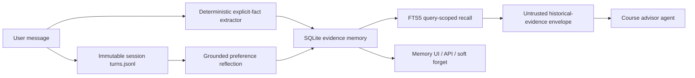

# MemoryBear-inspired long-term memory integration

ZotAdvisor uses an in-process SQLite evidence store derived from the lifecycle
ideas in [MemoryBear](https://github.com/SuanmoSuanyangTechnology/MemoryBear),
not a verbatim copy of its complete service. The upstream reference inspected
for this integration was commit
[`f63c4e8c`](https://github.com/SuanmoSuanyangTechnology/MemoryBear/commit/f63c4e8c60a87d0a7208736793312d845e739ac2)
(MemoryBear v0.4.1, Apache-2.0).

## Why this shape

MemoryBear is a standalone memory platform built around PostgreSQL, Neo4j,
Redis, Elasticsearch, Celery, multiple model clients, and a separate frontend.
ZotAdvisor is one FastAPI service with a local persistence model. Importing the
whole deployment would duplicate identity, conversation, API, and operational
layers.

The local provider therefore ports the pieces that matter for long-term memory
and drift control:

- provenance for every learned fact and preference;
- temporal versions (`active`, `superseded`, `forgotten`);
- exact-source quotes and confidence for inferred preferences;
- query-scoped FTS5 recall rather than injecting every memory every turn;
- soft deletion and a mutation/recall audit log;
- quota-based forgetting that removes low-confidence inferred items first;
- a provider boundary that can later point at a graph/vector service.

## Data flow



Assistant responses are never treated as factual memory sources. Deterministic
facts are written with the source conversation, user-turn index, and complete
user message. LLM-reflected preferences are accepted only when the returned
evidence quote is an exact substring of a user message and confidence is at
least 0.60.

## Storage model

The default database is `data/memory/long_term_memory.db`.

- `memory_profiles`: user-confirmed structured profile JSON.
- `memory_items`: fact/preference text, topic, confidence, provenance, temporal
  validity, supersession link, recall counters, and status.
- `memory_items_fts`: FTS5 search index maintained by triggers.
- `memory_events`: append-only audit events for create, confirm, recall,
  supersede, forget, and profile updates.
- `memory_migrations`: per-user idempotency marker for legacy JSON imports.

The full transcript remains owned by `app.data.sessions`; the memory store does
not make another transcript copy.

## Prompt trust boundary

User-managed structured profile data may be rendered in the leading system
context. Learned facts and preferences are not. Recall results are serialized
as JSON beside the current user question and paired with a system policy that
marks them as untrusted historical evidence. Current user statements override
older conflicting evidence.

This boundary reduces drift and stored-prompt-injection risk; it does not make
LLM output mathematically deterministic. The backend still validates course,
term, prerequisite, restriction, and schedule claims through domain tools.

## Configuration

```dotenv
MEMORY_PROVIDER=sqlite
MEMORY_ROOT=data/memory
MEMORY_DB_PATH=data/memory/long_term_memory.db
MEMORY_MAX_ACTIVE_ITEMS=1000
```

Set `MEMORY_PROVIDER=json` for an emergency rollback to the previous provider.
No new Python package or external service is required.

## Migration

Migration is lazy and automatic per user. For an eager deployment migration:

```bash
python scripts/migrate_memory_to_sqlite.py --dry-run
python scripts/migrate_memory_to_sqlite.py
```

The importer reads `profile.json`, `facts.json`, and `preferences.json` but does
not modify or delete them. Imported facts/preferences receive lower confidence
and `source_type=legacy_import` because the original files lack message-level
provenance.

## APIs

- `GET /api/memory/{user_id}`: compatible profile/facts/preferences response,
  plus active evidence records and lifecycle stats.
- `GET /api/memory/{user_id}/items?status=all`: inspect temporal versions.
- `DELETE /api/memory/{user_id}/items/{memory_id}`: user-requested soft forget.
- Existing profile and preference-forget endpoints remain compatible.

The authenticated cookie identity remains authoritative; the path `user_id` is
kept only for frontend wire compatibility.

## Deliberately deferred from full MemoryBear

- Neo4j entity/relation graph and multi-hop relation agent;
- embedding/vector retrieval and model reranking;
- multimodal perceptual memory;
- Celery/Redis distributed extraction and scheduled reflection workers;
- community clustering and memory summaries;
- advanced contradiction/staleness inspectors.

Those become worthwhile only after product data demonstrates that FTS5 and
typed UCI topics cannot answer real recall queries. The SQLite schema retains
source and version data so those backends can be added without losing audit
history.
